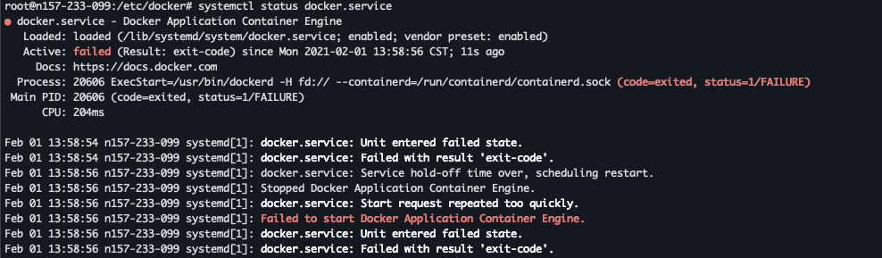

## centos 安装docker

把yum包更新到最新

```sh
yum update
```

安装需要的软件包

```shell
yum install -y yum-utils device-mapper-persistent-data lvm2
```

设置yum源

```shell
yum-config-manager --add-repo https://download.docker.com/linux/centos/docker-ce.repo
```

查看所有仓库中所有docker版本，并选择特定版本安装

```shell
yum list docker-ce --showduplicates | sort -r

[root@MiWiFi-R3-srv ~]# yum list docker-ce --showduplicates | sort -r
 * updates: mirrors.aliyun.com
Loading mirror speeds from cached hostfile
Loaded plugins: fastestmirror
Installed Packages
 * extras: mirrors.aliyun.com
docker-ce.x86_64            3:18.09.0-3.el7                    docker-ce-stable 
docker-ce.x86_64            18.06.1.ce-3.el7                   docker-ce-stable 
docker-ce.x86_64            18.06.1.ce-3.el7                   @docker-ce-stable
docker-ce.x86_64            18.06.0.ce-3.el7                   docker-ce-stable 
docker-ce.x86_64            18.03.1.ce-1.el7.centos            docker-ce-stable 
docker-ce.x86_64            18.03.0.ce-1.el7.centos            docker-ce-stable 
......
```

安装Docker，命令：yum install docker-ce-版本号，我选的是18.06.1.ce-3.el7，如下

```shell
yum install docker-ce-18.06.1.ce-3.el7
```

启动Docker，命令：systemctl start docker，然后加入开机启动，如下

```shell
systemctl start docker
systemctl enable docker
```

验证是否安装成功 docker version

```csharp
[root@MiWiFi-R3-srv ~]# docker version
Client:
 Version:           18.06.1-ce
 API version:       1.38
 Go version:        go1.10.3
 Git commit:        e68fc7a
 Built:             Tue Aug 21 17:23:03 2018
 OS/Arch:           linux/amd64
 Experimental:      false

Server:
 Engine:
  Version:          18.06.1-ce
  API version:      1.38 (minimum version 1.12)
  Go version:       go1.10.3
  Git commit:       e68fc7a
  Built:            Tue Aug 21 17:25:29 2018
  OS/Arch:          linux/amd64
  Experimental:     false
```

#### 使用Docker 中国加速器

由于网络原因，我们在pull Image 的时候，从Docker Hub上下载会很慢。

修改文件

```shell
vi  /etc/docker/daemon.json
#添加后：
{
    "registry-mirrors": ["https://registry.docker-cn.com"],
    "registry-mirrors": ["https://ustc-edu-cn.mirror.aliyuncs.com"],
    
    "live-restore": true
}
```

重起docker服务

```shell
systemctl daemon-reload && systemctl restart docker
```


## 进入容器Shell

```sh
docker exec -it <continer> /bin/bash # or sh
docker exec -it --user root <container id> /bin/bash # root 用户进入 -u root
```

## 修改容器中的文件

方法1：进入容器，使用vim修改

方法2：docker cp

```sh
 # 将文件从容器中copy 到本地
 docker cp fbaf54e9940a:/opt/cerebro/conf ./
 # 使用本地编辑器修改后，copy回容器中
 docker cp application.conf fbaf54e9940a:/opt/cerebro/conf
```

方法3：运行容器时使用本地的文件

```sh
# 冒号前是本地路径（需要绝对路径），冒号后是容器中的路径
docker run -itd -p 8080:80 -v /etc/nginx/nginx.conf:/etc/nginx/nginx.conf --name=webtest nginx:latest
```


## 安装docker Debain



```sh
# 查看docker状态，并尝试启动.
$ systemctl status docker
$ /usr/bin/dockerd -H fd:// --containerd=/run/containerd/containerd.sock
$ echo '' > /etc/modprobe.d/nf-blacklist.conf
$ systemctl status docker.service

# 如果出现
# failed to load listeners: no sockets found via socket activation: make sure the service was started by systemd
$ systemctl daemon-reload
$ service docker restart
$ service docker status

# 或者将 /etc/docker/daemon.json 置为空{}
```

## docker image 导出

```sh
# 导出image
docker save -o new_file.tar mysql:8.0.2

# 通过tar包载入image, --input -i 指定导入的文件
docker load --input new_file.tar

```


## 从容器创建一个镜像

````shell
docker commit [OPTIONS] CONTAINER [REPOSITORY[:TAG]]
docker commit -a "bytegopher.com" -m "first commit" a404c6c174a2  mymysql:v1
# -a 提交镜像的作者
# -m 提交信息
````


## docker神器

runlike


## 批量删除已经exit 的容器

https://www.cnblogs.com/brady-wang/p/10500597.html


## 容器自动重启

```sh
docker update --restart=always [container ID]
```


## fix Exited(139)

https://github.com/docker/for-linux/issues/58

In case someone stumbles on this closed issue, here's quick howto:
Description: centos:6 docker image fails to start, no output given.
Workaround: append `vsyscall=emulate` to line `GRUB_CMDLINE_LINUX_DEFAULT` in your `/etc/default/grub`. E.g.

```
GRUB_CMDLINE_LINUX_DEFAULT="consoleblank=0 systemd.show_status=true elevator=noop console=tty1 console=ttyS0 vsyscall=emulate"
```

then update grub
`update-grub`
and reboot host machine
`reboot`


