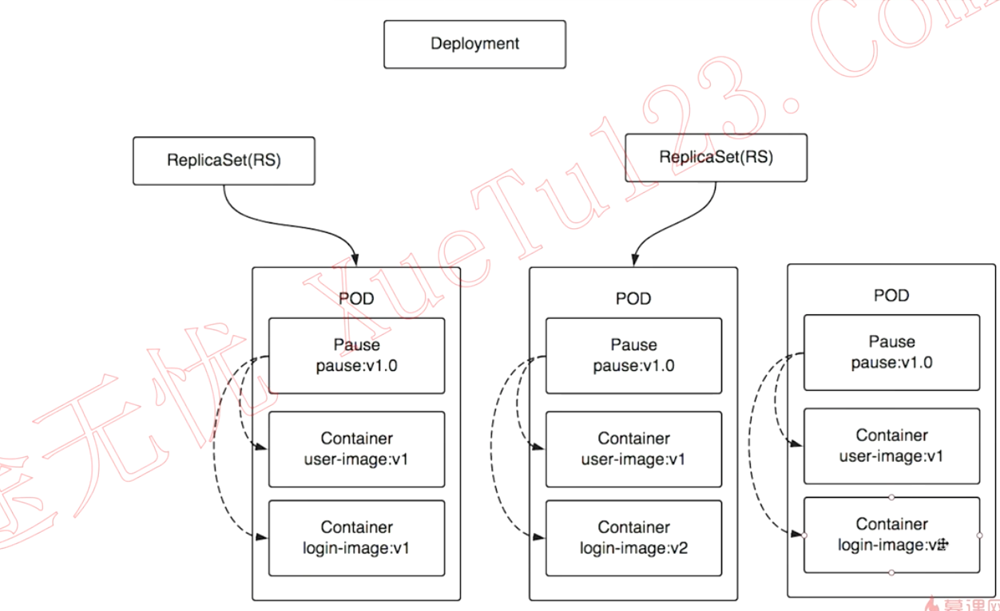
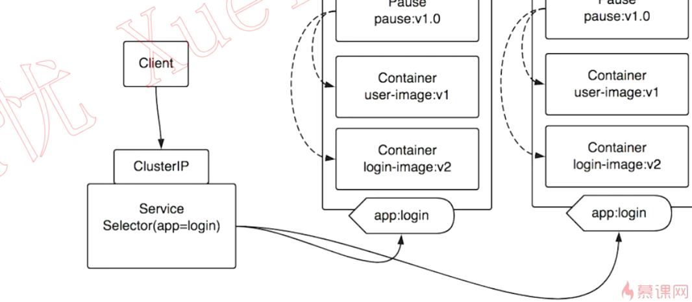
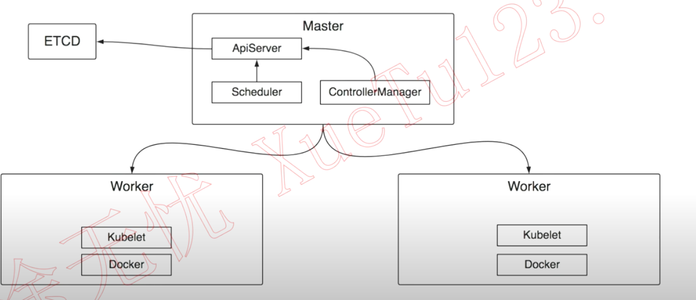
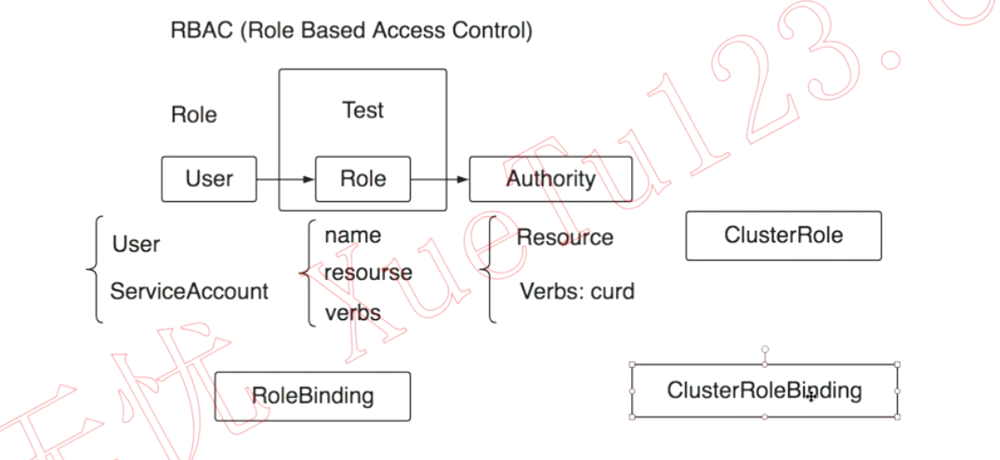
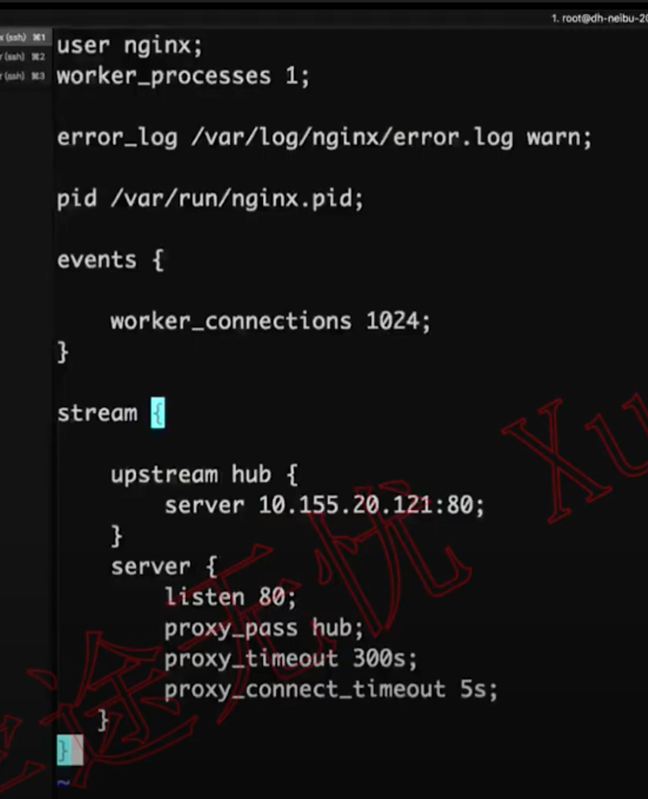
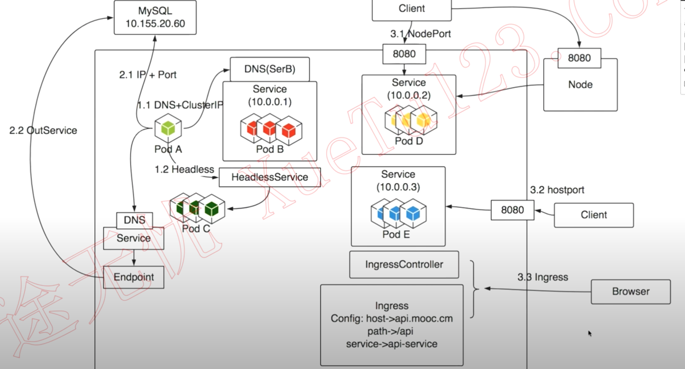

Kubenetes生产落地全程实践


核心概念

架构设计

认证授权

高可用集群搭建

二进制& kubeadm


3台master两台2 node


calico、coredns、dashboard

业务迁移到Kubenetes

Harbor

服务发现策略

IngressNginx

Docker 化服务、K8s、服务发现

CICD


namespace、resources、label


服务的调度与编排

健康检查

调度策略

部署策略

日志与监控


## 第2章 kubernetes快速入门

本章中将从核心概念、架构设计、认证授权以及集群搭建方案对比几方面，带领大家快速掌握kubernetes的重要知识点，助力快速入门。


### 2-1 了解kubernetes 

舵手： 渔网、渔船  docker : 鲸鱼，集装箱 🐳

Kubernetes is an open-source system for automating deployment, scaling, and management of containerized applications.

It groups containers that makeup application in to logical units for easy management and discovery.Kubernetes builds upon 15 years of  experience of running production workloads at Google, combined with best-of-breed ideas and practices from the community.

kubernetes的主要特征

- 以服务为中心
- 自动化， 自动扩缩容，更新、负载均衡、实例状态

kubernetes vs docker

- 以docker 容器技术技术的标准为基础，CRI


K8s架构设计

pod： pause 作为根容器，共享网络文件等资源



label： deploy/pod/container




## 


### 2-2 kubernetes的核心概念 

### 2-3 kubernetes的架构设计 

master (APIServer/Scheduler(资源、内存、cpu)/controller(k8s资源rs,service))        etcd 

worker   worker (kubelet维护pod的生命周期，网络、volume/ docker )



### 2-4 kubernetes认证的密码学原理 (15:30)

认证(Authentication)  防止有人入侵

授权(Authorization)

APIserver


A --8 篡改-- >  B 


对称加密：小姐姐好可爱 --> 对称加密 abc123--->  wqerjqwoeurfasdhjfskalj -> 对称解密abc123 ---> 小姐姐好可爱

非对称加密: 小姐姐好可爱 --> 非对称加密 abc123(公钥 public key)--->  wuqyieruzsxchjfvash -> 非对称解密cde987(私钥 private key) ---> 小姐姐好可爱


发送一个hello

serviceA       ------------------------->             ServiceB


serviceA --------asdfqwefwsadfasd 密文----------> serviceB


A 使用 serverB的pubkey进行加密，然后发送到serverB。 c截获后也解不开。只有B用自己的私钥才可以解开。非对称加密算法的消耗比较大。对称加密的算法消耗较低。


结合非对称加密和对称加密。

使用非对称加密，加密对称加密要使用的密钥。可以把对称加密需要的密钥安全带的送到B。接下来双方就可以使用对称加密进行通信。

性能和安全性都得到了解决。

SSL/TLS协议  ---> HTTPS


目前可能存在的风险就是B 在返回pubkey的时候，有可能被C截获，C截获后返回C的公钥给A，这样A就拿到了C的公钥。

CA 认证机构，让A可以验证拿到的B的pubkey 确实是B的，确实是合法的，是CA颁发的。


### 2-5 kubernetes的认证与授权 

认证

**1. 客户端证书认证(TLS双向认证)**


CA 自己的认证机构

给各个组件颁发证书


kubectl  --->   API server 

双向认证 ： 互相验证证书是否为CA颁发

- API server是否是kubectl 需要访问的

- kubectl 客户端是否是一个合法的客户端


**2.BearerToken**

**3.ServcieAccount**

Pod与API server打交道

(namespace，token，ca) 挂载到pod的文件系统中


授权

ABAC

webhook

RBAC(Role Based Access Control)


User ---------------------->  Role -------------------------> Authority(Resource, Verbs:Curd)

|_ User     

|_ ServiceAccount 


RoleBinding




AdmisionControl: 准入控制

AlwaysAdmit、AlwaysDeny、ServiceAccount、DenyEscolatingExec


### 2-6 集群搭建方案对比 

社区方案

Kubeadm：

Binary：

易于维护


iterm 级联功能


## 第3章 容器运行时-Docker or Containerd

本章主要讲解Docker or Containerd如何选择和全面上手实践Containerd。


3-1 Docker or Containerd如何选择 (07:40)

3-2 Containerd全面上手实践 (26:18)
第4章 高可用集群搭建---kubespray方式【集群落地方案1】6 节 | 52分钟
本章中将讲解kubespray集群搭建方案。带领大家一起分析kubespray部署方案、基础环境、kubespray的安装配置、用kubespray一键部署生产级K8s集群等，全面系统学会kubespray的集群落地方案。


4-1 分析kubespray部署方案，准备基础环境 (08:42)

4-2 kubespray的安装、配置 (15:13)

4-3 用kubespray一键部署生产级k8s集群 (08:28)

4-4 集群冒烟测试 (06:52)

4-5 访问dashboard (04:41)

4-6 基于kubespray的集群运维 (07:20)
第5章 高可用集群搭建---二进制方式【集群落地方案2】9 节 | 73分钟
本章中将讲解，如何使用二进制的方式，搭建最新版本的kubernetes高可用集群。同样会以三个master，两个worker节点为例，会针对集群可用性进行的测试，并完成dashboard的搭建和使用。并在本章结尾，通过文档方式，针对前面内容进行总结，便于同学们回顾查阅。...


5-1 基础环境准备 (13:58)

5-2 生成证书 (10:58)

5-3 kubernetes各组件的认证配置 (04:31)

5-4 部署etcd集群 (04:08)

5-5 部署kubernetes控制平面 (08:16)

5-6 部署kubernetes工作节点 (13:38)

5-7 网络插件-Calico_1 (06:00)

5-8 DNS插件-CoreDNS (04:40)

5-9 集群冒烟测试 (06:36)
第6章 业务系统迁移kubernetes---准备工作【为平稳迁移做好储备】6 节 | 90分钟
搭建完集群还不能马上迁移业务，本章中将讲解迁移前的一些准备工作：包括镜像仓库harbor的入门和部署、对kubernetes服务发现方案的学习分析以及ingress-nginx服务发现方案的部署。


6-1 Harbor入门 (17:06)

6-2 Harbor高可用部署（上） (11:50)

6-3 Harbor高可用部署（下） (12:21)



### 6-4 kubernetes的服务发现 

集群内部


集群内-> 集群外

集群外-> 集群内



6-5 部署ingress-nginx（上） (14:52)

6-6 部署ingress-nginx（下） (13:36)
第7章 业务系统迁移kubernetes---最佳实践【多类型业务迁移落地】7 节 | 86分钟
本章中将分析如何将非docker业务迁移到docker、使docker服务运行在kubernetes中，以及在这个过程中需要注意的问题。同时也会介绍，将定时任务、传统的web服务、springboot的web服务还有dubbo服务迁移部署在kubernetes中的全过程。


7-1 定时任务迁移kubernetes (21:56)

服务做到镜像里

- 基础镜像
- 搞定服务运行的相关文件
- 构建镜像 Dockerfile

制作K8s服务，并调度

- 确定服务发现的策略
- 编写K8s配置
- 


图文：
7-2 【不熟悉SpringBoot的筒子看过来】SpringBoot快速入门

7-3 springboot的web服务迁移kubernetes (11:29)
图文：
7-4 【不熟悉Dubbo的筒子看过来】Dubbo快速入门

7-5 传统dubbo服务迁移kubernetes（上） (16:22)

7-6 传统dubbo服务迁移kubernetes（下） (16:08)

7-7 传统web服务迁移kubernetes (19:40)
第8章 CICD实践【只会迁移还不够，持续集成走起】5 节 | 70分钟
本章将讲解如何让服务可以在kubernetes里面实现持续集成。逐步实现gitlab管理代码、maven构建、docker实现镜像的构建、推送到harbor仓库以及通过脚本跟kubernetes对接完成持续发布。最后还会应用jenkins通过pipeline整合整个流程实现CICD。...


8-1 kubernetes与cicd (12:41)

8-2 cicd实践（1） (12:56)

8-3 cicd实践（2） (13:26)

8-4 cicd实践（3） (13:31)

8-5 cicd实践（4） (17:18)

## 第9章 深入kubernete---几个重要的资源对象【透过表象看本质&装逼可选包】4 节 | 83分钟

本章中介绍了kubernetes的重要资源：namespace、resources和label。 讲解并实践了，命名空间对资源对象和资源配额多层面的隔离机制、pod资源限制的配置方式、pod在节点资源紧缺时的驱逐机制、label作用于不同资源对象上的不同的作用等核心知识。 ...


### 9-1 Namespace --- 集群的共享与隔离 

创建一个namespace

```yaml
apiVersion: v1
kind: Namespace
metadata:
  name: dev
```


9-2 Resources---多维度集群资源管理（上） (22:45)

9-3 Resources---多维度集群资源管理（下） (22:26)

9-4 Label---小标签大作为 (19:31)
第10章 深入kubernete---服务调度与编排【透过表象看本质&装逼可选包】6 节 | 121分钟
本章中主要围绕服务的调度与编排讲解讲解并实践了：pod的健康检查的参数配置及影响、调度器的整体工作原理以及常见的预选策略和优选策略、如何利用kubernetes本身的机制完成不同的部署方式。


10-1 健康检查---高可用的守护者 (23:06)

10-2 Scheduler--- 玩转pod调度（上） (13:57)

10-3 Scheduler --- 玩转pod调度（下） (13:49)

10-4 部署策略详解 --- 重建、滚动、蓝绿、金丝雀 (26:11)

10-5 深入Pod - pod相关的点点滴滴（上） (21:24)

10-6 深入Pod - pod相关的点点滴滴（下） (22:04)
第11章 深入kubernete--- 落地实践深入【透过表象看本质&装逼可选包】7 节 | 123分钟
本章主要从kubernetes落地的角度进行深入讲解，分别介绍：ingress在落地过程可能遇到的问题与应对方式、基于glusterfs的共享存储、kubernetes api的设计，并以一个真实的示例项目让大家看到容器管理平台可以做成什么样子的。


11-1 ingress --- 四层代理、session保持、定制配置、流量控制（上） (17:42)

11-2 ingress -- 四层代理、session保持、定制配置、流量控制（中） (17:18)

11-3 ingress --- 四层代理、session保持、定制配置、流量控制（下） (16:42)

11-4 共享存储 --- PV、PVC和StorageClass（上）.mp4 (16:13)

11-5 共享存储 --- PV、PVC和StorageClass（下） (16:04)

11-6 StatefulSet --- 有状态应用的守护者 (18:47)

11-7 KubernetesAPI ---如何开发一个基于kubernetes的容器管理平台 (19:38)
第12章 深入kubernete---日志和监控【透过表象看本质&装逼可选包】10 节 | 131分钟
本章中将介绍K8S使用者必须考虑的重量级问题：日志与监控。课程中会分析当下主流的日志处理方案并选择一种方案进行日志从采集到展示的完整实践；会讲解主流k8s监控方案prometheus，包括它的实现原理，支持的各种指标等。


12-1 常见日志采集问题和解决方案分析 (08:41)

12-2 logpilot+elasticsearch+kibana日志实践 (19:26)

12-3 监控入门---从整体把握监控 (07:39)

12-4 Prometheus入门---架构和原理 (11:45)

12-5 部署前奏 - Helm & Operator (10:31)

12-6 监控部署实战 - Helm+PrometheusOperator (19:30)

12-7 监控落地 - 指标完善、Grafana看板和邮件报警（上） (17:16)

12-8 监控落地 - 指标完善、Grafana看板和邮件报警（中） (17:28)

12-9 监控落地 - 指标完善、Grafana看板和邮件报警（下） (18:21)
图文：
12-10 【步骤总结，便于快速回顾】Helm部署文档

## 第13章 ServiceMesh代表作istio

本章中我们会从istio的架构设计开始让你对它的实现原理有深入了解，并会部署完整的istio环境，从架构上让我们的服务自动支持istio的功能，最后使用几个istio的常见工具集实现数据展现。


13-1 什么是ServiceMesh？什么是Istio？ (04:51)

微服务架构

设么是ServiceMesh

- 服务网格
- 是概念不是产品
- 解决网络层面的问题

服务发现、负载均衡、路由、流量控制、服务间通信的可靠性、监控----  API 网关？

Linkerd

始于2016年CNCF官方项目

1.x 基于节点(虚拟机、物理机)

2.x 基于kubernetes(conduit)

Istio

Google/IBM/Lyft 发起的开源项目，17年推出，18年7月发布1.0、多平台支持

都是基于sidecar模式

都分为数据层和控制层

Istio 更受欢迎


Pilot -> envoy 提供信息，服务发现， AB测试


Mixer：策略(访问控制)、遥测(数据收集和汇报，服务之间流转的数据)

Galley:  配置管理中心

Citadel： 安全


故障排查：

请求在哪失败的，A有调用B吗

为什么用户请求/页面hung住了

为什么系统组件这么慢？那个组件最慢？

应用容错性

客户端没有设置timeout导致应用卡住

没有重试机制，某个服务偶尔异常导致用户页面错误

某些节点异常，导致服务响应时间过长

应用升级发布

新版本一次性升级，一旦出错影响范围很大

无法进行AB测试，根据用户属性访问不同版本

服务版本的依赖关系处理不当导致服务不可用

系统安全

服务都是HTTP而非https

没有流量限制，任何人都可以对服务发起攻击


13-2 Istio架构和原理 (11:41)

13-3 部署istio 


13-4 部署BookInfo示例应用 (11:38)

13-5 配置请求路由 (08:47)

13-6 故障注入 (07:38)

13-7 流量转移 (09:27)

13-8 设置请求超时 (03:16)

13-9 熔断 (08:44)

13-10 流量镜像 (05:58)

13-11 Istio中的Prometheus和Grafana (11:44)

13-12 分布式追踪Jaeger (09:29)

13-13 网格可视化 (10:59)
第14章 课程总结【沉淀&展望】1 节 | 6分钟
本章中将总结本课程所学知识，展望docker和kubernetes的发展。


https://www.youtube.com/watch?v=2b7MRI6tmMo&list=PLsbVibQXuLjqZwdpSBXR27gNGgtHlQLHR&index=2


https://www.youtube.com/watch?v=8MlW9nixkwk&list=PLsbVibQXuLjqw6mCC4QMyLZ282dhdPWr3&index=13