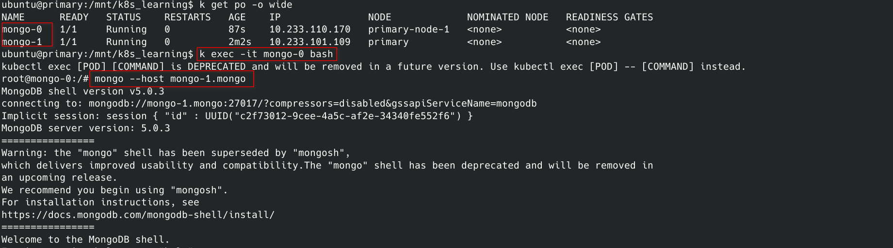

前面介绍的几种workload都有一个共性，那就是创建出来的Pod都是一致的。所谓的一致就是说，假设我们使用的是ReplicaSet，创建了3个Pod，那么这3个Pod创了名字一定不一样之外，其他属性可能都是一样的，包括运行时的参数和模式以及数据存储。


如果是Web Service，数据保存到后端的DB中，上述逻辑是没有问题的。

如果使用ReplicaSet来部署一个DB的多实例， 就可肯能存在问题了。

数据持久化，一般使用PVC，当使用PVC 和PV的时候

​                    


ReplicaSet  -> Pods(3 个) -> 持久卷声明 -> 持久卷


3个Pod的数据都写到同一个Pv中，这样肯定是不行的？？？


## StatefulSet


为了解决Pod的状态性的问题，K8s引入了StatefulSet的概念

- Pod有单独的存储和固定的网络标识
- 需要配备一个headless Service，用于DNS
- 可以通过DNS快速发现其他的Pod
- 可以直接通过Pod DNS通信

每个Pod都可以通过DNS访问到，这种特性在其他workload中是不能实现的。通过StatefulSet可以让Pod持有状态，即使因为故障Pod重建了，那么对应的Pod的名字和数据都会保留，和重建之前没有什么区别。


使用StatefulSet 必须建立一个HeadlessService，然后绑定这个headlessservice到StatefulSet。

以MongoDB为例，创建一个StatefulSet，因为还没有介绍到PVC和PV的内容，所以MongoDB将使用本地存储卷。


- 创建Headless Service

- 创建 StatefulSet

通过DNS访问Pod

在StatefulSet的Pod中可以通过DNS直接访问其他Pod。

```sh
mongo --host mongo-1.mongo
```



可以通过`<pod-name>.<service-name>`的形式访问Pod。这其实和StatefulSet的设计是有关系的，在类似的Deployment中Pod的名字是不固定的，而在StatefulSet中，Pod的名字是固定的。


和ReplicaSet对比

- 因为有状态的Pod彼此不同，通常希望操作的是其中的特定的一个，所以StatefulSet通常要求你创建一个用来记录每个Pod网络标记的HeadlessService。通过这个Service，每个Pod都拥有独立的DNS记录，而这在ReplicaSet中是不行的？（如果为ReplicaSet创建一个Headless Service会发生啥？）
- 因为StatefulSet缩容任何时候只会操作一个Pod实例，所以有状态应用的缩容不会很迅速。
- StatefulSet在有实例不健康的情况下，是不允许缩容的。
- 持久存储
  - 一个StatefulSet可以拥有一个或者多个卷声明模板，这些声明会在创建Pod前创建出来，绑定到一个Pod的实例上。
  - 扩容StatefulSet会创建两个API对象，一个Pod和一个卷声明；但是缩容StatefulSet却会删除一个Pod对象，而会留下PVC，因为一旦删除PVC则意味着PV会被回收。


StatefulSet at-most-one

Kubernetes 必须保证两个拥有相同标记和绑定相同持久卷声明的有状态的Pod实例不会同时运行。一个StatefulSet必须保证有状态的实例的 at-most-one 语义。也就是说StatefulSet必须保证一个Pod不再运行后，才会去创建它的替换Pod。

