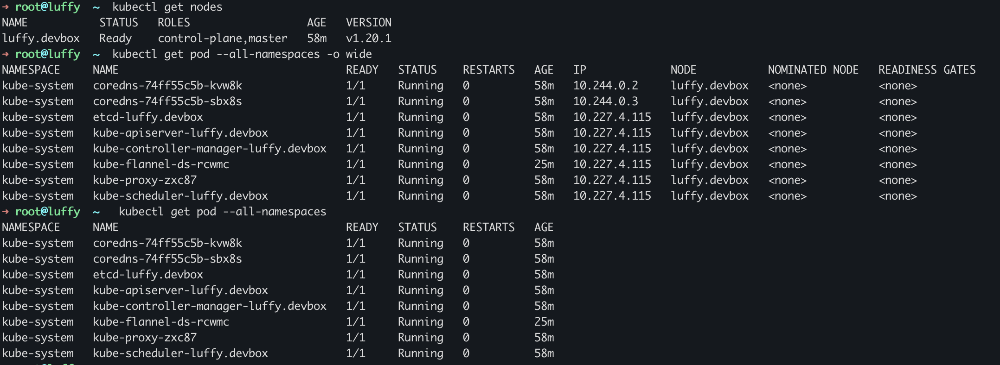

## 环境准备

K8s 只能基于Linux环境部署，用Win/Mac的小伙伴们怎么在自己的PC上Setup环境呢。此时就推荐[Canonical](https://canonical.com/)家的[Multipass](https://multipass.run/docs/installing-on-macos)了，Canonical 是谁，当然是Ubuntu的母公司了。


## 安装 kubelet kubeadm kubectl

[官方文档](https://kubernetes.io/docs/setup/production-environment/tools/kubeadm/install-kubeadm/)

```sh
sudo apt-get update && sudo apt-get install -y apt-transport-https curl
curl -s https://packages.cloud.google.com/apt/doc/apt-key.gpg | sudo apt-key add -
cat <<EOF | sudo tee /etc/apt/sources.list.d/kubernetes.list
deb https://apt.kubernetes.io/ kubernetes-xenial main
EOF
sudo apt-get update
sudo apt-get install -y kubelet kubeadm kubectl
sudo apt-mark hold kubelet kubeadm kubectl # 设置为不再更新
```


## 初始化

```sh
swapoff -a
kubeadm init ctl 
# kubeadm config images pull --v=10
 # 国内正常网络不能从k8s.grc.io拉取镜像, 所以从docker.io拉取, 然后重新打上一个符合k8s的tag:
docker pull registry.cn-hangzhou.aliyuncs.com/google_containers/kube-apiserver:v1.20.1 
docker tag registry.cn-hangzhou.aliyuncs.com/google_containers/kube-apiserver:v1.20.1 k8s.gcr.io/kube-apiserver:v1.20.1

docker pull mirrorgooglecontainers/kube-apiserver:v1.12.2
docker pull mirrorgooglecontainers/kube-controller-manager:v1.12.2
docker pull mirrorgooglecontainers/kube-scheduler:v1.12.2
docker pull mirrorgooglecontainers/kube-proxy:v1.12.2
docker pull mirrorgooglecontainers/pause:3.1
docker pull mirrorgooglecontainers/etcd:3.2.24
docker pull coredns/coredns:1.2.2

docker tag docker.io/mirrorgooglecontainers/kube-apiserver:v1.12.2 k8s.gcr.io/kube-apiserver:v1.12.2
docker tag docker.io/mirrorgooglecontainers/kube-controller-manager:v1.12.2 k8s.gcr.io/kube-controller-manager:v1.12.2
docker tag docker.io/mirrorgooglecontainers/kube-scheduler:v1.12.2 k8s.gcr.io/kube-scheduler:v1.12.2
docker tag docker.io/mirrorgooglecontainers/kube-proxy:v1.12.2 k8s.gcr.io/kube-proxy:v1.12.2
docker tag docker.io/mirrorgooglecontainers/pause:3.1 k8s.gcr.io/pause:3.1
docker tag docker.io/mirrorgooglecontainers/etcd:3.2.24 k8s.gcr.io/etcd:3.2.24
docker tag docker.io/coredns/coredns:1.2.2 k8s.gcr.io/coredns:1.2.2

docker rmi mirrorgooglecontainers/kube-apiserver:v1.12.2
docker rmi mirrorgooglecontainers/kube-controller-manager:v1.12.2
docker rmi mirrorgooglecontainers/kube-scheduler:v1.12.2
docker rmi mirrorgooglecontainers/kube-proxy:v1.12.2
docker rmi mirrorgooglecontainers/pause:3.1
docker rmi mirrorgooglecontainers/etcd:3.2.24
docker rmi coredns/coredns:1.2.2
```

**安装成功**


```sh
Your Kubernetes control-plane has initialized successfully!

To start using your cluster, you need to run the following as a regular user:

  mkdir -p $HOME/.kube
  sudo cp -i /etc/kubernetes/admin.conf $HOME/.kube/config
  sudo chown $(id -u):$(id -g) $HOME/.kube/config

Alternatively, if you are the root user, you can run:

  export KUBECONFIG=/etc/kubernetes/admin.conf

You should now deploy a pod network to the cluster.
Run "kubectl apply -f [podnetwork].yaml" with one of the options listed at:
  https://kubernetes.io/docs/concepts/cluster-administration/addons/

Then you can join any number of worker nodes by running the following on each as root:

kubeadm join 10.227.4.115:6443 --token 3hf7uz.3stfkg430pppne10 \
    --discovery-token-ca-cert-hash sha256:14d0a3cd33e86dc80081d806499a95366c4f0bdfd83d364c1e6576864684d3d7
```


## 安装网络组件

```sh
# sysctl net.bridge.bridge-nf-call-iptables=1
# https://kubernetes.io/docs/concepts/cluster-administration/addons/
kubectl apply -f "https://cloud.weave.works/k8s/net?k8s-version=$(kubectl version | base64 | tr -d '\n')"
```


## 检查集群状态

```sh
kubectl get nodes
kubectl get pod --all-namespaces -o wide
kubectl get pod --all-namespaces 
kubectl get pods -n kube-system # 指定命名空间
```




## 参考文档

概念

http://www.dockone.io/article/932

https://www.zhihu.com/question/37498459/answer/826736487

安装文档

https://kubernetes.io/zh/docs/setup/production-environment/tools/kubeadm/install-kubeadm/

https://www.hangge.com/blog/cache/detail_2414.html

https://zhuanlan.zhihu.com/p/46341911


init ubuntu as a k8s node

```shell
sudo su
apt update && apt -y upgrade
apt install -y apt-transport-https curl net-tools
curl -fsSLo /usr/share/keyrings/kubernetes-archive-keyring.gpg https://packages.cloud.google.com/apt/doc/apt-key.gpg
echo "deb [signed-by=/usr/share/keyrings/kubernetes-archive-keyring.gpg] https://apt.kubernetes.io/ kubernetes-xenial main" | sudo tee /etc/apt/sources.list.d/kubernetes.list
apt update
apt install -y kubelet kubeadm kubectl docker.io
```

