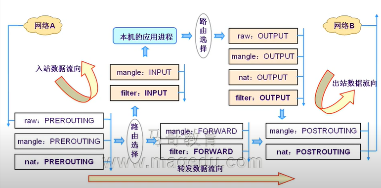

TCP 的有限状态机


CLOSED                      CLOSED

SYN_SENT                   LISTENING

​                                     SYN_RECEIVED

  ESTABLISHED             ESTABLISHED


netfilter: Frame

iptables: 数据报文过滤


防火墙： 硬件/软件

规则： 匹配标准和处理办法


默认规则：

​       关闭

匹配标准：

  IP:源IP， 目标IP

TCP: SPORT, DPORT    SYN=1,FIN=0,RST=0,ACK=0

UDP:SPORT, DPORT

ICMP: icmp-type


规则在内核空间

内核空间的TCPIP的协议栈上，开放给用户空间中的iptables API。

内核空间的工作框架：

用户空间的管理工具：   system call


参考 openBSD

Linux 2.0：ipfw/firewall

Linux 2.2： ipchain/firewall
Linux 2.4 ： iptables/netfilter

1：07
```sh
/proc/sys/net/ipv4/ip_forward
```


路由决策发生在数据包到达网卡， 送到TCPIP协议栈上的那一刻。
然后先发生路由决策


netfilter 补充在tcp ip协议上的3个hook function。

多个规则，自上而下，逐个检查，


不做拒绝或者放行策略

4： 刚刚进入本机网卡，还没有到达路由表。（地址转换k'k）

5： 即将离开本机的时候，路由决策做出之后。


规则链

PREROUTING

INPUT

FORWARD

OUTPUT

POSTROUTING


**filter**：过滤 表

INPUT/ OUTPUT/ FORWARD

**nat**: 地址转换 表

PREROUTING/ POSTROUTING/OUTPUT

redirect : 本机重定向

**mangle** 修改报文首部 拆开修改，封装

PREROUTING

INPUT

FORWARD

OUTPUT

POSTROUTING

**raw** 原始格式

PREROUTING/OUTPUT




chain的优先次序

4表5链k


500条规则

自定义链只能被默认链调用才可以生效（return), 如果没有别任何一条队则匹配到应该有返回机制。

不能删除非空链。 用户可以删除自定义的空链，默认链不能被删除。

每一条规则都有两个内置的计数器，

一个用来记录被匹配到的报文个数

被匹配的报文大小之和。

匹配标准和处理动作

标准： 

```sh
iptables [-t TABLE] COMMAND CHAIN [num] 匹配标准 -j 处理办法
```


通用匹配

```sh
-s, --src 源IP
-d, --dst , 目标地址
-p {tcp |udp | icmp}
-i Interface, 指定数据报文流入接口 prerouting，input，forward
-o interface， 指定数据报文流出的接口 output, postrouting, forward


-j jump
ACCEPT
DROP
REJECT

连接状态

```


扩展匹配： 依赖扩展功能/user/lib/iptables

- 隐含扩展，不用特别指明由哪一个模块进行扩展，因为此时使用-p{tcp | udp |icmp}

- 显示扩展，必须指明由哪一个模块进行扩展， 使用-m完成此功能，


网络访问控制

DDOS

netfilter，

在用户层通过iptables 对netfilter进行控制管理。


Redirect 是针对本机的， 本机产生的数据包转到 localhost的某个端口， 适合用redirect，会比DNAT效率高一点，而外部地址只能用DNAT了。
