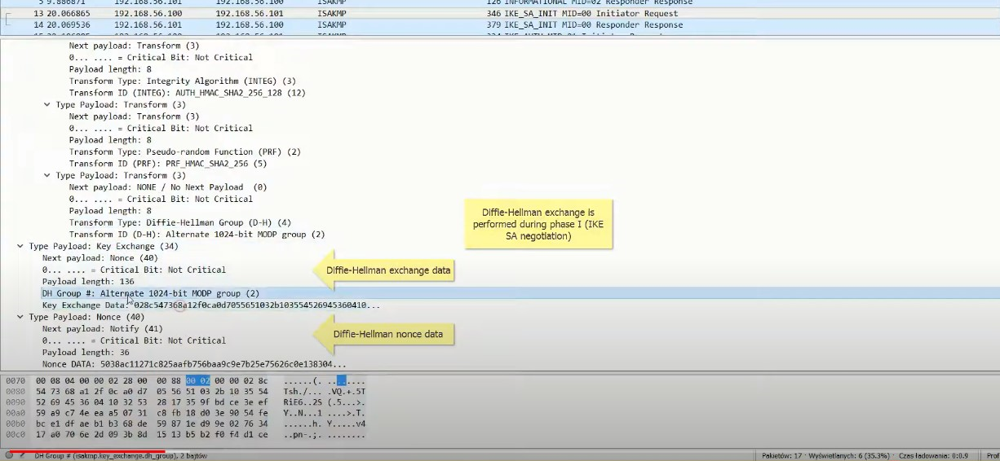
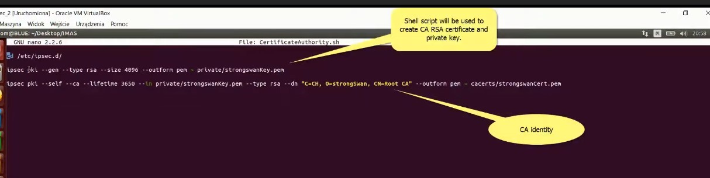

---

title: strongswan
---


When reading/adjusting any StrongSwan configurations, remember these important words:

> left is local to the machine it's stated on; right is remote in the same manner

So, on the server side, left is local to the server and on the client side, left is local to that client.


check the X509 cert details

```sh
openssl x509 -text -noout -in  /etc/ipsec.d/private/sunKey.pem
```

​	


## Ubuntu Set up IPsec Tunnel 


```sh
docker run --rm -d -i --network host --name cnf --user root -v /home/ubuntu/entrypoint.sh:/entrypoint.sh --privileged cnf:pro  sleep infinity


docker run --rm -i -d --network host --name cnf --user root -v /home/ubuntu/entrypoint.sh:/entrypoint.sh  --privileged cnf:pro bash -c '/entrypoint.sh'
```


###  Install StrongsWan

```sh

sudo apt update &&  sudo apt install strongswan strongswan-swanctl strongswan-pki strongswan-charon charon-cmd charon-systemd -y


sudo apt remove strongswan strongswan-swanctl strongswan-pki strongswan-charon charon-cmd charon-systemd -y
```


在如下两台机器之间 建立 host-to-host的ipsec tunnle, 以下配置过程整理自[Strongswan](https://github.com/strongswan/strongswan/blob/master/README.md#generating-a-host-or-user-end-entity-certificate).

```sh
| 10.95.62.25 | === | 10.95.62.114 |
     moon                sun
```

### 生成证书

使用strongswan的[PKI tool](https://wiki.strongswan.org/projects/strongswan/wiki/SimpleCA) 创建证书。

```sh
# 创建 root 私钥
pki --gen --outform pem > caKey.pem
# 生成 root CA
pki --self --in caKey.pem --dn "C=CH, O=strongSwan, CN=strongSwan CA" --ca --outform pem > caCert.pem

# 生成 node-1 私钥
pki --gen --outform pem > moonKey.pem
# 使用 root ca签发 node-1 端证书
pki --issue --in moonKey.pem --type priv \
--cacert caCert.pem --cakey caKey.pem \
--dn "C=CH, O=strongSwan,CN=moon.strongswan.org" --san moon.strongswan.org \
--outform pem > moonCert.pem

# 生成 node-2 私钥
pki --gen --outform pem > sunKey.pem
# 使用 root ca签发 node-1 端证书
pki --issue --in sunKey.pem --type priv \
--cacert caCert.pem --cakey caKey.pem \
--dn "C=CH, O=strongSwan,CN=sun.strongswan.org" --san sun.strongswan.org \
--outform pem  > sunCert.pem


```


### Host-to-Host 配置

**Configuration on host *moon*:**

```sh
 sudo cp caCert.pem /etc/swanctl/x509ca/caCert.pem
 sudo cp moonCert.pem /etc/swanctl/x509/moonCert.pem
 sudo cp moonKey.pem /etc/swanctl/private/moonKey.pem

/etc/swanctl/swanctl.conf:

    connections {
        host-host {
            #remote_addrs = 52.9.61.247
            pools=client_pool

            local {
                auth=pubkey
                certs = moonCert.pem
            }
            remote {
                auth = pubkey
                id = "C=CH, O=strongSwan, CN=sun.strongswan.org"
            }
            children {
                net-net {
                	remote_ts=192.168.0.1/32
                    start_action = trap
                }
            }
        }
    }
    pools{
    client_pool{
        addrs=192.168.0.1
    }
}
```

**Configuration on host *sun*:**

```sh
sudo cp caCert.pem /etc/swanctl/x509ca/caCert.pem
sudo cp sunCert.pem /etc/swanctl/x509/sunCert.pem
sudo cp sunKey.pem /etc/swanctl/private/sunKey.pem

/etc/swanctl/swanctl.conf:

    connections {
        host-host {   # connection name
            remote_addrs = 34.230.111.156

            local {
                auth = pubkey
                certs = sunCert.pem
            }
            remote {
                auth = pubkey
                id = "C=CH, O=strongSwan, CN=moon.strongswan.org"
            }
            children {
                host-host {
                    remote_ts=10.20.0.118/32
                    start_action = trap
                }
            }
        }
    }
```


上述配置是 是用key做认证，下面举个使用pre-shared key的例子

```sh
  # configuration on moon
  connections {
        host-host {
            remote_addrs = 10.95.62.114

            local {
                auth=psk
                id = "moon.strongswan.org"
            }
            remote {
                auth = psk
                id = "sun.strongswan.org"
            }
            children {
                net-net {
                    start_action = trap
                }
            }
        }
    }
 secrets{
    ike-h2h{
        id-moon =  "moon.strongswan.org"
        id-sun =  "sun.strongswan.org"
        secret = mysecret
    }
}
    
    # configuration on sun
    connections {
        host-host {   # connection name
            remote_addrs = 10.95.62.25

            local {
                auth = psk
                id = "sun.strongswan.org"
            }
            remote {
                auth = psk
                id = "moon.strongswan.org"
            }
            children {
                host-host {
                    start_action = trap
                }
            }
        }
    }
    secrets{
        ike-h2h{
            id-moon =  "moon.strongswan.org"
            id-sun =  "sun.strongswan.org"
            secret = mysecret
        }
    }
```


配置完成后，可以使用`swanclt --load-all` 使配置生效。


如果给initiator 分配一个[Virtual IP](https://wiki.strongswan.org/projects/strongswan/wiki/VirtualIp).

Initiator 获得虚拟IP后会再 IP table 220 中增加对应IP的路由方式。


## SmartCard demo with OpenSC

### Build Strongswan  with pcks11

```sh
# install essential dependency
sudo apt install  build-essential libgmp-dev libunbound-dev libldns-dev -y
git clone https://github.com/strongswan/strongswan.git
./autogen.sh
#  config
# ./configure --prefix=/usr --sysconfdir=/etc --enable-eap-mschapv2 --enable-kernel-libipsec --enable-swanctl --enable-unity --enable-unbound --enable-vici --enable-xauth-eap --enable-xauth-noauth --enable-eap-identity --enable-md4 --enable-pem --enable-openssl --enable-pubkey --enable-farp --enable-pkcs11
./configure --prefix=/usr --sysconfdir=/etc --enable-pkcs11 CFLAGS="-DDEBUG_LEVEL=1"
make
sudo make install
sudo systemctl daemon-reload
sudo systemctl restart strongswan-starter.service
```


### Build virt_cacard

[virt_card](https://github.com/Jakuje/virt_cacard) using libcacard, vitualsmartcard's vpcd and [softhsm2](https://fossies.org/linux/softhsm/README.md) to provide PCSC accessible virtual smart card.

```sh
# install essential dependency, libcacard & softhsm2
sudo apt install libcacard-dev libglib2.0-dev softhsm2 gnutls-bin libnss3-tools -y
```

Build & Install [vsmartcard](https://frankmorgner.github.io/vsmartcard/virtualsmartcard/README.html)

```sh
sudo apt-get install -y help2man libpcsclite-dev
git clone https://github.com/frankmorgner/vsmartcard.git
cd vsmartcard/virtualsmartcard
autoreconf --verbose --install
./configure --sysconfdir=/etc
make
sudo make install
```

Build & Install virt_card

```sh
cd ~
git clone https://github.com/Jakuje/virt_cacard.git
cd virt_cacard
./autogen.sh
./configure
make
```

configure softhsm with default certificates and start virt_cacard

```sh
./setup-softhsm2.sh
export SOFTHSM2_CONF=/home/ubuntu/vivirt_cacard/softhsm2.conf &&./virt_cacard
```

After that you should be able to access virtual smart card through OpenSC:

```sh
pkcs11-tool -L
```


```sh
pkcs15-tool --list-pins --list-keys --list-certificates
```

```sh
# Generate Key pair
openssl req -out pkcs11-new.csr -newkey rsa:2048 -nodes -keyout pkcs11-new.key -subj "/CN=pkcs11-new" 
# Generate Certificate
openssl x509 -req -days 365 -CA caCert.pem -CAkey caKey.pem -set_serial 1 -in pkcs11-new.csr -out pkcs11-new.crt
# Transform CA type to DER
 openssl rsa -in ./pkcs11-new.key -outform DER -out pkcs11-new.key.der
 openssl x509 -in ./pkcs11-new.crt -outform DER -out pkcs11-new.crt.der
 
 
 # Creating a token
#  pkcs11-tool  --init-token --label "pkcs11-new"  --slot 0--so-pin 12345678 --init-pin --pin 12345678
 
  # add private key
 pkcs11-tool  -login --pin 12345678 --login-type user --slot 0 --write-object pkcs11-new.key.der --type privkey --id 0001
 # add cert
 pkcs11-tool  -login --pin 12345678 --login-type user --slot 0 --write-object pkcs11-new.crt.der --type cert --id 0001
```


### Common Tools of PKCS#11

```sh
# list slot
pkcs11-tool --module /usr/local/lib/libp11sgx.so -L
# list object of slot
pkcs11-tool --module /usr/local/lib/libp11sgx.so --slot 0x7316c269 -O

```


### Creating a token

```sh
    pkcs11-tool --module /usr/local/lib/libp11sgx.so --init-token --label "ctk" --slot 0 --so-pin 1234 --init-pin --pin 1234
```

### Creating an RSA keypair

```sh
pkcs11-tool --module /usr/local/lib/libp11sgx.so --login --pin 1234 --id 0001 --token "ctk" --keypairgen --key-type rsa:3072 --label "cert-key" --usage-sign
```

### Listing the objects

```sh
pkcs11-tool --module /usr/local/lib/libp11sgx.so --list-objects -login --pin 1234 --login-type user
```


```shell
# login
pkcs11-tool --module /usr/local/lib/libp11sgx.so -login --pin 1234 --login-type user --slot 0x18c37829 -
 #listobject
 pkcs11-tool --module /usr/local/lib/libp11sgx.so -login --pin 1234 --login-type user --slot 0x18c37829 -O
# delete private key
 pkcs11-tool --module /usr/local/lib/libp11sgx.so -login --pin 1234 --login-type user --slot 0x18c37829 --delete-object --type privkey -d 0001
 # delete public key
 pkcs11-tool --module /usr/local/lib/libp11sgx.so -login --pin 1234 --login-type user --slot 0x18c37829 --delete-object --type pubkey -d 0001
 
 # add private key
 pkcs11-tool --module /usr/local/lib/libp11sgx.so -login --pin 12345678 --login-type user --slot 0x18c37829 --write-object clientkey.der --type privkey --id 0001
 # add cert
 pkcs11-tool --module /usr/local/lib/libp11sgx.so -login --pin 1234 --login-type user --slot 0xc8cbdbc --write-object clientcrt.der --type cert --id 0001
 
 # create key paair
 pkcs11-tool --module /usr/local/lib/libp11sgx.so --login --pin 1234 --id 0001 --token "ctk" --keypairgen --key-type rsa:3072 --label "cert-key" --usage-sign  --slot 0x18c37829
```


## Smart Demo with Intel SGX CTK


[Build and Install SGX SDK](./3_intel_sgx.md)


### Build  & Install SDK

```sh
# Ubuntu 20.04
sudo apt-get install build-essential ocaml ocamlbuild automake autoconf libtool wget python-is-python3 libssl-dev git cmake perl -y
sudo apt-get install libssl-dev libcurl4-openssl-dev protobuf-compiler libprotobuf-dev debhelper cmake reprepro unzip -y

sudo apt-get install build-essential python -y

git clone https://github.com/intel/linux-sgx.git
cd linux-sgx && make preparation
sudo cp external/toolset/{current_distr}/{as,ld,ld.gold,objdump} /usr/local/bin
which as ld ld.gold objdump

make sdk
make sdk_install_pkg
# linux/installer/bin/sgx_linux_x64_sdk_${version}.bin  location /opt/intel

export SDK_INSTALL_PATH_PREFIX=/opt/intel
./sgx_linux_x64_sdk_${version}.bin --prefix $SDK_INSTALL_PATH_PREFIX
 source ${sgx-sdk-install-path}/environment
 # source /opt/intel/sgxsdk/environment
```

**verify SGX SDK**

```sh
$ cd ${sgx-sdk-install-path}/SampleCode/LocalAttestation
  $ make SGX_MODE=SIM
  $ cd bin
  $ ./app
```


### Build & Install PSW

```sh
make psw
make deb_psw_pkg
make deb_local_repo
# linux/installer/deb/sgx_debian_local_repo
# deb [trusted=yes arch=amd64] file: /home/ubuntu/linux-sgx/linux/installer/deb/local_repo_tool/../sgx_debian_local_repo focal main
sudo apt update
sudo apt-get install libsgx-launch libsgx-urts -y
```

 

### Build & Install  Intel-sgx-ssl

```sh
make all test
sudo make install
```


### Build & Install CTK

```sh
sudo apt-get install dkms  autoconf libcppunit-dev autotools-dev libc6-dev libtool build-essential -y
#libprotobuf10

make
sudo make install
```


### Build & Install pkcs11 Tool

```sh
git clone https://github.com/Mastercard/pkcs11-tools.git
./configure
sudo make install
```

use `p11req`  generate csr

```sh
p11req -i my-ec-key -d '/CN=my.site.org/O=My organization/C=BE' -e 'DNS:another-url-for-my.site.org' -v
```


### Initialize HSM & Generate Cert

```shell
# Init Token
pkcs11-tool --module /usr/local/lib/libp11sgx.so --init-token --label "sgx-pkcs11" --slot 0 --so-pin 12345678 --init-pin --pin 12345678
#Create Key Pair
pkcs11-tool --module /usr/local/lib/libp11sgx.so  --login --pin 12345678 --id 0001 --token "sgx-pkcs11" --keypairgen --key-type rsa:2048 --label "cert-key" --usage-sign

# Check slot info
pkcs11-tool --module /usr/local/lib/libp11sgx.so -L 

# Create csr, cert-key is the private lable
p11req -l /usr/local/lib/libp11sgx.so -i cert-key -d '/CN=sgx-node'  -s 0x5e6dceb4 -p 12345678 > new.csr
 
# Issuer the cert from root CA 
openssl x509 -req -days 365 -CA caCert.pem -CAkey caKey.pem -set_serial 1 -in new.csr -out client.crt
# Transfer to DER form
openssl x509 -in client.crt -outform DER -out clientcrt.der
# Add cert to HSM
pkcs11-tool --module /usr/local/lib/libp11sgx.so -login --pin 12345678 --login-type user --slot 0x5e6dceb4 --write-object clientcrt.der --type cert --id 0001
 
# Check private Key and Cert status
pkcs11-tool --module /usr/local/lib/libp11sgx.so --login --pin 12345678  -O  --slot 0x5e6dceb4 
```


```sh
#需要下载的 组件

crypto-api-toolkit  intel-sgx-ssl  linux-sgx  linux-sgx-driver  OpenSC  pkcs11  SDEWAN-SetUp  SGX.code-workspace  sgx-pkcs11  sgx-software-enable  strongswan  virt_cacard  vsmartcard
```


### Configure PCKS#11 Plugin of Strongswan

```sh
#strongswan.d/charon/pkcs11.conf
pkcs11 {
    load = yes
    modules {
        ctk{
                path=/usr/local/lib/libp11sgx.so
                os_locking=yes
                load_certs=yes
        }
    }

}


bash-5.1$ /usr/lib/libp11-kit.so.0^C


echo 'pkcs11 {
    load = yes
    modules {
        ctk{
                path=/usr/lib/p11-kit-client.so 
                os_locking=yes
                load_certs=yes
        }
    }
}' | sudo tee /etc/strongswan.d/charon/pkcs11.conf


```


### Configure IPsec Tunnel  through swanctl.conf

```sh
# /etc/swanctl/swanctl.conf
connections {
    pkcs11-demo{   # connection name
       # remote_addrs = 10.95.62.25
       pools = client_pool

       local {
           auth = pubkey
           cert1{
               handle=0001
               slot=0x11
               module=ctk
           }
       }
       remote {
           auth = pubkey
           id = "CN=sun.strongswan.org"
       }
       children {
           pkcs11-demo {
               start_action = trap
           }
       }
    }
}

pools{
    client_pool{
        addrs=192.168.0.1
    }
}

secrets{
#    token_1{
#        handle=0001
#        slot=0
#        module=opensc
#        pin=12345678
#    }
    token_2{
        handle=0001
        slot=0x11
        module=ctk
        pin=12345678
    }
}


# /etc/swanctl/swanctl.conf
connections {
    pkcs11-demo{   # connection name
       remote_addrs = 10.233.76.178
       local {
           auth = pubkey
           cert1{
               handle=0001
               slot=0x11
               module=ctk
           }
       }
       remote {
           auth = pubkey
           id = "CN=sgx-1"
       }
       children {
           pkcs11-demo {
               start_action = trap
           }
       }
    }
}


secrets{
    token_1{
        handle=0001
        slot=0x11
        module=ctk
        pin=12345678
    }
}

```


### Configure IPsec Tunnel Through ipsec.conf use different secret

```sh
# /etc/ipsec.conf

# ipsec.conf - strongSwan IPsec configuration file

sudo cp caCert.pem /etc/ipsec.d/cacerts/
sudo cp moonKey.pem /etc/ipsec.d/private/
sudo cp moonCert.pem /etc/ipsec.d/certs/

conn host-host
  left=%any
  right=%any
  ikelifetime=3h
  lifetime=1h
  margintime=9m
  keyingtries=%forever
  dpdaction=restart
  dpddelay=30s
  closeaction=restart
  leftauth=pubkey
  rightauth=pubkey
  leftcert=moonCert.pem
  leftsendcert=yes
  rightsendcert=yes
  rightsourceip=192.168.0.8
  auto=start
  leftid="C=CH, O=strongSwan, CN=moon.strongswan.org"
  rightid="C=CH, O=strongSwan, CN=sun.strongswan.org"
  keyexchange=ikev2
  mark=30
  esp=aes128-sha256-modp3072,aes256-sha256-modp3072
  ike=aes128-sha256-modp3072,aes256-sha256-modp3072
  type=tunnel
  
  
  
conn host-host
  left=%any
  right=34.230.111.156  
  ikelifetime=3h
  lifetime=1h
  margintime=9m
  keyingtries=%forever
  dpdaction=restart
  dpddelay=30s
  closeaction=restart
  leftauth=pubkey
  rightauth=pubkey
  leftcert=sCert.pem
  leftsendcert=yes
  rightsendcert=yes
  rightsourceip=192.169.0.8
  auto=start
  leftid="C=CH, O=strongSwan, CN=sun.strongswan.org"
  rightid="C=CH, O=strongSwan, CN=moon.strongswan.org"
  keyexchange=ikev2
  mark=30
  esp=aes128-sha256-modp3072,aes256-sha256-modp3072
  ike=aes128-sha256-modp3072,aes256-sha256-modp3072
  type=tunnel


conn common-con
  left=%any
  right=%any
  ikelifetime=3h
  lifetime=1h
  margintime=9m
  keyingtries=%forever
  dpdaction=restart
  dpddelay=30s
  closeaction=restart
  leftauth=pubkey
  rightauth=pubkey
  leftcert=/etc/ipsec.d/certs/root-nodeCert.pem
  leftsendcert=yes
  rightsendcert=yes
  rightsourceip=192.168.0.9
  auto=start
  leftid="CN=root-node"
  rightid="C=CH, O=strongSwan,CN=node-3"
  keyexchange=ikev2
  mark=30
  esp=aes128-sha256-modp3072,aes256-sha256-modp3072
  ike=aes128-sha256-modp3072,aes256-sha256-modp3072
  type=tunnel
  
  
  
  # client
sudo cp caCert.pem /etc/ipsec.d/cacerts/
sudo cp sunKey.pem /etc/ipsec.d/private/
sudo cp sunCert.pem /etc/ipsec.d/certs/

conn common-con
  left=%any
  right=10.233.76.178
  leftsourceip=%config
  ikelifetime=3h
  lifetime=1h
  margintime=9m
  keyingtries=%forever
  dpdaction=restart
  dpddelay=30s
  closeaction=restart
  leftauth=pubkey
  rightauth=pubkey
  leftcert=%smartcard:0001
  leftsendcert=yes
  rightsendcert=yes
  auto=start
  leftid="CN=sgx-2"
  rightid="CN=sgx-1"
  keyexchange=ikev2
  esp=aes128-sha256-modp3072,aes256-sha256-modp3072
  ike=aes128-sha256-modp3072,aes256-sha256-modp3072
  type=tunnel
```


ipsec.secrets

```sh
# /etc/ipsec.secrets
C=CH, O=strongSwan,CN=sun.strongswan.org : RSA sunKey.pem
: PIN %smartcard:0001 "12345678"

```


```sh

# 1. Add strongswan.d/chron/pkcs11.conf


# 2. This is the firsth 
```


/usr/sbin/ipsec start --nofork


##  IPsec protocol overview

IPsec is a framework, which provide security at the network layer of the OSI model by enabling a system to select required security protocols, determine the algorithms to use for security services, and implement any cryptographic keys required to provide secure communication.

IPsec architecture consist of:

- Basic concept:

  - Security Association(SA)

  - Security Association Database

- Fundamental security protocols
  - ESP/AH
- Protocol mode
  - transport/tunnel
- Various cryptographic primitives with AH and ESP
  - Encryption: DES, 3DES, AES-CBC
  - Integrity: HMAC, MD5, SHA1, SHA2
- Key management procedures
  - IKEv1, IKEv2, ISAKMP


- Security Association(SA) is a set of IPsec specifications that are negotiated between devices that are establishing an IPsec relationship.
  - The specifications include preferences for the type of  authentication, encryption, and security protocol that should be used when establishing the IPsec connection.
  - A single SA protects data in one direction
  - An SA is uniquely  identified by:
    - Security Parameter Index(SPI)
    - IPv4 or IPv6 destination address
    - security protocol(AH or ESP) identifier
  - Security associations are stored in a security associations database(SADB)
- Security Associations(SAs) require keying material for authentication and for encryption. The managing of this keying material is called key management.
- The Internet Key Exchange(IKE) protocol is used to exchange SAs between two devices.
  - IKE is based on Internet Security Association and Key Management Protocol( ISAKMP)
  - Two version of IKE are defined(IKEv1 and IKEv2), but at present IKE2 is mostly used
- IPsec session consists of the following phases:
  - establishing IKE SA (IKE phase I)
  - establishing IPsec SA (IKE phase II)
  - secured communication(IPsec tunnel)
  - re-keying procedures( IKE CHILD_SA)
  - IP tunnel termination( IKE "delete")


- Experiment has been performed using two virtual machines
- Strongswan has been used as IPsec implementation

Red Machine: 192.168.56.100 === Blue Machine: 192.16.56.101


Basic Strongswan configuration

IPsec configuration files: 

- /etc/ipsec.conf IPsec tunnel parameters
- /etc/ipsec.secret cryptographic secrets


```sh
# Blue
conn bule-to-red
	authby=secret     # authentication method
	auto=route
	keyexchange=ikev2    # key exchange protocol
	ike=ase256-sha2_256-modp1024   # IKE secrity association proposal
	left=192.168.56.101            # IP of both ends of tunnel
	right=192.168.56.100
	type=transport                 # IPsec mode(tunnel or transport)
	esp=aes256-sha2_256            # IPsec security association proposal(ESP/ AH)
	#ah=sha1-sha256-modp1024
	
	
# RED
conn red-to-blue
	authby=secret     
	#ah=sha1-sha256-modp1024
	auto=route
	keyexchange=ikev2   
	ike=ase256-sha2_256-modp1024   # 3des-sha2_256-modp1024
	left=192.168.56.100           
	right=192.168.56.101
	type=transport                
	esp=aes256-sha2_256  
```


> ```sh
> sudo ipsec stroke loglevel ike 4
> 
> sudo tcpdump -i eth0 -w ike.pcap
> ```
>
> 

IKE and IPsec negotiation

- IKE Phase I (IKE SA negotiation) creates a secure channel between the two IKE peers. IKE SA is negotiated during phase I and the Diffie-Hellman key agreements is always performed in this phase.
- IKE Phase II (IPsec SA negotiation) negotiates the IPsec security associations and generates the required key material for IPsec(encryption and integrity Keys).  Peers authenticate echo other is this phase.  A new Diffie-Hellman agreement may be done in  phase2, or the keys may be derived form the phase 1.
- Re-keying (IKE or IPsec) is invoked by send CREATE_CHILD_SA
- IKE tunnel termination is perform by sending IKE INFORMATIONAL message with payload "delete"


IKE SA proposals of RED and BLUE endpoint(the same now)

```sh
IKE algorithmn

--- RED --
IKE ENCR ALG: AES-CBC-256  # encryption algorithm
IKE AUTH ALG: HMAC_SHA2_256_128 # Integrity algorithm
IKE D-H GROUP: MODP 1024-bit   # Diffie-Hellman group
PRF: NOT CONFIGURABLE            # Pseudo random function

--- BLUE --
IKE ENCR ALG: AES-CBC-256
IKE AUTH ALG: HMAC_SHA2_256_128
IKE D-H GROUP: MODP 1024-bit
PRF: NOT CONFIGURABLE
```


Let's change encryption algorithm proposal of RED endpoint, is the IKE algorithm not equal. BULE endpoint doesn't accept IKE SA proposal with "3des" encryption algorithm. BULE doesn't support such algorithm and responds with NO_PROPOSAL_CHOSEN payload. Inconsistency of encryption algorithm. Now red's IKE SA proposal has been accepted by BLUE.  Authentication process has been started.

Note, the IPsec SA negotiation (Phase II) and authentication has been successful. 





After decryption using keys, we can see IKE_AUTH message payload. Shared key data is exchanged (PSK authentication is used.)


traffic selector


### IPsec ESP vs AH

Authentication Header(AH) and Encapsulating Security Payload(ESP) are two protocols, which provide security for IPsec tunnel.

- AH provides only **integrity authentication** service to IPsec-capable device, so they can verify that message are received intact from other device.
- AH provides authentication by creating and add MACs to packets.
- ESP provides not only **integrity authentication**, but  also a **privacy** for IP. ESP encrypt payload by ESP header and ESP trailer to each packet.


### IPsec Tunnel vs transport mode

- IPsec protocol use transport or tunnel mode.

  - Transport mode can only be used between end-point of a communication
  - Tunnel mode can be used between arbitrary peers

- The difference between the two modes is protocol stack construction

  - Transport mode just add a security specific header
  - Tunnel mode encapsulates IP packets

  


### IPsec with pre-shared secret

Pre-Shared Key(PSK) IKEv2 authentication uses pre-shared secrets stored in host's memory. Secret's sharing is out of IPsec's scope.

The shared key is exchanged during IPsec SA negotiation and used by peers to authenticate each other.

The easiest, but not recommended type of authentication


pre-shared secret is configured in ipsec.secrets file. 

```sh
  # authty=secret
192.145.66.100 192.145.66.101   :PSK "123"
```


### IPsec with CA certificates (PKI)

Public Key authentication is based on Public Key Infrastructure(PKI) architecture

- An  individual that wishes to send encrypted data obtains a  digital certificate form a Certificate Authority(CA). CA's  certificate contains a public key
- Both peers need to generate self-certificates, which can be self-signed, in which case they have to installed on peers, or signed by a common Certificate Authority(CA)
- The latter simplifies deployment and configuration a lot as the gateway only needs the CA certificate.

IKEv2 uses:

- CERTREQ payload contains information of  supported by peer CAs
- CERT payload contains peer's certificate signed by CA

During IKE AUTH exchange peers authenticate each other. In SA_INIT response responder sends CERTREQ payload. Then initiator send its certificate in CERT with its identity(IDi). Responder uses public key from CA certificate to authenticate initiator. In the last message responder sends its certificate (CERT) with its identity(IDr). Now, responder is authenticated by initiator(if certificate is authorized by the same CA)


Public Key authentication- RSA authentication with X.509 certificate



CA certificate and private key need to delivered to each IPsec peer.


```sh
# Blue
conn bule-to-red
	# authby=secret     # authentication method
	left=192.168.56.101            # IP of both ends of tunnel
	right=192.168.56.100
	ike=ase256-sha2_256-modp1024   # IKE secrity association proposal
	esp=aes256-sha2_256            # IPsec security association proposal(ESP/ AH)
	auto=start
	keyexchange=ikev2    # key exchange protocol
	type=tunnel                 # IPsec mode(tunnel or transport)
	leftcert=client1Cert.pem
	leftid="C=CH,O=strongSwan,CN=device1"
    rightid="C=CH,O=strongSwan,CN=device2"
	
	#ah=sha1-sha256-modp1024
	
	
# RED
conn red-to-blue
	# authby=secret     # authentication method
	left=192.168.56.101            # IP of both ends of tunnel
	right=192.168.56.100
	ike=ase256-sha2_256-modp1024   # IKE secrity association proposal
	esp=aes256-sha2_256            # IPsec security association proposal(ESP/ AH)
	auto=start
	keyexchange=ikev2    # key exchange protocol
	type=tunnel                 # IPsec mode(tunnel or transport)
	leftcert=client2Cert.pem
	leftid="C=CH,O=strongSwan,CN=device2"
    rightid="C=CH,O=strongSwan,CN=device"
	
```


```sh
# ipsec.secret RSA private key location is configured in ipsec.secrets
: RAS client1key.pem
```


## Create IPsec Tunnel on AWS

Running CNF through docker in host network mode

```sh
docker run --rm -i -d --network host --name cnf --user root -v /home/ubuntu/entrypoint.sh:/entrypoint.sh  --privileged cnf:pro bash -c '/entrypoint.sh'
```


NAT mode

```sh
docker run --rm -i -d -p 5:q
jjikk00:500/udp -p 4500:4500/udp --name cnf-1 --user root -v /home/ubuntu/entrypoint.sh:/entrypoint.sh  --privileged cnf:pro bash -c '/entrypoint.sh'

netstat -atunlp
```


rrr

```sh
# sun add DNAT

sudo iptables -D PREROUTING --destination 10.20.0.118/32  -p esp  -j DNAT --to-destination 172.17.0.3 -t nat
sudo iptables -D PREROUTING --destination 10.20.0.118/32  -p udp --dport 4500 -j DNAT --to-destination 172.17.0.3:4500 -t nat
sudo iptables -D PREROUTING --destination 10.20.0.118/32  -p udp --dport 500 -j DNAT --to-destination 172.17.0.3:500 -t nat


# moon add DNAT
sudo iptables -D PREROUTING --destination 172.16.182.193/32  -p esp  -j DNAT --to-destination 172.17.0.2 -t nat
sudo iptables -D PREROUTING --destination 172.16.182.193/32  -p udp --dport 4500 -j DNAT --to-destination 172.17.0.2:4500 -t nat
sudo iptables -D PREROUTING --destination 172.16.182.193/32  -p udp --dport 500 -j DNAT --to-destination 172.17.0.2:500 -t nat

192.169.0.4/32 === 172.17.0.2/32
iptables -I POSTROUTING -d 172.17.0.2/32 -j SNAT --to-source 192.169.0.4 -t nat


```


```sh
# sun add DNAT

sudo iptables -I PREROUTING --destination 10.95.62.171/32  -p esp  -j DNAT --to-destination 10.233.83.75 -t nat
sudo iptables -I PREROUTING --destination 10.95.62.171/32  -p udp --dport 4500 -j DNAT --to-destination 10.233.83.75:4500 -t nat
sudo iptables -I PREROUTING --destination 10.95.62.171/32  -p udp --dport 500 -j DNAT --to-destination 10.233.83.75:500 -t nat


# moon add DNAT
sudo iptables -I PREROUTING --destination 10.95.62.90/32  -p esp  -j DNAT --to-destination 10.233.120.76 -t nat
sudo iptables -I PREROUTING --destination 10.95.62.90/32  -p udp --dport 4500 -j DNAT --to-destination 10.233.120.76:4500 -t nat
sudo iptables -I PREROUTING --destination 10.95.62.90/32  -p udp --dport 500 -j DNAT --to-destination 10.233.120.76:500 -t nat
```


### Add AppArmor security Rules	


```sh
# Add to /etc/apparmor.d/usr.lib.ipsec.charon
# /usr/lib/ipsec/charon flags=(attach_disconnected) {

  /tmp/ipsec/**                r,
  /tmp/run/**                  rw,:qjjjkkkkk
  /tmp/ipsec/strongswan.conf   rwk,
  /tmp/ipsec/ipsec.secrets     rwk,
  /tmp/run/charon.ctl          rwk,
  /tmp/run/charon.pid          rwk,
  /bin/busybox                 rmPUx,
# }
# Add to  /etc/apparmor.d/usr.lib.ipsec.stroke
  /tmp/ipsec/strongswan.conf    r,
  /tmp/run/charon.ctl           wr,
```


### Site-to-Site  Mode

In site to site mode need to add IP rule on the host, post the traffic through the VTI interface

**Add IP Rule**

```sh
# sun node
ip route add default dev  vti_52.9.61.247 table 40
ip rule add to  172.16.182.193 lookup  40

# moon node
ip r add default dev vti_34.230 table 50
ip rule add to 10.20.0.118 lookup 50
```


**ipsec.conf**


```sh
# sun node
conn hubaedge1-Connedge1_19216904
  left=%any
  leftsubnet=0.0.0.0/0
  right=%any
  rightsubnet=0.0.0.0/0
  ikelifetime=3h
  lifetime=1h
  margintime=9m
  keyingtries=%forever
  dpdaction=restart
  dpddelay=30s
  leftauth=pubkey
  rightauth=pubkey
  leftcert=/etc/ipsec.d/certs/sunCert.pem
  leftsendcert=yes
  rightsendcert=yes
  auto=start
  # leftid="C=CH, O=strongSwan, CN=sun.strongswan.org"
  rightid="C=CH, O=strongSwan, CN=moon.strongswan.org"
  leftupdown=/etc/updown
  keyexchange=ikev2
  mark=30
  esp=aes256-sha256-modp4096,aes256-sha256-modp4096
  ike=aes256-sha256-modp4096,aes256-sha256-modp4096
  type=tunnel


# moon node
conn edge1huba-Connhuba_10107039
  left=%any
  leftsubnet=0.0.0.0/0
  right= 34.230.111.156
  rightsubnet=0.0.0.0/0
  ikelifetime=3h
  lifetime=1h
  margintime=9m
  keyingtries=%forever
  dpdaction=restart
  dpddelay=30s
  leftauth=pubkey
  rightauth=pubkey
  leftcert=/etc/ipsec.d/certs/moonCert.pem
  leftsendcert=yes
  rightsendcert=yes
  auto=start
  # leftid="C=CH, O=strongSwan, CN=moon.strongswan.org"
  rightid="C=CH, O=strongSwan, CN=sun.strongswan.org"
  leftupdown=/etc/updown   # need to bind with a mark
  mark=30
  keyexchange=ikev2
  esp=aes256-sha256-modp4096,aes256-sha256-modp4096
  ike=aes256-sha256-modp4096,aes256-sha256-modp4096
  type=tunnel

```


### Site-to-Host Mode


**Add SNAT on Client**	

```sh
# moon node
iptables -I POSTROUTING -d 10.20.0.118/32 -j SNAT --to-source 192.169.0.4 -t nat
iptables -I POSTROUTING -d 10.233.83.75/32 -j SNAT --to-source 192.168.0.1 -t nat

```


**ipsec.conf**


```sh
# sun node
conn hubaedge1-Connedge1_19216904
  left=%any
  right=%any
  leftsubnet=10.20.0.118/32
  rightsubnet=192.169.0.4/32
  ikelifetime=3h
  lifetime=1h
  margintime=9m
  keyingtries=%forever
  dpdaction=restart
  dpddelay=30s
  leftauth=pubkey
  rightauth=pubkey
  leftcert=/etc/ipsec.d/certs/sunCert.pem
  leftsendcert=yes
  rightsendcert=yes
  rightsourceip=192.169.0.4
  auto=start
  #leftid="C=CH, O=strongSwan, CN=sun.strongswan.org"
  rightid="C=CH, O=strongSwan, CN=moon.strongswan.org"
  leftupdown=/etc/updown
  keyexchange=ikev2
  mark=30
  esp=aes256-sha256-modp4096,aes256-sha256-modp4096
  ike=aes256-sha256-modp4096,aes256-sha256-modp4096
  type=tunnel

# moon
conn edge1huba-Connhuba_10107039
  left=%any
  leftsourceip=%config
  right= 34.230.111.156
  rightsubnet=10.20.0.118/32
  ikelifetime=3h
  lifetime=1h
  margintime=9m
  keyingtries=%forever
  dpdaction=restart
  dpddelay=30s
  leftauth=pubkey
  rightauth=pubkey
  leftcert=/etc/ipsec.d/certs/moonCert.pem
  leftsendcert=yes
  rightsendcert=yes
  auto=start
  # leftid="C=CH, O=strongSwan, CN=moon.strongswan.org"
  rightid="C=CH, O=strongSwan, CN=sun.strongswan.org"
  leftupdown=/etc/updown_oip
  keyexchange=ikev2
  esp=aes256-sha256-modp4096,aes256-sha256-modp4096
  ike=aes256-sha256-modp4096,aes256-sha256-modp4096
  type=tunnel

```


### Todo

1. Apparmor

2. VTI bind with mark and ip xfrm check the startus

   


Hi, Huifeng, I think we can con

