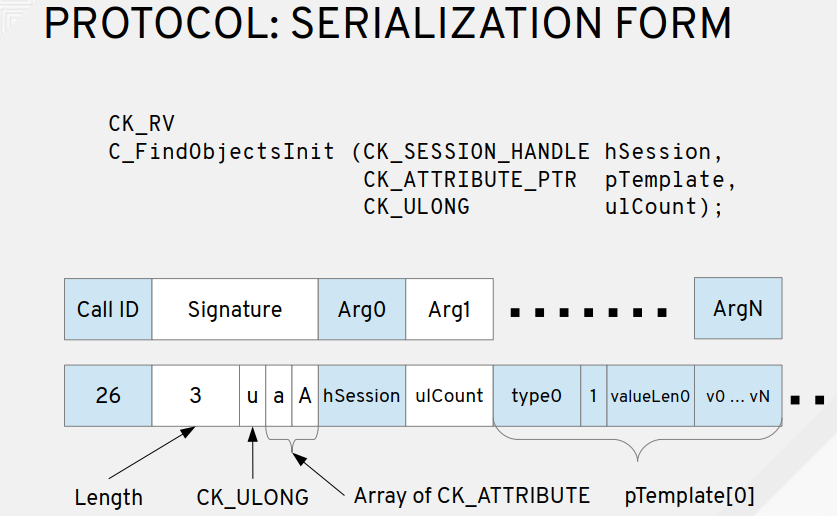

## PKCS11 Terminology

### Cryptoki

Cryptoki(Cryptographic Token Interfaces) is a library(dll or so file) that is provided by the cryptographic device vendors. It contains an implementation of the PLCS#11 C header files. Every cryptographic device vendor provides its own PKCS#11 complaint library. Applications has to load this library in order to access the cryptographic device.

### Slots

Slots are the logical partitions in the cryptographic device. In case of  HSMs, there could be hundreds or more slots are available while in the case of smart cards, there could be only on slot available.

### Token

Token is a device where application stores the cryptographic objects and also preform cryptographic operations. In the case of the smart cards, you can think of slot as a smart card reader while the smart card inserted inside the reader is  the token. In case of HSM, you cannot visualize the slot and token relationship just like you did in case of reader and the smart card, when a slot is initialized in HSM then the token is present in the slot.

### Session

Once a token is present in the slot then the application opens a session(logical connection) with the token. Once the session is in place, the application can perform different cryptographic operations with the token e.g. application can use the session object to generate asymmetric key pair, produce signature with the private key present inside the token and so on. When the application is done with the cryptographic operations then it can close the session with the token.

### Mechanism

In PKCS#11 terminology, cryptographic algorithm are called mechanisms e.g. RSA, AES and SHA 256 cryptographic algorithms are called mechanism.

### User

Cryptographic devices contains private and public objects. In order to  access the  private objects, users must be authenticated from the device. One of the operation that requires authentication is the access of the private key in order to produce a signature.

## HSM


## PKCS11 Tools

### OpenSC

[OpenSC]([opensc : Trusty (14.04) : Ubuntu (launchpad.net)](https://launchpad.net/ubuntu/trusty/+package/opensc)) provides a set of libraries and  utilities to access smart cards. It mainly focuses on cards that support cryptographic operations. It facilitates their use in security applications such as mail encryption, authentication, and digital signature.

### [pkcs11-tool]([Ubuntu Manpage: pkcs11-tool - utility for managing and using PKCS #11 security tokens](http://manpages.ubuntu.com/manpages/trusty/man1/pkcs11-tool.1.html))

provided by OpenSC

**Init Token**

```sh
pkcs11-tool --module /usr/local/lib/libp11sgx.so \
--init-token --label "$token" --so-pin 12345678 --init-pin --pin 12345678 \
--slot 0 
```

> lable may be same in different slot. If slot not specify，it will reset slot 0.

**Create Key Pair**

```sh
pkcs11-tool --module /usr/local/lib/libp11sgx.so  \
--login --pin 12345678  --token-label "$token"  \
--keypairgen --key-type rsa:2048 --id 0001 --label "cert-key" --usage-sign
```

> `--token-label`  can be replaced by `--token`

**Add Cert to HSM**

```sh
pkcs11-tool --module /usr/local/lib/libp11sgx.so \
-login --pin 12345678 --token "$token"  \
--write-object clientcrt.der --type cert --id 0001
```

**Check private Key and Cert status**

```sh
pkcs11-tool --module /usr/local/lib/libp11sgx.so \
--login --pin 12345678  -O  --token "$token"
```

**List  slots**

```sh
pkcs11-tool --module /usr/local/lib/libp11sgx.so -L 
```


### p11req

[Mastercard/pkcs11-tools](https://github.com/Mastercard/pkcs11-tools) A set of tools to manage objects on PKCS#11 cryptographic tokens. Compatible with any PKCS#11 library, including NSS. 

```sh
p11req -l /usr/local/lib/libp11sgx.so -i cert-key -d '/CN=sgx-1'  -t "$token"   -p 12345678 -o new.csr

# -i label/alias of the key
```


### p11tool

```sh
# p11tool GnuTLS PKCS#11 tool
apt-get install gnutls-bin
```

Usage

```sh
# list tokens
p11tool --list-tokens
```


```sh
Token 1:
        URL: pkcs11:model=PKCS%2315%20emulated;manufacturer=Common%20Access%20Card;serial=000058bd002c19b5;token=CAC%20II
        Label: CAC II
        Type: Hardware token
        Flags: RNG, Requires login
        Manufacturer: Common Access Card
        Model: PKCS#15 emulated
        Serial: 000058bd002c19b5
        Module: opensc-pkcs11.so

# /usr/lib/x86_64-linux-gnu/opensc-pkcs11.so
```


### p11-kit


Github: https://github.com/p11-glue/p11-kit

PDF: https://archive.fosdem.org/2017/schedule/event/smartcard_forwarding/attachments/slides/1796/export/events/attachments/smartcard_forwarding/slides/1796/pkcs11_remoting.pdf


**Install p11-kit-module**

```sh
sudo apt install p11-kit
sudo apt install p11-kit-modules
```


```sh
p11-kit server --provider /usr/lib/x86_64-linux-gnu/opensc-pkcs11.so "pkcs11:model=PKCS%2315%20emulated;manufacturer=Common%20Access%20Card;serial=000058bd002c19b5;token=CAC%20II"
```


#### **Forwarding a sgx-ctk** 

```sh
p11-kit server --provider /usr/local/lib/libp11sgx.so "pkcs11:model=SGXHSM%20v2;manufacturer=SGXHSM%20project;serial=b326ab0138ada9cb;token=sgx-1" -f

# use ssh to forward a unix socket
ssh -R /run/user/1000/p11-kit/pkcs11:${P11_KIT_SERVER_ADDRESS#*=} ubuntu@sdewan

pkcs11-tool --module /lib/x86_64-linux-gnu/pkcs11/p11-kit-client.so -L


pkcs11-tool --module /usr/lib/p11-kit-client.so -L
pkcs11-tool --module /usr/lib/p11-kit-client.so  --login --pin 12345678 -O --token sgx-1

pkcs11-tool --module /usr/local/lib/pkcs11/p11-kit-client.so -L
```


#### Implementation

Define protocol that serializes smart card access

Expose the protocol at a unix domain socket

Forward the socket with ssh




#### Debug

Set the Value of  to print the debug log

```sh
export P11_KIT_STRICT=yes;export P11_KIT_DEBUG=all;
unset P11_KIT_STRICT P11_KIT_DEBUG;
# for openwrt neet to install opkg install opensc-utils-pkcs11-tool
```


**Install**

```sh
sudo cp ./.libs/libp11-kit.so.0 /lib//x86_64-linux-gnu/libp11-kit.so.0
sudo cp ./.libs/libp11-kit.so.0.3.0 /lib//x86_64-linux-gnu/libp11-kit.so.0.3.0


# for openwrt 
opkg install opensc-utils-pkcs11-tool p11-kit
```


#### Client

```sh
rpc_C_Initialize
rpc_C_GetSlotList
rpc_C_GetTokenInfo
rpc_C_Openssion
rpc_C_Login
rpc_C_FindObjectsInit
rpc_C_FindObjects
rpc_C_GetAttributeValue
rpc_C_FindObjectFinal
rpc_C_CloseSession
rpc_C_Finalize
```

#### Server

```sh
rpc_C_Initialize
managed_C_Initialize
proxy_C_Initialize
rpc_C_GetSlotList
rpc_C_GetTokenInfo
rpc_C_OpenSession
rpc_C_Login
rpc_C_FindObjectsInit
rpc_C_FindObjects
rpc_C_GetAttributeValue
rpc_C_FindObjectsFinal
rpc_C_CloseSession
rpc_C_Finalize
```


p11-kit implements most of the PKCS#11 interfaces through an RPC protocol(self desigend) between client-side and server-side. If, based on the p11-kit protocol and changed the protocol to grpc, maybe need to rewrite the p11-kits rpc-message.c .

## Build virt_cacard

[virt_card](https://github.com/Jakuje/virt_cacard) using libcacard, vitualsmartcard's vpcd and [softhsm2](https://fossies.org/linux/softhsm/README.md) to provide PCSC accessible virtual smart card.

```sh
# install essential dependency, libcacard & softhsm2
sudo apt update
sudo apt install  build-essential libgmp-dev libunbound-dev libldns-dev libtool -y
sudo apt install libcacard-dev libglib2.0-dev softhsm2 gnutls-bin libnss3-tools -y
```

Build & Install [vsmartcard](https://frankmorgner.github.io/vsmartcard/virtualsmartcard/README.html)

```sh
sudo apt-get install -y help2man libpcsclite-dev
git clone https://github.com/frankmorgner/vsmartcard.git
cd vsmartcard/virtualsmartcard
autoreconf --verbose --install
./configure --sysconfdir=/etc
make
sudo make install
```

Build & Install virt_card

```sh
cd ~
sudo apt install opensc
git clone https://github.com/Jakuje/virt_cacard.git
cd virt_cacard
./autogen.sh
./configure
make
```

configure softhsm with default certificates and start virt_cacard

```sh
./setup-softhsm2.sh
export SOFTHSM2_CONF=/home/ubuntu/virt_cacard/softhsm2.conf &&./virt_cacard
```

After that you should be able to access virtual smart card through OpenSC:

```sh
pkcs11-tool -L
```


## PKCS11 Remote Forward


A solution for Smart Card Remoting. The tool named p11-kit, a redhat's project.

If we use p11-kit as the solution of HSM forwarding, as is shown in the picture. The StrongSwan uses the p11-kit-client.so directly, this is a standard PKCS#11 interface. And the p11-kit-client will call the p11-kit socket server to interact with the CTK.

 The p11-kit client connects with the p11-kit server through socket with a self-designed protocol.  For StrongSwan, the p11-kit is transparent. Like direct call the CTK dynamic library.

And, the ubuntu container has an HTTP server to provide RESTful API to Initialize the token, Create Keypair and generate CSR. 


And, if  we use p11-kit , we need to make some changes of the p11-kit code to make it fit with CTK.

- CTK does not support application provided function pointers or callbacks and mutexes.
  - **C_Initialize**: The members *CreateMutex*, *DestroyMutex*, *LockMutex* and *UnlockMutex* in CK_C_INITIALIZE_ARGS are not supported and must be set to NULL_PTR.
  - **C_OpenSession**: The members *pApplication* and *Notify* are not supported and must be set to NULL_PTR.
- Change the socket module, from unix domain socket(+ ssh)  to internet dmain socket. 


### P11-kit

- Modify `initialize arguments` of sever-side and change the `unix socket path`.
- `Cross complie` p11-kit-clinet.so through openwrt SDK.

### CTK
- Build and install CTK in ubuntu container.  `280M`

### CNF Pod

- enable pkcs11 for strongswan `opkg instsall strongswan-mod-pkcs11`
- add `p11-kit-client.so` and install libffi `opkg install libffi`
- add default env ` P11_KIT_SERVER_ADDRESS="unix:path=/tmp/p11-kit/p11-kit-server-sgx"`


### Configuration of StrognSwan

#### Init Token & Create Cert

```sh
#!/bin/bash

set -ex

token="sgx-1"
key_pair_id="0001"
key_pair_label="cert-key"
subject='/CN=sgx-2'


# Init Token
pkcs11-tool --module /usr/local/lib/libp11sgx.so \
--init-token --label "${token}" --slot 0 --so-pin 12345678 --init-pin --pin 12345678

# Create Key Pair
pkcs11-tool --module /usr/local/lib/libp11sgx.so  --login --pin 12345678 --id ${key_pair_id} --token "$token"  --keypairgen --key-type rsa:2048 --label ${key_pair_label} --usage-sign

# SLOT_ID=$(pkcs11-tool --module /usr/local/lib/libp11sgx.so -L|grep 'Slot 0'|grep 'SGXHSM slot ID'| awk '{print $7}')

# Create csr, cert-key is the private lable
# p11req -l /usr/local/lib/libp11sgx.so -i cert-key -d '/CN=sgx-node'  -s  $SLOT_ID  -p 12345678 > new.csr

p11req -l /usr/local/lib/libp11sgx.so -i cert-key -d '${subject}'  -t "$token"   -p 12345678 -o new.csr


# Issuer the cert from root CA
openssl x509 -req -days 365 -CA caCert.pem -CAkey caKey.pem -set_serial 1 -in new.csr -out client.crt

# Transfer to DER form
openssl x509 -in client.crt -outform DER -out clientcrt.der

# Add cert to HSM
pkcs11-tool --module /usr/local/lib/libp11sgx.so \
-login --pin 12345678 --login-type user --token "$token"   --write-object clientcrt.der --type cert --id ${key_pair_id}

# Check private Key and Cert status
pkcs11-tool --module /usr/local/lib/libp11sgx.so --login --pin 12345678  -O  --token "$token"

echo ">>>>>>>> slot id: $SLOT_ID"

SERIAL_NUM=$(pkcs11-tool --module /usr/local/lib/libp11sgx.so -L |awk 'NR==9{print $4}')
echo ">>>>>>>> serial num: $SERIAL_NUM"

export P11_KIT_STRICT=yes;export P11_KIT_DEBUG=all;
# unset P11_KIT_STRICT P11_KIT_DEBUG

p11-kit server --provider /usr/local/lib/libp11sgx.so \
"pkcs11:model=SGXHSM%20v2;manufacturer=SGXHSM%20project;serial=$SERIAL_NUM;token=sgx-1" -f

```


#### strongswan.conf

```sh
# /etc/strongswan.d/charon/pkcs11.conf
echo 'pkcs11 {
    load = yes
    modules {
        ctk{
                path=/usr/lib/p11-kit-client.so 
                os_locking=yes
                load_certs=yes
        }
    }
}' | sudo tee /etc/strongswan.d/charon/pkcs11.conf
```

#### ipsec.secret & ipsec.conf

This is a legacy configuration, is deprecated, but ... used in openwrt

**ipsec.secret**

```sh
# /etc/ipsec.secrets
: PIN %smartcard:0001 "12345678"
 #                key-pair id
```

ipsec.conf

```sh
# /etc/ipsec.conf
# server
conn common-con  
  left=%any
  right=%any
  ikelifetime=3h
  lifetime=1h
  margintime=9m
  keyingtries=%forever
  dpdaction=restart
  dpddelay=30s
  leftauth=pubkey
  rightauth=pubkey
  leftcert=%smartcard:0001
  leftsendcert=yes
  rightsendcert=yes
  rightsourceip=192.168.0.1
  auto=start
  leftid="CN=node-1"
  rightid="CN=node-2"
  leftupdown=/etc/updown
  keyexchange=ikev2
  mark=30
  esp=aes128-sha256-modp3072,aes256-sha256-modp3072
  ike=aes128-sha256-modp3072,aes256-sha256-modp3072
  type=tunnel

# client
conn common-con
  left=%any
  right=10.233.76.147
  leftsourceip=%config
  ikelifetime=3h
  lifetime=1h
  margintime=9m
  keyingtries=%forever
  dpdaction=restart
  dpddelay=30s
  closeaction=restart
  leftauth=pubkey
  rightauth=pubkey
  leftcert=%smartcard:0001
  leftsendcert=yes
  rightsendcert=yes
  auto=start
  leftid="CN=node-2"
  rightid="CN=node-1"
  keyexchange=ikev2
  esp=aes128-sha256-modp3072,aes256-sha256-modp3072
  ike=aes128-sha256-modp3072,aes256-sha256-modp3072
  type=tunnel

```


#### swanct.conf

You can use `swanctl.conf` to replace the `ipsec.conf`

```sh
# /etc/swanctl/conf.d/con.conf
connections {
    pkcs11-demo{   # connection name
       # remote_addrs = 10.233.76.179
       pools = client_pool

       local {
           auth = pubkey
           cert1{
               handle=0001
               slot=0x11
               module=ctk
           }
       }
       remote {
           auth = pubkey
           id = "CN=sgx-2"
       }
       children {
           pkcs11-demo {
               start_action = trap
           }
       }
    }
}

pools{
    client_pool{
        addrs=192.168.0.1
    }
}

secrets{
    token_1{
        handle=0001
        slot=0x11
        module=ctk
        pin=12345678
    }
}


```


### ToDo

- [x]  golang server to init token, only once, and create unix socket fd, set mod to 777.
- [x] create key pair , specify a key-pair-id and label.
- [x] generate a csr.
- [x] add the cert to the slot with key-pair-id and label.
- [ ] lua, add cert config to `ipsec.secret`
- [x]  do not re-create key pair if existed with a same name.
- [x]  define err code when add cert encounter error.


### RESTful API

#### HSM: Create Key-Pair and Generate CSR

```sh
 # token info, this is a default token, don't change any field
 # key-pair label, for
  
 curl --location --request POST 'http://sdewan-:8081/pkcs11/csr' \
--header 'Content-Type: application/json' \
--data-raw '{
    "token": {
        "label": "sdewan-sgx",  
        "slot": 0,               
        "so_pin": "12345678",
        "pin": "12345678"
    },
    "cert": {
        "key_pair": {
            "key_type": "rsa:2048",
            "label": "node-1", 
            "id": "0001"
        },
        "subject": "/CN=node-1",
        "pem": ""
    }
}'

# response  string, code 200
-----BEGIN CERTIFICATE REQUEST-----
MIICVjCCAT4CAQAwETEPMA0GA1UEAwwGbm9kZS0xMIIBIjANBgkqhkiG9w0BAQEF
AAOCAQ8AMIIBCgKCAQEA7ct+mdZvjeVEOtMXejtcN9HHJM3xYvk6Yddbp59/W8Vz
EUZDnfXZ32ZrarP1adLCxmcCrOb7geJYV3rfIFl/MoJFpUxR1OZWBqQGhfDpV+tW
cJltauDzgJ9+dgO3Rz/a+mSr2HIV5nmuIcfmk69cWrFGdr09G6VX+PPBS0dSbMqB
u3YwCDEgIfzA3tdOFrkcJ3olVUyT7hKimNGZzsYotxJtis28g0BxQG5GiAmrC6gH
qegCZgVkFJ2950UGvXQnfylnZHHZrGB1R9fi2P3/XrRmAsCAQZa52gOLZKWQOqUL
tAemm+IP1tvr9/AzG1jg3wCb151LUOF61q3v0E8G3QIDAQABoAAwDQYJKoZIhvcN
AQELBQADggEBAAJqarYbiNsjpogMx27jrP00BeHvTd2+22U0wP0M9G94ZornRzSX
xGxJMLib4QTIMQANrBrZNKWaBzdYFpCfbTXyYE509UMnEqGG/MZEB6M1bQWzWlh2
zLOwHx32f7OH5O2fMeNDVzBZ1pRidIqWlIlZGfMfq1KwmCoKdsQuHSWjW1dtD0Ka
tJRwnGW78vVdsetO0WgykmLO0CySS63dgnwf3Lqm0nLfzxnQ5LJ2h+UMgpEh5ygi
x66WTcRrvmkYTLivv5mNm4XS6o2NMw95HfKKJbdj+kqHISHZWGCDqPr1+Z0jjfXW
CZ01fouDJIXLehgw62ol7TsuKC1CvUkVUiI=
-----END CERTIFICATE REQUEST-----
```


#### HSM: Add Cert to SGX  token

```sh
curl --location --request POST 'http://127.0.0.1:8081/pkcs11/cert' \
--header 'Content-Type: application/json' \
--data-raw '{
    "token": {
        "label": "sdewan-sgx",
        "slot": 0,
        "so_pin": "12345678",
        "pin": "12345678"
    },
    "cert": {
        "key_pair": {
            "key_type": "rsa:2048",
            "label": "node-1",
            "id": "12345678"
        },
        "subject": "/CN=node-1",
        "pem": "LS0tLS1CRUdJTiBDRVJUSUZJQ0FURS0tLS0tCk1JSUM3VENDQWRXZ0F3SUJBZ0lSQUt2WkVWRkJ1Z0FsWVljbW03M3RqVGN3RFFZSktvWklodmNOQVFFTEJRQXcKRURFT01Bd0dBMVVFQXhNRmMyUjNZVzR3SGhjTk1qSXdOREU0TURJd05URXhXaGNOTWpRd05ERTNNREl3TlRFeApXakFRTVE0d0RBWURWUVFERXdWelpIZGhiakNDQVNJd0RRWUpLb1pJaHZjTkFRRUJCUUFEZ2dFUEFEQ0NBUW9DCmdnRUJBTUZ4NzNPOVd2SGdkYW5uVkJoME5XSHNpWVZWRTdiRm1EVWIyZ0p2Y282UkRxa3Z0VVg3alJHVlIwZDEKZXptdW9CUlptRHI0Nmp1TWFWUlo4S283WERBbU1MZUNMak1OcmhxT3hkbUFhSWJXSUlmM2FsQThXTjM4NDcvWAptMEgzcFRYSTZCT3FwRG1PYTRsc3c4aU8rRkpFa3VNMCtOU041UzNFaEsyQzR4dVE1cjRrZ1NZeUM3eUpraE5wClhKVkQyVTVQVmpTTlV3dCtld0FJMmVIOUY2RTd5VUgrRStyMEVDajZzWjQ0d2VvL2pOTElObGhCNUJwdmp4MGwKS2JCcWNreURsS0FOODJvNWsranR4MHZSVGg3NDZTcFRKemYwYmE4M0xvNFkwMldiVWFUVzMzOE5FdVM3bGRjZgpKRENMZnV3UnpNa1c5ajYzMmJVTFVFWnJWRGNDQXdFQUFhTkNNRUF3RGdZRFZSMFBBUUgvQkFRREFnS2tNQThHCkExVWRFd0VCL3dRRk1BTUJBZjh3SFFZRFZSME9CQllFRktZZ3RiV2hncG1kRWFrQlBIVm9nek0xYnMyV01BMEcKQ1NxR1NJYjNEUUVCQ3dVQUE0SUJBUUJuNjRIZ2lQVDVWWGVjU2doL1ZqZVVEY1EyRENKODdoYlNlc3RRZEtWZApoTHBIcy9zamw0MHF1NUZUV1Q5ZzIzSW1HOHBhMmlBTkdtaDZYTmNFTDF0bXdHNmFGMjloKzYzazZJUmZNQkpoCkJPVk5odnVhZDlJNWJSUGR5akJRbUZ2NUVuWXhDdzRLc1hUcW1Za2k0QndMN3hyTTk1bjNhdmhobkdTQUlqejYKMTB4a29GRTRubC9zRGpJaXVTZnJjQ3dtdDBOdFRvZVhlTnl6SzVNOTdEdTVCd0JZNTNTa1JidUY0elRlcmJnegp2UDUxeE5Qdy9XbVpURTdhZ0k2M2pSOHhYNk5TYmlES2Fxc1dNUEw4YVV4RDR4WWxMd0VGeStHU2JsSy9EelphCnI2MFUvbVZ3YUl3aHhwcHRaY2g2OFQ2TGJyQml2dk9xSFA1UXpWRnJ6Zi9TCi0tLS0tRU5EIENFUlRJRklDQVRFLS0tLS0K"
    }
}'

# response string, code 200
success
```


test.sh

```bash
#!/bin/bash

set -x

sdewan_hsm_ip="127.0.0.1"
cert_label="node-1"
cert_subject="/CN=node-1"

curl --location --request POST "http://${sdewan_hsm_ip}:8081/pkcs11/csr" \
--header 'Content-Type: application/json' \
--data-raw "{
    \"cert\": {
        \"key_pair\": {
            \"key_type\": \"rsa:2048\",
            \"label\": \"${cert_label}\",
            \"id\": \"0001\"
        },
        \"subject\": \"${cert_subject}\",
        \"pem\": \"\"
    }
}" | tee  new.csr

openssl x509 -req -days 365 -CA caCert.pem -CAkey caKey.pem -set_serial 1 -in new.csr -out client.crt

cert="-----BEGIN CERTIFICATE-----\n$(cat client.crt|awk "NR>1{print $1}"|sed '$d'|tr -d "\n")\n-----END CERTIFICATE-----"

curl --location --request POST "http://${sdewan_hsm_ip}:8081/pkcs11/cert" \
--header 'Content-Type: application/json' \
--data-raw "{
    \"token\": {
        \"label\": \"sdewan-sgx\",
        \"slot\": 0,
        \"so_pin\": \"12345678\",
        \"pin\": \"12345678\"
    },
    \"cert\": {
        \"key_pair\": {
            \"key_type\": \"rsa:2048\",
            \"label\": \"node-1\",
            \"id\": \"12345678\"
        },
        \"subject\": \"/CN=node-1\",
        \"pem\": \"${cert}\"
    }
}"

```


#### Lua: Add configuration to ipsec.secret

```sh
```


### Squash Docker Image

| Name | Size   | Target Size | Des                  |
| ---- | ------ | ----------- | -------------------- |
| CNF  | 33.6MB |             | p11-kit-client.so 9M |
| HSM  | 277 MB | < 300MB     |                      |


openWRT test

```sh
 # Cert is the cnf-default-cert
 curl "https://10-233-103-209.sdewan-system.pod.cluster.local/cgi-bin/luci/?luci_username=root&luci_password=root1" --cacert ./cert.pem
```


### static file share

```sh
docker run -d -v /home/ubuntu/qiang/images:/web -p 8888:8080 --restart=always  --name=images-halverneus/static-file-server:latest

gogs/gogs
siomiz/chrmoe
```


**Reference**

http://www.pkiglobe.org/pkcs11_terminology.html


## NAT Traversal

The NAT Traversal function penetrates firewalls or NATs. This technology is almost same to Skype's NAT Traversal, but SoftEther VPN's NAT Traversal is more optimized for the VPN-use.

Legacy IPsec-based or OpenVPN-based VPN Server cannot placed on behind the NAT, because VPN Clients must reach to the VPN Server through the Internet. Some NATs can be configured to define a "DMZ" or "Port-mapping" to relay any packets toward the outside IP address of NAT to the internal VPN Server. However it has a compatible problems. Moreover it requires a special permission by the administrator of the NAT. If your network administrator of the corporate are not cooperative to you, he hesitates to set up the NAT device to open a hole from the Internet.


