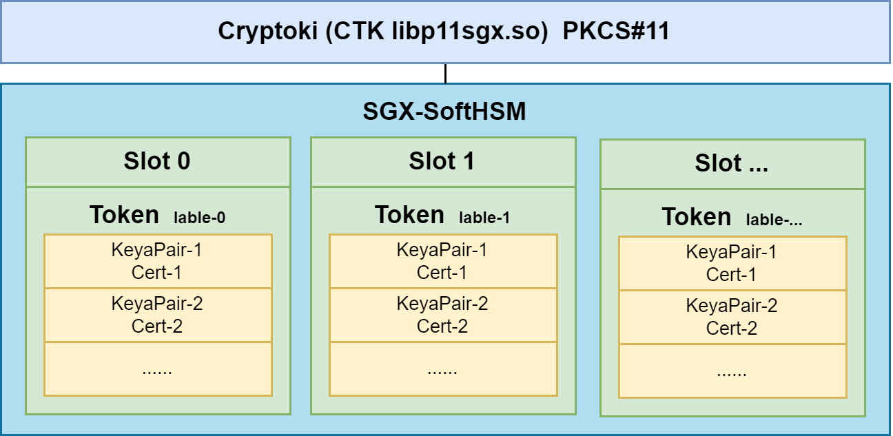

## PKCS11 Terminology

### Cryptoki

Cryptoki(Cryptographic Token Interfaces) is a library(dll or so file) that is provided by the cryptographic device vendors. It contains an implementation of the PLCS#11 C header files. Every cryptographic device vendor provides its own PKCS#11 complaint library. Applications has to load this library in order to access the cryptographic device.

### Slots

Slots are the logical partitions in the cryptographic device. In case of  HSMs, there could be hundreds or more slots are available while in the case of smart cards, there could be only on slot available.

### Token

Token is a device where application stores the cryptographic objects and also preform cryptographic operations. In the case of the smart cards, you can think of slot as a smart card reader while the smart card inserted inside the reader is  the token. In case of HSM, you cannot visualize the slot and token relationship just like you did in case of reader and the smart card, when a slot is initialized in HSM then the token is present in the slot.

### Session

Once a token is present in the slot then the application opens a session(logical connection) with the token. Once the session is in place, the application can perform different cryptographic operations with the token e.g. application can use the session object to generate asymmetric key pair, produce signature with the private key present inside the token and so on. When the application is done with the cryptographic operations then it can close the session with the token.

### Mechanism

In PKCS#11 terminology, cryptographic algorithm are called mechanisms e.g. RSA, AES and SHA 256 cryptographic algorithms are called mechanism.

### User

Cryptographic devices contains private and public objects. In order to  access the  private objects, users must be authenticated from the device. One of the operation that requires authentication is the access of the private key in order to produce a signature.

## HSM




## PKCS11 Tools

### OpenSC

[OpenSC]([opensc : Trusty (14.04) : Ubuntu (launchpad.net)](https://launchpad.net/ubuntu/trusty/+package/opensc)) provides a set of libraries and  utilities to access smart cards. It mainly focuses on cards that support cryptographic operations. It facilitates their use in security applications such as mail encryption, authentication, and digital signature.

### [pkcs11-tool]([Ubuntu Manpage: pkcs11-tool - utility for managing and using PKCS #11 security tokens](http://manpages.ubuntu.com/manpages/trusty/man1/pkcs11-tool.1.html))

provided by OpenSC

**Init Token**

```sh
pkcs11-tool --module /usr/local/lib/libp11sgx.so \
--init-token --label "$token" --so-pin 12345678 --init-pin --pin 12345678 \
--slot 0 
```

> lable may be same in different slot. If slot not specify，it will reset slot 0.

**Create Key Pair**

```sh
pkcs11-tool --module /usr/local/lib/libp11sgx.so  \
--login --pin 12345678  --token-label "$token"  \
--keypairgen --key-type rsa:2048 --id 0001 --label "cert-key" --usage-sign
```

> `--token-label`  can be replaced by `--token`

**Add Cert to HSM**

```sh
pkcs11-tool --module /usr/local/lib/libp11sgx.so \
-login --pin 12345678 --token "$token"  \
--write-object clientcrt.der --type cert --id 0001
```

**Check private Key and Cert status**

```sh
pkcs11-tool --module /usr/local/lib/libp11sgx.so \
--login --pin 12345678  -O  --token "$token"
```

**List  slots**

```sh
pkcs11-tool --module /usr/local/lib/libp11sgx.so -L 
```


### p11req

[Mastercard/pkcs11-tools](https://github.com/Mastercard/pkcs11-tools) A set of tools to manage objects on PKCS#11 cryptographic tokens. Compatible with any PKCS#11 library, including NSS. 

```sh
p11req -l /usr/local/lib/libp11sgx.so -i cert-key -d '/CN=sgx-1'  -t "$token"   -p 12345678 -o new.csr

# -i label/alias of the key

```


### p11tool

```sh
# p11tool GnuTLS PKCS#11 tool
apt-get install gnutls-bin
```

Usage

```sh
# list tokens
p11tool --list-tokens
```


```sh
Token 1:
        URL: pkcs11:model=PKCS%2315%20emulated;manufacturer=Common%20Access%20Card;serial=000058bd002c19b5;token=CAC%20II
        Label: CAC II
        Type: Hardware token
        Flags: RNG, Requires login
        Manufacturer: Common Access Card
        Model: PKCS#15 emulated
        Serial: 000058bd002c19b5
        Module: opensc-pkcs11.so

# /usr/lib/x86_64-linux-gnu/opensc-pkcs11.so
```


### p11-kit


Github: https://github.com/p11-glue/p11-kit

PDF: https://archive.fosdem.org/2017/schedule/event/smartcard_forwarding/attachments/slides/1796/export/events/attachments/smartcard_forwarding/slides/1796/pkcs11_remoting.pdf


A solution for Smart Card Remoting. The tool named p11-kit, a redhat's project.

If we use p11-kit as the solution of HSM forwarding, as is shown in the picture. The StrongSwan uses the p11-kit-client.so directly, this is a standard PKCS#11 interface. And the p11-kit-client will call the p11-kit socket server to interact with the CTK.

 The p11-kit client connects with the p11-kit server through socket with a self-designed protocol.  For StrongSwan, the p11-kit is transparent. Like direct call the CTK dynamic library.

And, the ubuntu container has an HTTP server to provide RESTful API to Initialize the token, Create Keypair and generate CSR. 


And, if  we use p11-kit , we need to make some changes of the p11-kit code to make it fit with CTK.

- CTK does not support application provided function pointers or callbacks and mutexes.
  - **C_Initialize**: The members *CreateMutex*, *DestroyMutex*, *LockMutex* and *UnlockMutex* in CK_C_INITIALIZE_ARGS are not supported and must be set to NULL_PTR.
  - **C_OpenSession**: The members *pApplication* and *Notify* are not supported and must be set to NULL_PTR.
- Change the socket module, from unix domain socket(+ ssh)  to internet dmain socket. 


**Install p11-kit-module**

```sh
sudo apt install p11-kit
sudo apt install p11-kit-modules
```


```sh
p11-kit server --provider /usr/lib/x86_64-linux-gnu/opensc-pkcs11.so "pkcs11:model=PKCS%2315%20emulated;manufacturer=Common%20Access%20Card;serial=000058bd002c19b5;token=CAC%20II"
```


**Forwarding a sgx-ctk** 

```sh
p11-kit server --provider /usr/local/lib/libp11sgx.so "pkcs11:model=SGXHSM%20v2;manufacturer=SGXHSM%20project;serial=b326ab0138ada9cb;token=sgx-1" -f

ssh -R /run/user/1000/p11-kit/pkcs11:${P11_KIT_SERVER_ADDRESS#*=} ubuntu@sdewan

pkcs11-tool --module /lib/x86_64-linux-gnu/pkcs11/p11-kit-client.so -L
pkcs11-tool --module ./.lib/p11-kit-client.so -L
```


#### Implementation

Define protocol that serializes smart card access

Expose the protocol at a unix domain socket

Forward the socket with ssh


#### Debug

Set the Value of  to print the debug log

```sh
export P11_KIT_STRICT=yes;
export P11_KIT_DEBUG=all;
```


**Install**

```sh
sudo cp ./.libs/libp11-kit.so.0 /lib//x86_64-linux-gnu/libp11-kit.so.0
sudo cp ./.libs/libp11-kit.so.0.3.0 /lib//x86_64-linux-gnu/libp11-kit.so.0.3.0
```


#### Client

```sh
rpc_C_Initialize
rpc_C_GetSlotList
rpc_C_GetTokenInfo
rpc_C_Openssion
rpc_C_Login
rpc_C_FindObjectsInit
rpc_C_FindObjects
rpc_C_GetAttributeValue
rpc_C_FindObjectFinal
rpc_C_CloseSession
rpc_C_Finalize
```

#### Server

```sh
rpc_C_Initialize
managed_C_Initialize
proxy_C_Initialize
rpc_C_GetSlotList
rpc_C_GetTokenInfo
rpc_C_OpenSession
rpc_C_Login
rpc_C_FindObjectsInit
rpc_C_FindObjects
rpc_C_GetAttributeValue
rpc_C_FindObjectsFinal
rpc_C_CloseSession
rpc_C_Finalize
```


p11-kit implements most of the PKCS#11 interfaces through an RPC protocol(self desigend) between client-side and server-side. If, based on the p11-kit protocol and changed the protocol to grpc, maybe need to rewrite the p11-kits rpc-message.c .

## Build virt_cacard

[virt_card](https://github.com/Jakuje/virt_cacard) using libcacard, vitualsmartcard's vpcd and [softhsm2](https://fossies.org/linux/softhsm/README.md) to provide PCSC accessible virtual smart card.

```sh
# install essential dependency, libcacard & softhsm2
sudo apt update
sudo apt install  build-essential libgmp-dev libunbound-dev libldns-dev libtool -y
sudo apt install libcacard-dev libglib2.0-dev softhsm2 gnutls-bin libnss3-tools -y
```

Build & Install [vsmartcard](https://frankmorgner.github.io/vsmartcard/virtualsmartcard/README.html)

```sh
sudo apt-get install -y help2man libpcsclite-dev
git clone https://github.com/frankmorgner/vsmartcard.git
cd vsmartcard/virtualsmartcard
autoreconf --verbose --install
./configure --sysconfdir=/etc
make
sudo make install
```

Build & Install virt_card

```sh
cd ~
sudo apt install opensc
git clone https://github.com/Jakuje/virt_cacard.git
cd virt_cacard
./autogen.sh
./configure
make
```

configure softhsm with default certificates and start virt_cacard

```sh
./setup-softhsm2.sh
export SOFTHSM2_CONF=/home/ubuntu/virt_cacard/softhsm2.conf &&./virt_cacard
```

After that you should be able to access virtual smart card through OpenSC:

```sh
pkcs11-tool -L
```


## Init CTK


```sh
#!/bin/bash

set -ex


MODULE=
token="sgx-1"
key_pair="key-pair-1"


# Init Token
pkcs11-tool --module /usr/local/lib/libp11sgx.so \
--init-token --label "$token" --slot 0 --so-pin 12345678 --init-pin --pin 12345678

# Create Key Pair
pkcs11-tool --module /usr/local/lib/libp11sgx.so  --login --pin 12345678 --id 0001 --token "$token"  --keypairgen --key-type rsa:2048 --label "key-1" --usage-sign


pkcs11-tool --module ./.libs/p11-kit-client.so  --login --pin 12345678 --id 0002 --token "$token"  --keypairgen --key-type rsa:2048 --label "key-2" --usage-sign

# Generate CSR
p11req -l /usr/local/lib/libp11sgx.so -i $key_pair -d '/CN=sgx-1'  -t "$token"   -p 12345678 -o new.csr


# Issuer the cert from root CA
openssl x509 -req -days 365 -CA caCert.pem -CAkey caKey.pem -set_serial 1 -in new.csr -out client.crt

# Transfer to DER form
openssl x509 -in client.crt -outform DER -out clientcrt.der

# Add cert to HSM
pkcs11-tool --module /usr/local/lib/libp11sgx.so \
-login --pin 12345678 --login-type user --token "$token"   --write-object clientcrt.der --type cert --id 0001

# Check private Key and Cert status
pkcs11-tool --module /usr/local/lib/libp11sgx.so --login --pin 12345678  -O  --token "$token"

```


## PKCS11 API


**Reference**

http://www.pkiglobe.org/pkcs11_terminology.html


