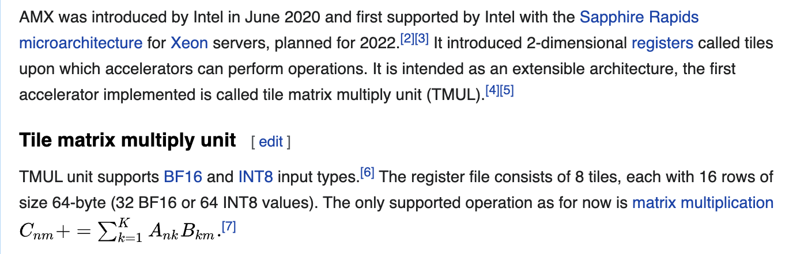
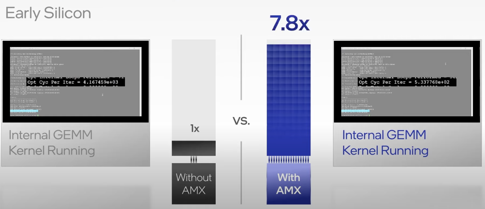
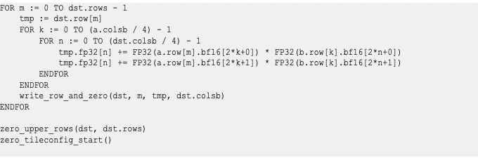
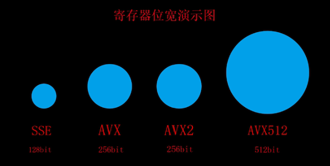
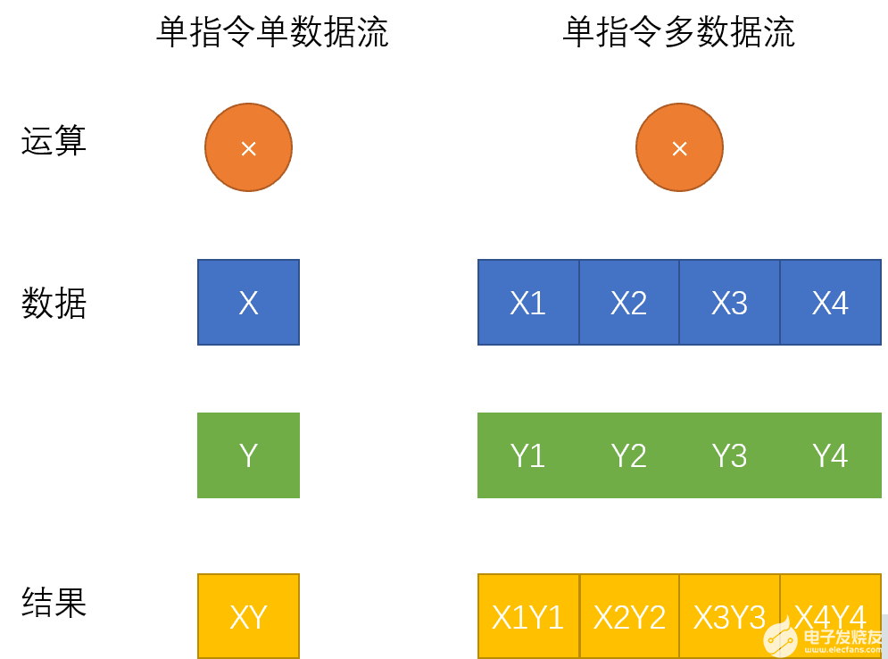
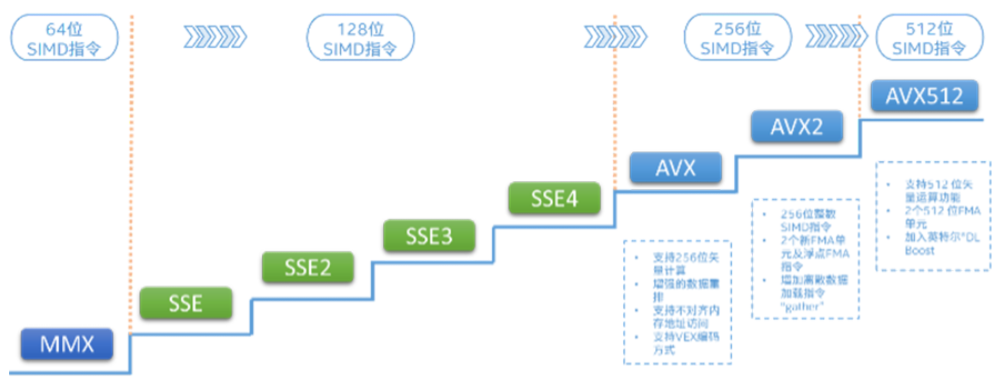

- Introduce SIMD   单指令数据-> 
- 


VNNI/INT8






## Intrinsics for Intel(R) Advanced Matrix Extension Instructions

Intel Advanced Matrix Extension is a new 64-bit programming paradigm consisting of two components:

- A set of 2-dimensional registers(tiles) representing sub-arrays from a larger 2-dimensional memory image
- Am accelerator that is able to operate on tiles; the first implementation of this accelerator is called TMUL(tile matrix multiply unit)

### Intrinsic for Intel Advanced Matrix Extension AMX-BF16 Instructions

This intrinsic supports tile computational operations on bfloat16 number.

#### _tile_dpbf16ps

**Synopsis**

```
void _tile_dpbf16ps (__tile dst, __tile a, __tile b)
```


**Description**

Compute dot-product of BF16(16-bit) floating-point pairs in tiles "a" and "b", accumulating the intermediate single-precision(32-bit) floating-point elements with elements with elements in "dst", and store the 32-bit result back to tile "dst".

**Operation**




AVX  Advanced Vector Extension

AVX 也是SIMD指令， 单指令多数据

SIMD Single Instruction Multi Data

寄存器位宽 演示图



https://gyazo.com/51d14424f81c80ae77ea790bfcc92d0d


###### How AVX Solve it 

1. AVX2 AVX256    8*32    8个32位浮点书运算    16FLOPs/cycle/FMA（运算器，cpu架构）      32 FLOps/cycle/core
2.    16 个32位浮点数运算，
3.    2x 16 个32位的浮点运算


BF16 就是 16位的浮点数


###### Sapphire Rapids with high Bandwidth Memory

内存带宽需求较高的负载有卓越的性能提高. 提高了Cache的利用率。


AVX2  is enough


AVX 512 授权AMD


浮点数学运算，

更多的是通过GPU实现2


2008 年，英特尔在 Sandy Bridge 酷睿 CPU 架构推出的同时发布了 AVX 指令集（Advanced Vector Extension，高级矢量扩展指令集），聚焦矢量运算，AVX 很快形成了一套完整的单指令多数据指令集规范，一些版本也得到了 AMD 的支持。

2013 年，英特尔发布了 AVX-512 指令集，其指令宽度扩展为 512bit，每个时钟周期内可打包 32 次双精度或 64 次单精度浮点运算，因此在图像 / 音视频处理、数据分析、科学计算、数据加密和压缩和深度学习等应用场景中，会带来更强大的性能表现，理论上浮点性能翻倍，整数计算则增加约 33% 的性能。


Intel 新一代 CPU 将限制包括 AVX-512 在内的指令集只能运行在大核芯片上


单指令数据流

$$X* Y$$

多指令数据流







英特尔AVX-512VNNI(VectorNeural NetworkInstructions)是英特尔深度学习加速一项重要的内容，也是对标准英特尔AVX-512指令集的扩展。可以将三条指令合并成一条指令执行，更进一步的发挥新一代英特尔至强可扩展处理器的计算潜能，提升**INT8模型**的推理性能。目前第2代和第3代英特尔至强可扩展处理器均支持英特尔VNNI。


AVX 引入了一种称为 VEX 编码方案的三操作数 SIMD 指令格式，其中目标寄存器与两个源操作数不同。例如，使用传统的双操作数形式 a ← a + b 的 SSE 指令现在可以在 a + b ←使用非破坏性三操作数形式 c，从而保留两个源操作数。最初，AVX 的三操作数格式仅限于具有 SIMD 操作数 （YMM） 的指令，并且不包括具有通用寄存器（例如 EAX）的指令。它后来用于在后来的扩展（如BMI）中的通用寄存器上编码新指令。VEX 编码还用于在 AVX-512 中引入的 k0-k7 掩码寄存器上运行的指令。


8维及以下的64位双精度浮点矢量或者16维及以下的单精度浮点矢量。也支持8维的64位整数矢量，16维的32位整数矢量 作者：硬件老哥哥 https://www.bilibili.com/read/cv9689142 出处：bilibili


浮点性能提升


提高整数和浮点运算性能。

解压缩，排序算法

视频编码，3D建模，浮点运算性能


AVX512 16个32bit 或者 8 个64bit的数据


双发射AVX 512， 

但发射 AVX512，


https://gyazo.com/88d101c5bb5ae241144f37fdddd0c02f


- 深度学习 图片降噪


- 高性能计算 250 万位圆周率计算

最大寄存器位宽


AMX 的release的time是2022， 估计现在市面上还没有support的CPU可以用来测试。

所有找了一个AVX512 的code demo. 然后通过AVX512 介绍一下SIMD的使用

再这个示例中是计算两个向量，并把结果写道第三个向量中。

这里定义了ABC3个向量，每个向量都是8个64位浮点数。刚好是512 bit. 每个向量刚好存入一个AVX512寄存器。

右边的这个汇编就是 AVX512 计算两个向量和的实现。 第一行就是把向量A从内存中加载到寄存器0，第二行，就是计算zmm0和内存中向量B的和，并存入zmm0中。第三行就是把zmm0寄存器的值写入到向量C。 这样就得到了计算结果。如果使用SISD命令，就需要对每一个数据单独相加。

接下来我们看下通过调试器来看下 AVX512 寄存器中zmm0中的数据情况，向量A 加载到zmm0的时候，这里可以看到AVX512 支持 的数据类型要远远多于AMX。

接下来我们看一个AMX的指令。_tile_spbf16()

这条指令就是计算两个BF16的点成

AVX 和AMX现在大部分应用场景都是用在机器学习，深度学习 领域，处理一些大规模的矩阵计算。这部分已经有很多人做了很多工作，所以 如果在这方面去做一些基于AMX的或AVX的专利和改进会比较困难。于是我们选择了数据处理这个方向。

在数据处理这个方向。我想简单介绍一下时序数据。通过这张图，大家可能会对时序数据有个初步的概念。

时序数据的吞吐量是非常大的，尤其是IoT设备，设备的规模可能达到千万上亿，数据自动生成，假设1s采样一次，每秒千万、亿级别的数据写入。

在大写入吞吐量的情况下，数据的实时性要求也很高。例如，将时序数据的统计量关联做监控、报警，能容忍的延迟可能在秒级

需要做降频采样、插值、实时计算、聚合等操作，关心的是一段时间的趋势，而不是某一特定时间的值等。

目前我们还没有具体明确要对哪一种具体的算法或者应用场景进行基于AMX的改进。只是看到了这个事情的可能性。例如说我要计算一个指标在一段时间内的均值。这个算法在将采样的过程中非常常见。这一段时间内的时序是指标。 

关于这个应用场景的，大家gan


参考文献

https://baijiahao.baidu.com/s?id=1672265837981500533&wfr=spider&for=pc

https://baijiahao.baidu.com/s?id=1729339781120838964&wfr=spider&for=pc

https://www.prowesscorp.com/what-is-intel-avx-512-and-why-does-it-matter/

https://www.elecfans.com/d/1812270.html