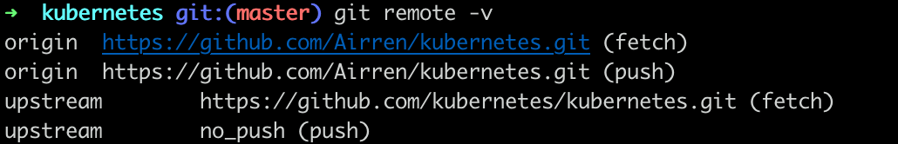

## Branch Strategy

Fork K8s 源码， 并从自己的仓库中clone到本地。设置Upstream， 跟踪K8s源码的更新

Kubernetes Project 使用标准的Github "Fork and Pull" workflow。在git中，个人Fork的仓库应该设置为"origin", 而原始项目的仓库成为"upstream"。为了保证个人分支(origin)和上游(upstream)更新保持一致，需要在你的本地仓库中完成以下设置。

### Adding Upstream

增加`upstream` 作为一个`remote`，并且配置为不可以`push`。

```sh
git remote add upstream https://github.com/kubernetes/kubernetes.git
git remote set-url --push upstream no_push
```

设置完成后可以通过`git remote -v` 检查`remote`的配置情况。



### Keeping Your Fork in sync

Fetch all the changes from `upstream` and  "rebase" them on your local `master` branch.  这将保证你的本地仓库与上游项目保持同步。Push the local changes to your `remote master`.

```sh
git fetch upstream
git checkout master
git rebase upstream/master
git push
```

You should do this minimally before creating  a new branch to work on you feature or fix.

```sh
git checkout -b myfeature
```


### Squashing Commits

The main purpose of squashing commits is to create a clean readable git history or log of the changes that were made. Usually this is done is last phase of a PR revision. If you are unsure if you should squash your commits, it its better to err on the side of having more and leave it up to the judgement of the other contributors assigned to review and approve your PR.


Perform an interactive rebase to choose which commits you want to keep and which you want to squash, then force push your branch:

```sh
# git rebase -i <commit id>
git rebase -i HEAD~3

# git push -f
git push --force
```


## Build  K8s source code


```sh
apt install rsync gcc make
```

