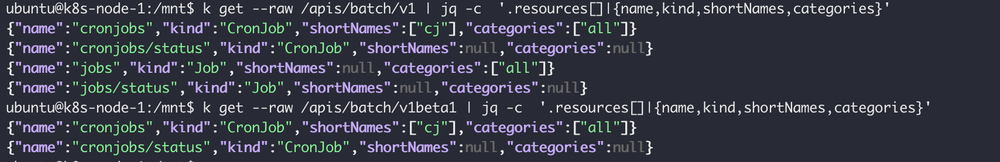
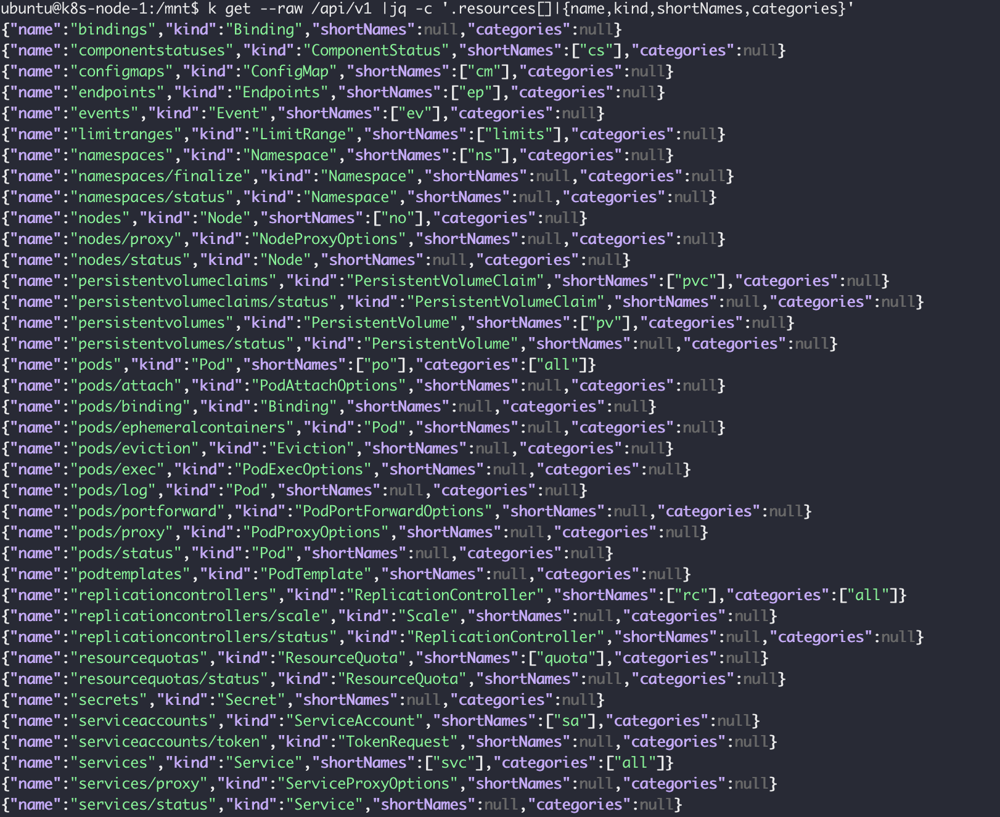
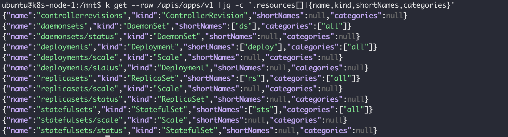

## How the API Server Process the request


API HTTP handler -> authn & authz -> Mutating adminssion -> Object schema validation -> Validating admission -> Presisting to etcd


K8s version v1.23.0


#### apis/batch

```sh
k get --raw /apis/batch/v1 | jq -c  '.resources[]|{name,kind,shortNames,categories}'
```




#### api/v1




#### apis/apps/v1




### deepcopy-gen 

deepcopy-gen 是一个自动生成DeepCopy函数的代码生成器。给定一个包的目录路径作为输入源，它可以为其生成DeepCopy相关函数，这些函数可以有效的执行每种类型的深复制操作。