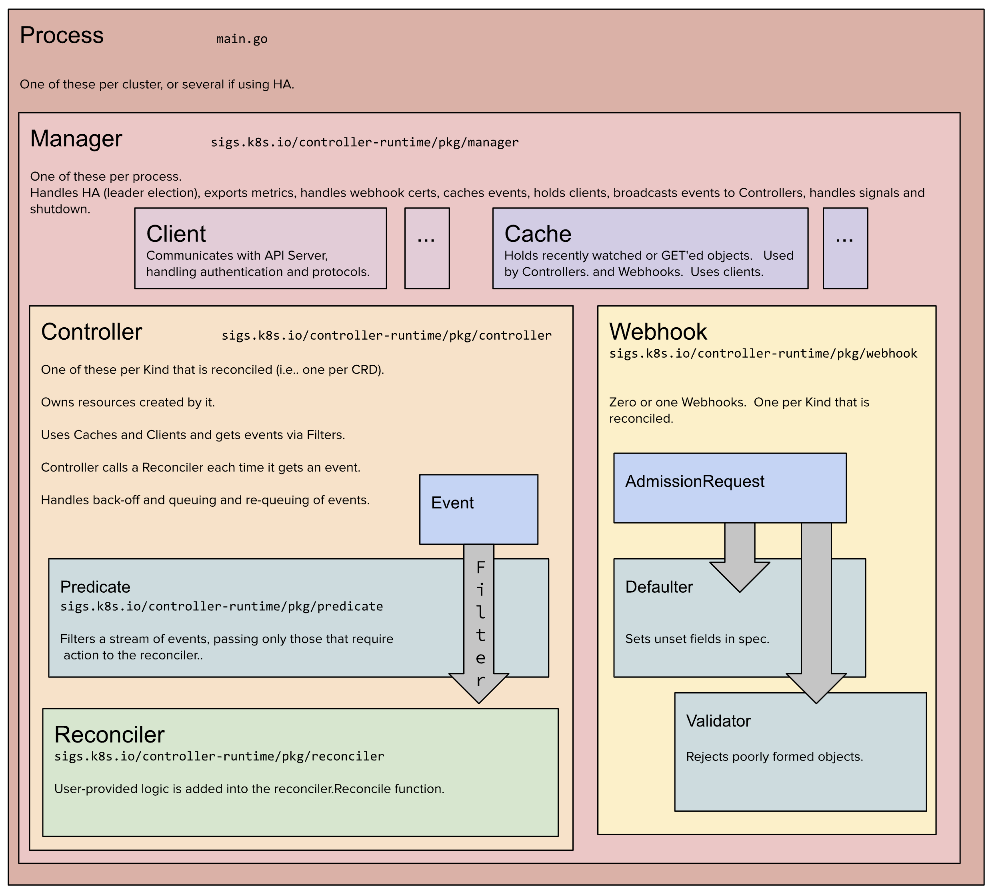

## Following sample-controller

### Bootstraping


### Business Logic

We are now in the position to implement the business logic of the custom controller. That is, we implement the state transitions between the three phases--form `PhasePending` to `PhaseRuning` to `PhaseDone`--in `controller.go`.


### processNextWorkItem()

`processNextWorkItem() bool` will read a single work item off the  workquque and attempt to process it, by calling the `syncHandler`.

```go
func (c *Controller) processNextWorkItem() bool{
    obj, shutdowon := c.workqueue.Get()
    
    if shutdown{
        return false
    }
    
    // We wrap this block in a func so we can defer c.workqueue.Done.
    err := func(obj interface{})error{
        // We call Done here so the workqueue knows we have finished processing this item.
        // We also must remeber to call Forget if we do not want this work item being
        // re-queued. For example, we do not call Forget if a transient error occurs, instead 
        // the item it put back on the workqueue and attempted again after a back-off period.
        defer c.workqueue.Done(obj)
        var key string
        var ok bool
        // We expect strings to come off the wordqueue. There are of the form namespace/name.
        // We do this as the delayed nature of the workqueue means the iterms in the informer 
        // cache may actually be more up to date then when the item was initially put on to 
        // the workqueue.
        if key,ok:=obj.(string);!ok{
            // As the item in the workqueue is actually invalid, we call Forget here else we'd
            // go into a loop of attemping to process a work item that is invalid.
            c.workqueue.Forget(obj)
            // %#v print struct and content
            ultiruntime.HandleError(fmt.Errorf("expected string in workqueue but got %#v",obj))
            return nil
        }
        // Run the syncHandler, passing it the namespace/name string of the Foo resource to
        // be synced.
        if err := c.syncHandler(key); err != nil{
            // Put the item back on the workqueue to handle any transient errors.
            c.workqueue.AddRateLimited(key)
            return fmt.Errorf("err sync '%s':'%s', requeuing",key, error.Error(jj))
        }
        // Finally, if no error occurs we Forget this item so it dose not get queued again
        // until another change happens.
        c.workqueue.Forget(obj)
        klog.Infof("Successfully synced '%s'",key)
        return nil
    }(obj)
    
    if err != nil {
        utilruntime.HandleError(err)
        return true
    }
    return true
}
```

`

### syncHandler()

`syncHandler(key string)` compares the actual state with the desired, and attempts to **converge the two**. It then updates the Status block of the Foo resource with the current status of the resource.

```go
func (c *Controller) syncHandler(key string) error{
    // Convert the namespace/name string into a distinct namespace and name.
    namespace, name, err := cache.SplitMetaNamespaceKey(key)
    if err != nil{
        utilruntime.HandleError(fmt.Errorf("invalid resource key :%s",key))
        return nil
    }
    
    // Get the Foo resource with this namespace/name
    foo, err:= c.foosLister.Foos(namespace).Get(name)
    if err != nil{
        // The foo resource may no longer exist, in which case we stop processing.
        if errors.IsNotFound(err){
            utilruntime.HandleError(fmt.Errorf("foo '%s' in working queue no longer exists"))
            return nil
        }
        return err
    }
    
    deploymentName := foo.Spec.DeploymentName
    if deploymentName == ""{
        // we choose to absord the error here as the worker would requeue 
        // the resource otherwise. Instead, the next time the resource is update the 
        // resource will be queued again.
        return nil
    }
    
    // Get the deployment with the name specified in Foo.spce
    deployment, err := c.deploymentLister.Deployments(foo.Namespace).Get(deployment)
    // If the resource doesn't exist, we'll create it
    if errors.IsNotFound(err){
        deployment, err = c.kubeclinetset.AppsV1().Deployments(foo.Namespace).
        Create(context.TODO,newDeployment(foo),metav1.CreatedOptions{})
    }
    if err != nil{
        return nil
    }
    
    // If the Deployment is not controllerd by this Foo resource, we should log 
    // a warning to the event recorder and return error msg.
    if !metav1.IsControlledBy(deployment, foo){
        msg := fmt.Sprintf(MessageResourceExists, deployment.Name)
        c.recorder.Event(foo, corev1.EventTypeWarning, ErrorResourceExists,msg)
        return fmt.Errorf("%s",msg)
    }
    
    // If this number of the replicas on the Foo resource is specified, and the number
    // does not equal the current desired replicas on the Deployment, we should updated
    // the Deployment resource
    if foo.Spce.Replicas != nil && *foo.Spec.Replicas != *deployment.Spec.Replicas{
        deployment, err != c.kubeclientset.AppsV1().Deployments(foo.Namespase).
        Update(context.TODO),newDeployment(foo),metav1.UpdateOptions{})
    }
    if err != nil{
        return err
    }
    
    err = c.updateFooStatus(foo,deployment)
    if err != nil{
        return err
    }
    c.recorder.Event(foo, corev1.EventTypeNormal, SuccessSynced,MessageResourceS)
    
}
```


## Kubebuilder

```sh
source < $(kubebuilder completion zsh)
# --repo git the git module name
kubebuilder init --domain bytegopher.com --license apache2 --owner "ByteGopher" --repo www.github.com/airren/cnat-kubebuilder


kubebuilder create api --group cnat --version v1alpha1 --kind CronJobA

# if you are editing the API definitions, generate the manifest such as Custom Resources(CRs) or Custom Resource Definitions(CRDs) using
make manifest

```


###  Architecture Concept Diagram

The following diagram will help you better understand the Kubernetes concepts and architecture.

###### Process main.go

One of these per cluster, or several if using HA.

###### Manger  sigs.k8s.io/controller-runtime/pkg/manger

One of these per process.

Handles HA(leader election), exports metrics, handles webhook certs, caches events, holds clients, broadcasts events to Controllers, handles signals, and shutdown.

###### Client...

Communicates with API server, handling authentication and protocols.

###### Cache...

Holds recently watched or GET'ed objects. Used by Controllers, and Webhooks. Uses clients.

###### Controller sigs.k8s.io/controller-runtime/pkg/controller

One of these per Kind that is reconciled (i.e. one per CRD)

Owns resources created by it.

Uses Caches and Clients and gets events via Filters.

The controller calls a Reconciler each time it gets an event.

Handles back-off and queuing and re-queuing of events.

###### Predicate sigs.k8s.io/controller-runtime/pkg/predicate

Filters a stream of events, passing only those that require action to the reconciler.

###### Reconciler sig.k8s.io/controller-runtile/pkg/reconciler

User-provided logic is added to the reconciler.  Reconcile Function.

###### Webhook sigs.k8s.io/controller-runtime/pkg/webhook

Zero or one webhooks. One per Kind that is reconciled.




### Scheme

Every set of controllers needs a `Scheme`, which provides mappings between Kinds and their corresponding Go types. The `Scheme` is simply a way to keep track of what Go type correspond to a given GVK.


### Reconcile

We return an empty result and no error,  which indicates to controller-runtime that we've successfully reconciled this object and don't need to try again until there's some changes.
