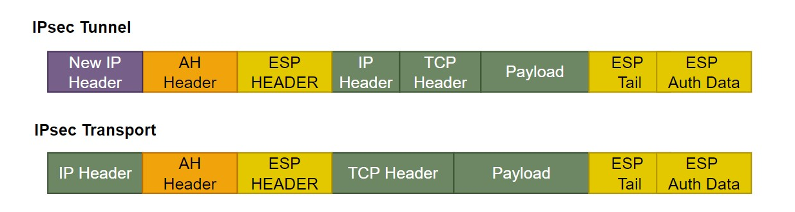

IPsec is a group of networking protocols used for setting up secure encrypted connections, such VPNs, across publicly shared networks.


# What is IPsec


IPsec is a group of protocols that are used together to set up encrypted connections between devices. It helps keep data send over public networks secure. IPsec is often used to set up VPNs, and it works by encrypting IP packets, along with authenticating the source where the packets come from.

Within the term "IPsec", "IP" stands for "Internet Protocol" and "sec" for "secure". The Internet protocol is the main routing protocol used on the Internet; it designates where data will go using IP addresses. IPsec is secure because it adds encryption and authentication to this process.

> Encryption is the process of concealing information by mathematically alerting data so that it appears random. In simpler terms, encryption is the use of a "secret code" that only authorized parties can interpret.


## How does IPsec Work?

IPsec connections include the following steps:

**Key exchanges**: Keys are the necessary for encryption; a key is a string of random characters that can be used to "lock"(encrypt) and "unlock"(decrypt) messages. IPsec set up keys with a key exchange between the connection devices, so that each device can decrypt the other device's messages.

**Packet headers and trailers**: All data that is sent over a network is broken down into smaller pieces call packets. Packets contain both a payload, or actual data being sent, and headers, or information about that data so that computers receiving the packets know what to do with them. IPsec add several headers to data packets containing authentication and encryption information. IPsec also add trailers, which go after each packet's payload instead of before.

**Authentication**: IPsec providers authentication for each packets, like a stamp of  authenticity on a collection item. This ensures that packets are from a trusted source and not an attacker.

**Encryption**: IPsec encrypts the payloads within each packets and each packet's IP header(unless transport mode is used instead of tunnel mode). This keeps data sent over IPsec secure and private.

**Transmission**: Encrypted IPsec packets travel across one or more networks to their destination using a transport protocol. At this stage, IPsec traffic differs from regular IP traffic in that it  most often uses UDP as its transport protocol,  rather than TCP. TCP the transmission Control Protocol,set up dedicated connections between devices and ensures that all packets arrive. UDP, the User Datagram Protocol, does not set up these dedicated connections. IPsec uses UDP because this allows IPsec packets to get through firewalls.

**Decryption**: At the other end of the communication, the packets are decrypted, and applications can now use the delivered data.


## What protocols are used in IPsec

In networking,  a protocol is specified way of formatting data so that any networked computer can interpret the data. ***IPsec is not one protocol, but a suite of protocols***. The following protocol make up the IPsec suite.

**Authentication Header(AH)**: The AH protocol ensures that data packets are form a trusted source and that the data has not been tampered with,  link a temper-proof seal on a consumer product. These header do not provider any encryption; the do not help conceal the data from attackers.

**Encapsulating Security Protocol(ESP)**: ESP encrypts the IP header and the payload for each packet -  unless transport mode is used, in which case it only encrypts the payload. ESP add its own header and a trailer to each data packet.

**Security Association(SA)**: SA refers to a number of protocols used  for negotiating encryption keys and algorithm. One of the most common SA protocols is Internet Key Exchange(IKE).

Finally, while the **Internet Protocol(IP)** is  not part of the IPsec suite, IPsec runs directly on top of IP.


## What is the difference between IPsec tunnel mode and IPsec transport mode?

IPsec tunnel mode is used between two ***dedicated routers***, with each router acting as one end of a virtual "tunnel" through a public network. In IPsec tunnel mode, the *original IP* header containing the final destination of the packet is encrypted, in addition to the packet payload. To tell intermediary routers where to forward the packets, IPsec adds a new IP header. At each end of the tunnel, the router decrypt the IP headers to deliver the packets to their destination.

In transport mode, the payload of each packet is encrypted, but the original IP header is not. Intermediary routes thus able view the final destination of each packet-- unless a separate tunneling protocol(such as GER) is used.




## What port does IPsec use?

A network port is the virtual location where data goes in a computer.  Ports are how computers keep track of difference processes and connections; if data goes a certain port, the computer's operating system knows which process it belongs to. IPsec usually uses port 500.


## How does IPsec impact MSS and MTU?

MSS and MTU are two measurements of packet size. Packets can only reach a certain size(measures in bytes) before computers,  routers and switches cannot handle them.  MSS measures the size of each packet's  payload, while MTU measures the entire packets, including headers. Packets that exceed a network's MTU may be fragmented, meaning broken up into smaller packets and then reassembled. Packets that exceed the MSS are simply dropped.


IPsec protocols add several headers and trailers to packets, all of which take up several bytes. For networks that use IPsec, either the MSS and MTU have to adjusted  accordingly, or packets will be fragmented and slightly delayed. Usually, the MTU for a network is 1,500 bytes. A normal IP header is 20 bytes long, and a TCP header is also 20 bytes long, meaning each packet can contain 1,460 bytes of payload. However, IPsec add an Authentication Header, and ESP header, and associated trailers. These add 50-60 types to a packets, or more.

```sh
sudo iptables -t mangle -I POSTROUTING -p tcp -m tcp -j TCPMSS --tcp-flags SYN,RST SYN --set-mss 1280


sudo iptables -t mangle -I POSTROUTING -p tcp -m tcp -j TCPMSS --tcp-flags SYN,RST SYN --set-mss 60
```


## Challenge

To secure traffic, IPsec requires an SA to be set up between two points, creating a tunnel for the traffic to travel through. Depending on the implementation model, this can introduce some challenges. For example, in a mesh model, all nodes(or locations) are connected to each other by dedicated tunnels. However, this requires creating managing several IPsec tunnels, which is difficult to scale.


# IKE

Negotiating IPsec's IKE Phase1. The best way to make sure you site-to-site tunnels get built is to remember to HAGLE: make sure you hash, Authentication, Group, Lifetime and Encryption are negotiated and agreed on.

Before the device establish the tunnel, you need to negotiate IPsec's IKE Phase1. There are 5 times. To remember each step, Keith's Recommend method is "HAGLE".

- H: Hashing algorithm to verify data integrity
- A: Authentication to verify one another  /PSK
- G: Groups to generate secret keys (DH, diffie helman Group Asymmetric)
- L：Lifetime to determine how long the tunnel stands up
- E: Encryption to agree which algorithm to use(AES  symmetric )

With these five items, you ASAs can stand up an IKE Phase1 and connect you site securely across the Internet.


> MD5


IPsec is a protocol suit to authenticate and encrypt the packets being exchanged between two points.

VPN is a private connection over a public network - Layer 2 or Layer 3

IPsec is standard by IETF to create a VPN tunnel at layer 3(Network Layer)

IPsec provides:

- Integrity: It indicates that the received message is same message that was sent [MD5, SHA]

- Authentication: refers to verifying identity of a network entity like user/device [PSK, RSA], Make sure the user is  we expected.

- Confidentiality: it is used to hide information [DES, 3DES, AES,SEAL]
- Key Management: To agree on key used for authentication and other purpose [Manual or automatic]


To achieve the goal of creating a secure tunnel, two peers needs to negotiate all the required parameters.                                              

IPsec use following protocols: 

- Authentication Header(AH): It provides authentication and integrity
- Encapsulation Security Protocol(ESP): It provides authentication, integrity and confidentiality
- Internet Key Exchange(IKE): Key management protocol, used to negotiate Security Association(SA), SA are security polices for communication between peers.


IKE performs it jobs using ISAKMP framework using two phases

**Phase-1** is used to negotiate **ISAKMP policy** by exchange 5 parameters referred to as HAGLE. In this phase, Peers authenticate each other and calculate a shared secret key. Phase-1 gives a secure tunnel to be used in second IKE phase.


After the negotiation , then **IKE Policy Set**. then get a **tunnel**.

the tunnel for the second IKE phase.

Phase 1 can run in two modes

- Main mode. identity of peers is protected using encryption
- Aggressive mode. identity of peers is not protected.


Phase-2 is used to negotiate IPsec security parameters [negotiate protocols and algorithm]

- Encapsulation protocol(AH, ESP)
- Encryption
- Hashing
- Tunnel mode( Transport mode)

When then have done that, **IPsec Transform Set**,  ***IPsec policy*** for  sending our data 


### Authentication Header

IPsec use two main protocols - AH and/or ESP

- Authentication Header(AH): It provides authentication and integrity(no confidentiality,no encryption to hide the message)

   Authentication : both side authenticate each other

  Integrity: The message from one side to another can not be changed. If change will be discard.

  : can provide security against replay attack using sliding window. Replay attack allows a bad guy to resend the intercepted contents between two points.

- Encapsulation Security Protocol(ESP): It provides authentication, integrity and confidentiality

  can provide security against replay attack using sliding window.


参考资料

https://www.cloudflare.com/learning/network-layer/what-is-ipsec/

https://www.youtube.com/watch?v=tapoOQ-MkPU&ab_channel=GDNetworkingNewbie

