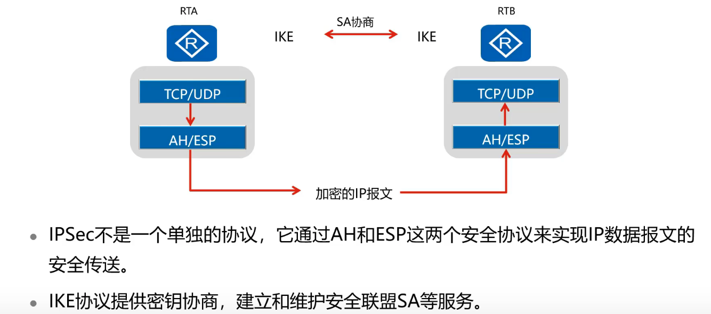
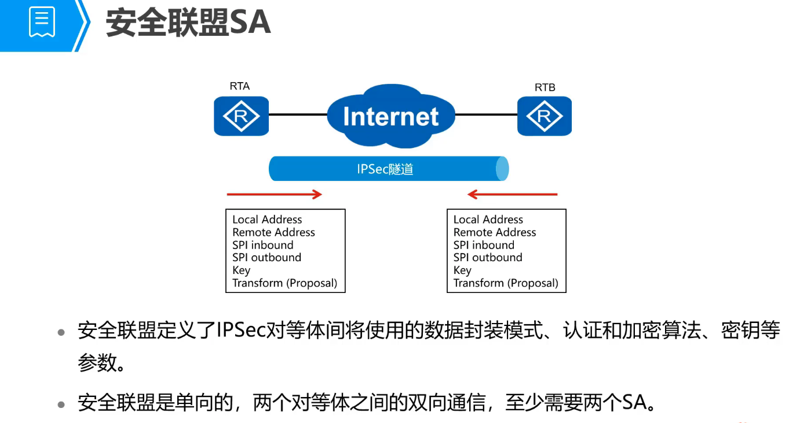
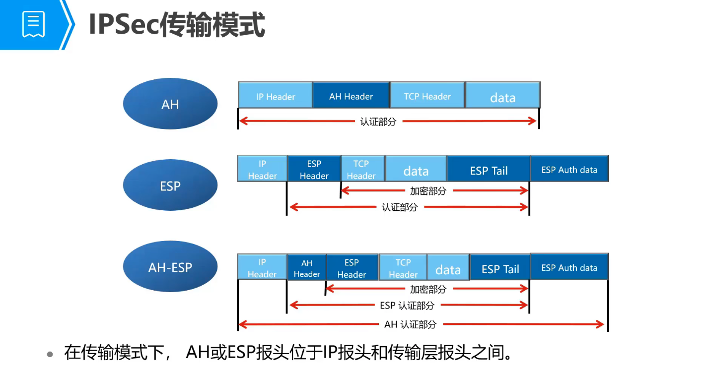
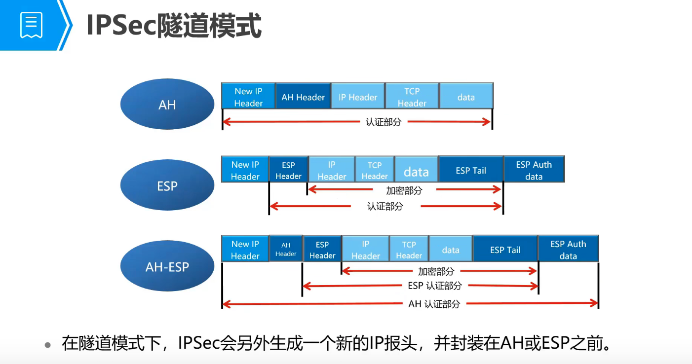
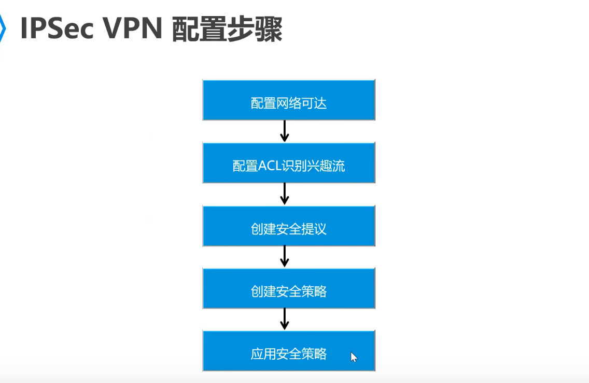
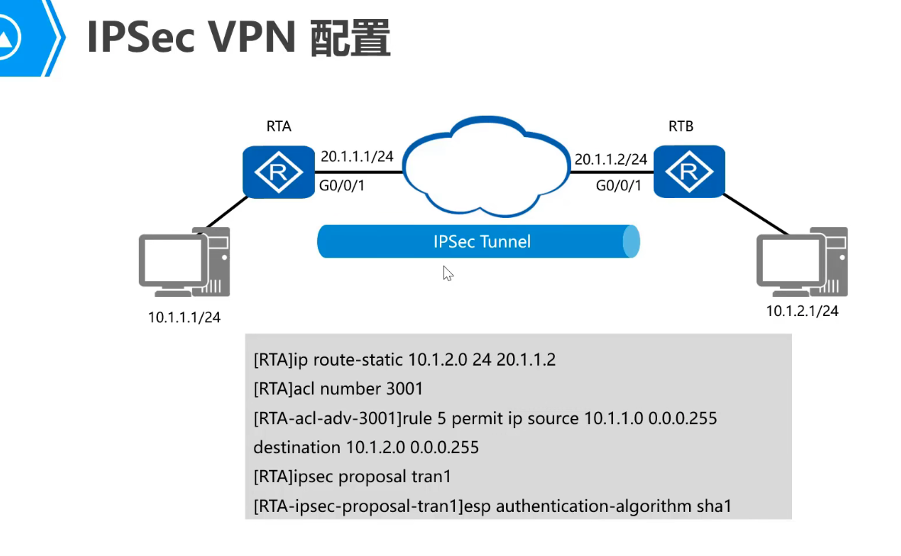
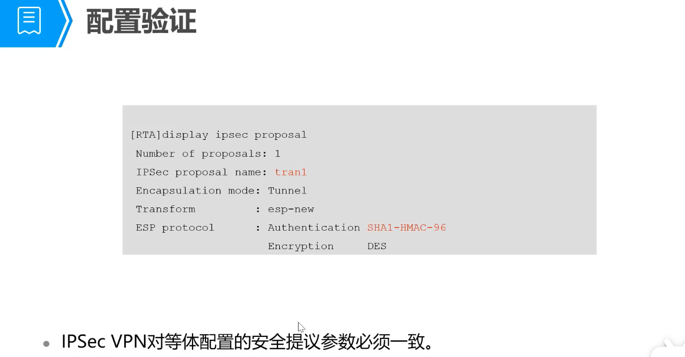
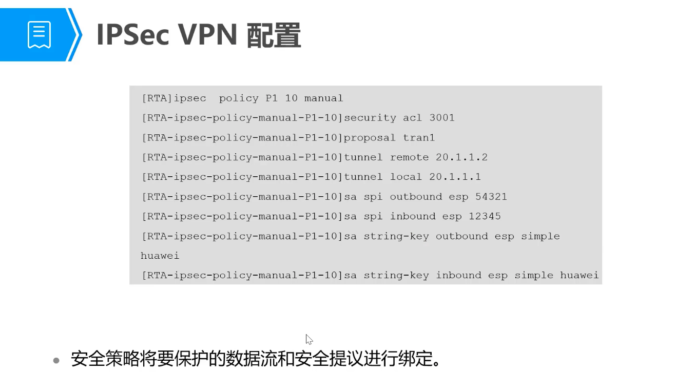
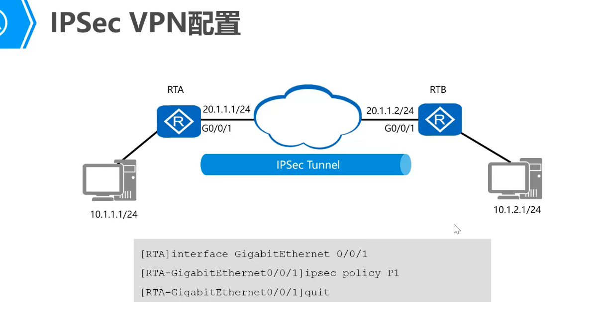
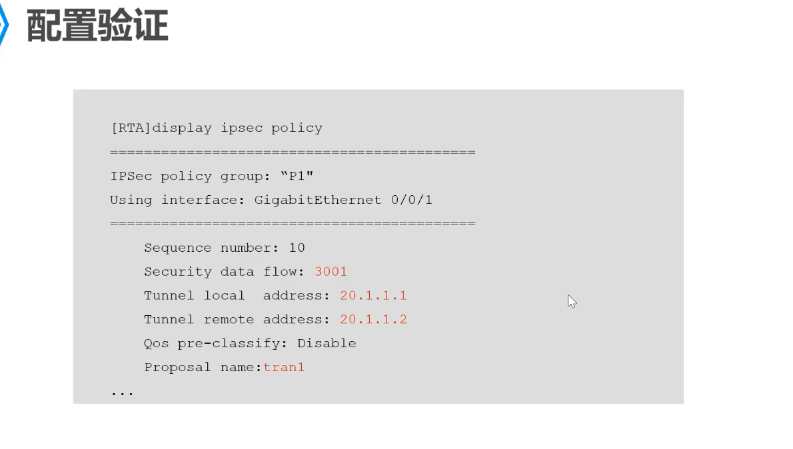

## IPSec 协议

IPSec(IP Security)协议族是IETF执行的一系列协议，它为IP数据报提供了高质量的、可互操作的、基于密码学的安全性。特定的通信方之间在IP层通过加密和数据源验证等方式，来保证数据报在网络上传输时的私有性、完整性、真实性和放重放。

- 私有性(Confidentiality)指对用户数据进行加密保护，用密文的形式传送。
- 完整性(Data integrity)指对接收的数据进行验证， 以及判定报文是否被篡改。
- 真实性(Data authentication)指验证数据源，以保证数据来自真实的发送者。

> IPSec 是一个协议族，包含了IKE、 AH、ESP

基本概念

1. 手动配置SA 2. 使用IKE配置SA

1. 

  

## IPSec 和VPN

VPN 只是IPSec的一种应用方式。

参考资料

https://wenku.baidu.com/view/1f897ad85022aaea998f0f38.html

https://blog.51cto.com/u_13817711/2478622

http://www.h3c.com/cn/d_201005/675214_97665_0.htm

http://www.h3c.com/cn/d_201005/675214_97665_0.htm

https://bbs.huaweicloud.com/blogs/detail/154030