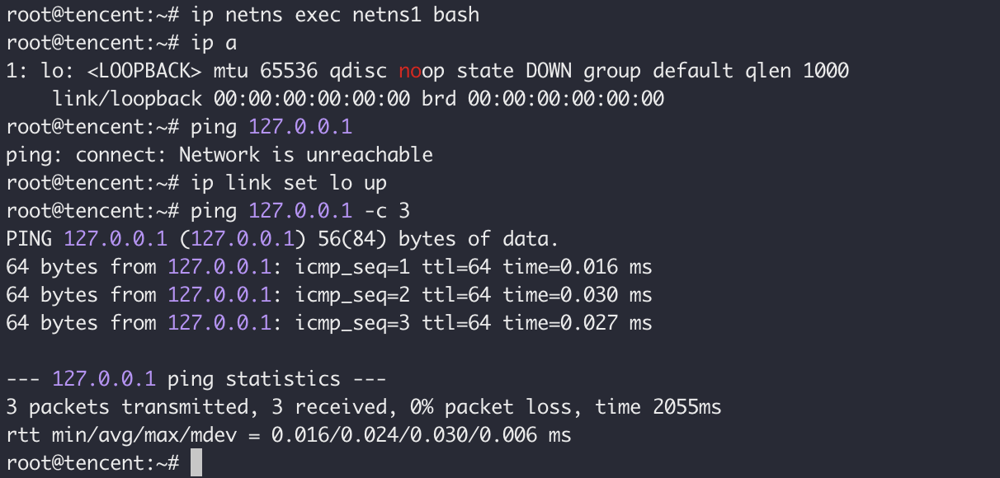

```
title: Linux Network Virtualization
```


## Network Namespace

In order to provide the isolation, Linux has 6 namespaces to split the different resources, shown as follows:

| Namespace         | Description                     |               |
| ----------------- | ------------------------------- | ------------- |
| Mount Namespace   | File system mount point         | CLONE_NEWNET  |
| UTS Namespace     | Hostname                        | CLONE_NETUTS  |
| IPC Namespace     | POSIX process messaging queue   | CLONE_NEWIPC  |
| PID Namespace     | Process PID number namespace    | CLONE_NEWPID  |
| Network Namespace | IP address/Port/Router/IPtables | CLONE_NEWNS   |
| User Namespace    | User isolation                  | CLONE_NEWUSER |


For the process, if they want to use the resources of the Namespace,  they should enter the namespace first. And the resources don't share between different namespaces.


### Network Namespace Overview

You can use `ip netns` to manage the Network Namespace, or you can write C code to operate the Network Namespace through the system call. We can use `clone()`(a extend for `fork()`) to create a usual Namespace, and specify the parameter `CLONE_NEWNET` to create a Network Namespace.

```sh
ip netns add netns1
```

After you created the namespace, you can use `ip netns show` or `ip netns list` to check the result. At the same time, a file named `netns1` is created at `/var/run/netns/netns1`, this is the Mount Point.  On the one hand, this file is for managing the namespace, on the other hand, even if no process running in the namespace, the namespace still exists.

Once the Network Namespace is created, you can use `ip netns exec <namespace> <command>` to enter it to do some configuration.

For example,

```sh
# run bash in network namespace <netns1>
ip netns exec netns1 bash

# get the network interface of the network namespace <netns1>
ip net exec netns1 ip link list
```

After you create a Network Namespace, it contains a Loopback Interface at least.

If you want to delete the Network Namespace, try

```sh
ip netns delete netns1
```

Noted, actually, the above command does not totally delete the Network Namespace, this only removed the Mount Point. If there is any process still running, the Network Namespace will still exist.

### Configuration

When we talk about the network communication of the processes in the Network Namespace, the Virtual/Actual Network Device is required.

The new Network Namespace only contains a Loopback Interface, and the status of this interface is `DOWN`. After setting the `lo`up,  you can `ping 127.0.0.1` and get the response.




But, if we want to contact the outside, we need to create a couple of virtual ether network cards, it's the `veth pair`. Veth pair always presents in couples. It was like a two-way pipe, the datagram went into one side, and came out from another side. 

Let's create a `veth pair`, and put one side into the `netns1`.

```sh
# create a veth pair veth0-veth1
ip link add veth0 type veth peer name veth1
# mv veth1 to netns1 network namespace
ip link set veth1 netns netns1
```

After that, we created 2 veth interface. But these are in `DOWN`status. Next, we set them up and bind an IP to the interface.

```sh
ip netns exec netns1 ifconfig veth1 10.1.1.1/24 up
ifconfig veth0 10.1.1.2/up
```


Now, you can `ping 10.1.1.1` on the host.

The route table and IPtables are different between different Network Namespace.


When we enter the `netns1` Network Namespace, the route table and IPtables are empty. So, when you are in the `netns1` you can't connect to the Internet. There are several ways to solve that:

- Create a Linux bridge on the host, and bind one side of the veth pair to the bridge

- Add NAT rule on the host and enable Linux IP forward.

  ```sh
  # enable or disable IP forwarding status
  sysctl -w net.ipv4.ip_forward=0
  # OR
  sysctl -w net.ipv4.ip_forward=1
  
  # check the IP forwarding status
  cat /proc/sys/net/ipv4/ip_forward
  0
  ```

  

> Note
>
> Users can put the physical/virtual network device to any network namespace, and one device only can be put into one Network Namespace.


The process can enter the Network Namespace through the Linux System Call `clone()/unshare()/setns()`. No-root process in a specific Network Namespace only can assess and config the local Network Namespace.

The root process can create a network device in the Network Namespace. And, root process can put the local Network Namespace's device in another namespace.

```sh
# move interface form netns1 to PID=1 
ip net exec netns1 ip link set veth1 netns 1
```

The above command moves the veth1 interface from netns1 to host default Network namespace.

For the root user of the network namespace, they can move the network device to any Network Namespace, even the host network namespace. So, there will be a potential risk. If users want to avoid the risk, they need to combine the PID Namespace and Mount Namespace to make the Network Namespace totally isolated.

> How do combine the PID Namespace and Mount Namespace to make the Network Namespace totally isolated?


### Network Namespace API

The API is related with Linux System Call: `clone() unshare() setns()` and file in `/proc`. This chapter will introduce the usage of the network namespace API through several examples.

`clone() unshare() setns()` use the const variable `CLONE_NEW*` to represent different namespace:

| Namespace         | Description                     |               |
| ----------------- | ------------------------------- | ------------- |
| Mount Namespace   | File system mount point         | CLONE_NEWNS   |
| UTS Namespace     | Hostname                        | CLONE_NEWUTS  |
| IPC Namespace     | POSIX process messaging queue   | CLONE_NEWIPC  |
| PID Namespace     | Process PID number namespace    | CLONE_NEWPID  |
| Network Namespace | IP address/Port/Router/IPtables | CLONE_NEWNET  |
| User Namespace    | User isolation                  | CLONE_NEWUSER |


#### Create namespace through clone()						

```sh
int clone(int (*child_func)(void *), void *child_stack, int flags, void *arg);
```


`clone()` is an extension of `fork()`, we can control the function through the `flags` parameter. `clone()`has more than 20 `CLONE_*` flag to control the processes' actions.

If set a flag `CLONE_NEW`, the system will create a corresponding type namespace and a new process and put the process into the new Namespace. Through `|` we can specify multiple `CLONE_NEW` flags.

 The parameters' meaning, from left to right

- Function point `child_func`,  specify a new function for the new process. When the function returned, the child process ended. This function returns an integer value to represent the exit code.
- Point  `child_stack`  is put into the child process's stack, another word,  put user-mode stack point to child process's esp register. The process that calls `clone()` needs to allocate a new stack to the child process.
- Int `flags` represent the `CLONE_*` flag, which can be multiply connected with `|`.
- `args` is the user-defined parameter.

Finally, you should pay attention to the authorization and safety, most of the Namespace creates need the system capability, which not should be total root permission, but need `CAP_SYS_ADMIN` to execute the essential System Call. 

> Linux 的特权是将root的权限分为各个小部分，使得一个进程只需要被授予刚刚好的权限来执行特定的任务。如果这些特权足够小，且选择的恰到好处，那么即使一个进程受损（比如缓冲区溢出），它所造成的危害也会受限于它所拥有的的特权。 例如，CAP_KILL 允许向任意的进程发送信号， 而CAP_SYS_TIME允许进程设置系统的时钟。


#### Keep namespace existing

Every process has its own `/proc/PID/ns`, and every file in this path represents a type of namespace.

Before Linux Kernel v3.8, the file in this path is a hard link, and only has IPC, nets, and uts. After v3.8, every file is a special symbolic link file and these files provide a way to operate the namespace related to the process.

```sh
ls -l /proc/$$/ns # $$ is the PID of bash
```


One of the symbolic link file's usage is to show if two processes use the same namespace. If two processes are in the same namespace, the `inode` number on the symbolic link file should be the same. (You can through `stat()`to get the inode number in `st_ino` )


```c
#define _GNU_SOURCE
#define NULL 0x0
#include <sys/types.h>
#include <sys/wait.h>
#include <sys/mount.h>
#include <stdio.h>
#include <sched.h>
#include <signal.h>
#include <unistd.h>
#include <stdlib.h>

#define STACK_SIZE (1024 * 1024)

// sync primitive
int checkpoint[2];

static char child_stack[STACK_SIZE];
char *const child_args[] = {
    "/bin/bash",
    NULL};

int child_main(void *arg)
{
    char c;

    // init sync primitive
    printf(">> wait for signal");
    close(checkpoint[1]);
    printf(">> receive signal");

    // setup hostname
    printf("- [%5d] World !\n", getpid());
    sethostname("In Namespace", 12);

    // remount "/proc" to get accurate "top" && "ps" output
    mount("proc", "/proc", "proc", 0, NULL);

    // wait for network setup in parent
    read(checkpoint[0], &c, 1);

    // setup network
    system("ip link set lo up");
    system("ip link set veth1 up");
    system("ip addr add 192.168.0.2/24 dev veth1");
    execv(child_args[0], child_args);
    printf("Oops \n");
    return 1;
}

int main()
{
    // init sync primitive
    pipe(checkpoint);

    printf("- [%5d] Hello ?\n", getpid());

    int child_pid = clone(child_main, child_stack + STACK_SIZE,
                          CLONE_NEWUTS | CLONE_NEWIPC | CLONE_NEWPID | CLONE_NEWNS | CLONE_NEWNET | SIGCHLD, NULL);

    // further init; create a veth pair
    char *cmd;
    asprintf(&cmd, "ip link set veth1 netns %d", child_pid);
    system("ip link add veth0 type veth peer name veth1");
    system(cmd);
    system("ip link set veth0 up");
    system("ip addr add 192.168.0.1/24 dev veth0");
    free(cmd);

    // single "done"
    close(checkpoint[1]);
    printf(">>> signal done");

    waitpid(child_pid, NULL, 0);
    return 0;
}

```


> **NC command**
>
> use for network test
>
> **C primitive**


## Veth Pair


The **principle** of Veth Pair is that put data into one side of the veth pair, and get out from another side.


### The kernel code if veth pair

```c
```


### Relationship between container and veth pair

The typical model of the container network is veth pair + bridge. The interface in the container `eth0` is a peer of the host veth interface. So, how to find which is the peer interface?

**Method 1:**

First, in the target container find that,

```sh
cat /sys/class/net/eth0/iflink
```


And then check all the files on the host `/sys/class/net/`,check the `ifindex `value which is the same as the `iflink`.  The interface with the same value is another side of the veth pair.


**Method 2**


## Linux Bridge

### What is Linux Bridge


Create and Manage the Linux Bridge

```sh
ip link add name br0 type bridge
ip link set br0 up
```


Besides the `ip` command, we can use the `brctl` tool in the `bridge-utils` package to create a bridge.

```
brctl addr br0
```


