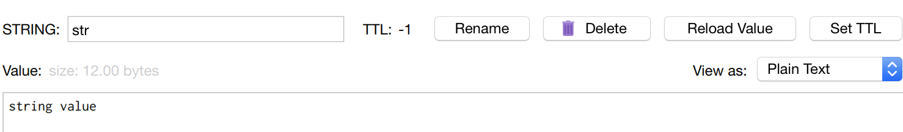
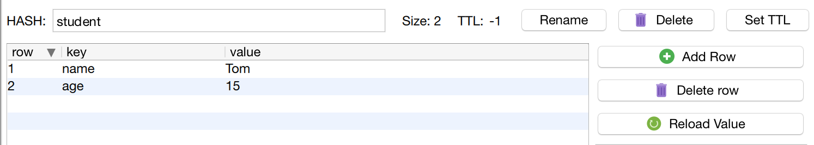
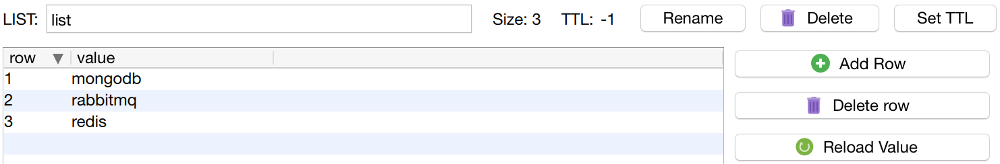
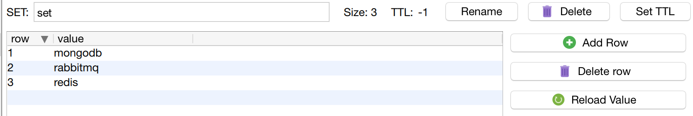
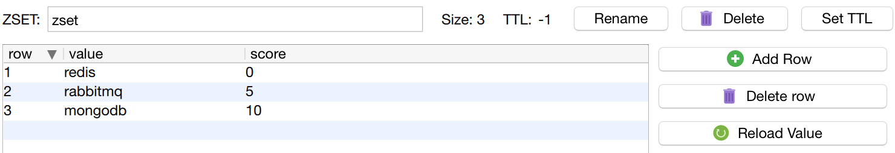

## Redis简介

Redis是一个高性能的Key-Value数据库

- Redis支持数据的持久化，可以将内存中的数据保存在在磁盘中，重启的时候可以再次加载进行使用。
- Redis不仅仅支持简单的key-value存储，同时还提供list，set，zset，hash等数据结构的存储。
- Redis支持数据的备份，即master-slave模式的数据备份。

### 优势

- 性能极高- Redis能读的速度是110000次/s，写的速度是81000次/s

  > 与mysql的性能对比， redis的读写次数是否取决于机器的性能
  >
  > mysql 5000-10000左右，取决于机器性能，mysql 是如何调优的。

- 丰富的数据类型- Strings，list，HashSet，sets 以及order sets。

- 原子- Redis所有的操作都是原子性的。意思是要么成功执行，要么失败全不执行。

  单个操作是原子性的。多个操作也支持事务，即原子性，通过`MULTI`和`EXEC`指令包起来。

- Redis还支持publish、subscribe，通知，key过期等特性。


安装

```
docker run -d -p 6379:6379 --name redis
```


## 5种基本数据类型

### String(字符串)

- string 是 redis 最基本的类型，你可以理解成与 Memcached 一模一样的类型，一个 key 对应一个 value。

- string 类型是`二进制安全`的。意思是 redis 的 string 可以包含任何数据。比如`jpg图片或者序列化的对象`。

- string 类型是 Redis 最基本的数据类型，`string 类型的值最大能存储 512MB`。

- 场景： token

```sh
127.0.0.1:6379> set str "string value"
OK
127.0.0.1:6379> get str
"string value"
```



### Hash（哈希）

- Redis hash 是一个键值(key=>value)对集合。对应编程语言中的`Map类型`。

- Redis hash 是一个 string 类型的 field 和 value 的映射表，hash 特别适合用于存储对象。可以只修改对象某一个属性的值（对应Memcached 中需要取出整个字符串反序列化成对象修改完成再反序列化回去）
- 每个 hash 可以存储 23^2 ^-1 键值对（40多亿）

- 场景：存储，读取，修改用户属性

```sh
127.0.0.1:6379> hmset student name "Tom" age "15"
OK
127.0.0.1:6379> hget student name
"Tom"
127.0.0.1:6379> hget student age
"15"
```




### List（列表）

- Redis 列表是简单的字符串列表，按照插入顺序排序。你可以添加一个元素到列表的头部（左边）或者尾部（右边）。

- 列表是双向链表。增删快。

- 列表最多可存储 23^2 - 1 元素 (4294967295, 每个列表可存储40多亿)。
- 场景：最新消息排行（朋友圈的时间线），消息队列

```sh
127.0.0.1:6379> lpush list redis
(integer) 1
127.0.0.1:6379> lpush list rabbitmq
(integer) 2
127.0.0.1:6379> lpush list mongodb
(integer) 3
127.0.0.1:6379> lrange list 0 1   # 从尾部开始计数
1) "mongodb"
2) "rabbitmq"
127.0.0.1:6379> lrange list 0 5
1) "mongodb"
2) "rabbitmq"
3) "redis"
```





### Set（集合）

- Redis 的 Set 是 string 类型的无序集合。

- 集合是通过哈希表实现的，元素不重复，所以添加，删除，查找的复杂度都是 O(1)。

- 集合中最大的成员数为 23^2 - 1(4294967295, 每个集合可存储40多亿个成员)。
- 提供了求交集，并集，差集等操作。
- 场景：共同好友；统计访问网站的所有的独立ip；好友推荐时，根据tag求交集，大于某个阈值就可以推荐

`sadd 命令`

添加一个 string 元素到 key 对应的 set 集合中，成功返回 1，如果元素已经在集合中返回 0。

```sh
127.0.0.1:6379> sadd set redis
(integer) 1
127.0.0.1:6379> sadd set mongodb
(integer) 1
127.0.0.1:6379> sadd set rabbitmq
(integer) 1
127.0.0.1:6379> sadd set rabbitmq   # 此次添加被忽略，返回数值为0
(integer) 0
127.0.0.1:6379> smembers set
1) "mongodb"
2) "rabbitmq"
3) "redis"
```



### Zset(sorted set： 有序集合)

- Redis zset 和 set 一样也是string类型元素的集合,且不允许重复的成员。

- 将Set中的元素增加一个权重参数score,元素按score`从小到大`的排序。数据插入集合时已经排序

- zset的成员是唯一的,但分数(score)却可以重复。
- 场景： 排行榜；带权重的消息队列。

`zadd 命令`

添加元素到集合，元素在集合中存在则更新对应score

```sh
127.0.0.1:6379> zadd zset 0 redis
(integer) 1
127.0.0.1:6379> zadd zset 0 mongodb
(integer) 1
127.0.0.1:6379> zadd zset 0 rabbitmq
(integer) 1
127.0.0.1:6379> ZRANGEBYSCORE zset 0 10
1) "mongodb"
2) "rabbitmq"
3) "redis"
127.0.0.1:6379> zadd zset 0 rabbitmq  # rabbitmq 已经存在，返回0
(integer) 0
127.0.0.1:6379> zadd zset 5 rabbitmq  # 更新rabbitmq 的score， 返回0
(integer) 0
127.0.0.1:6379> ZRANGEBYSCORE zset 0 10  # rabbitmq的位置排序已经不同
1) "mongodb"
2) "redis"
3) "rabbitmq"
127.0.0.1:6379> zadd zset 10  mongodb # 更新mongodb 的 score
(integer) 0
127.0.0.1:6379> ZRANGEBYSCORE zset 0 10
1) "redis"
2) "rabbitmq"
3) "mongodb"
```


