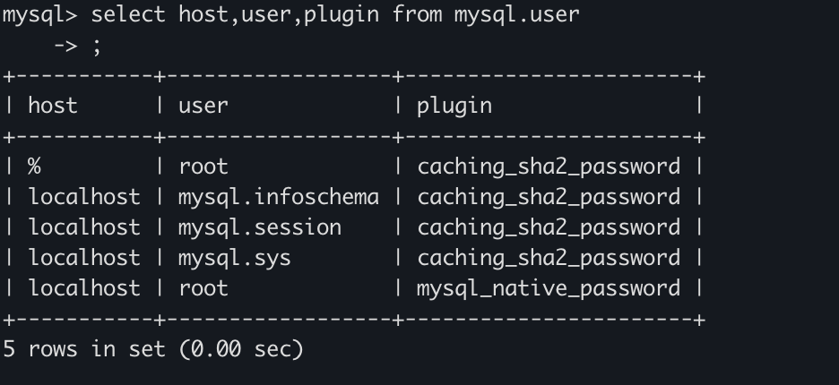

Docker安装Mysql

```sh
docker search mysql

docker pull mysql:8.0.22

docker run -d --name mysql_8.0 -e MYSQL_ROOT_PASSWORD=123456  -p 3306:3306 mysql:8.0.22

docker run -d -p 3306:3306 --name mysql_5_7_33 -e MYSQL_ROOT_PASSWORD=bytedance_aiops_observe mysql:5.7.33
```


修改表字段

```sh
# 新增一个字段
alert table rules add effect_time 
```


mysql sql 8.0 认证问题

 connect to 10.227.4.115:3306 err: this authentication plugin is not supported



```sql
alter user root@% identified with mysql_native_password by "123456"
```


```sql
CREATE DATABASE IF NOT EXISTS xiba DEFAULT CHARSET utf8 COLLATE utf8_general_ci;
```

