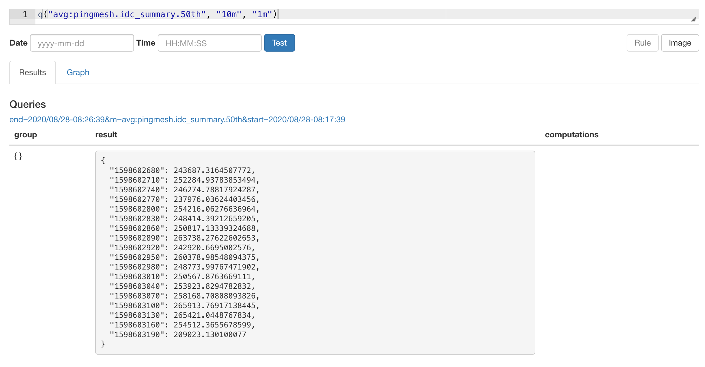

> 使用bosun之前首先要了解什么是时序数据，时序数据的组成部分以及时序数据的常用查询


Bosun安装

```sh
docker run -d --name bosun -p 4242:4242 -p 8070:8070 stackexchange/bosun:latest
```

123123


## 时序数据的类型


counter

guage(store)


## Bosun的数据类型

- Scalar
- NumberSet：   Group+Scalar


## Bosun 查询语法

### 简单查询

查询过去10分钟到过去1分钟之间的时序数据




`avg`是时序数据库的的运算，对不同的tag set的数据求平均


最外面的`avg` 是对这段时间内的时序数据做一个平均，得到一个数值


### 宏替换


运算的时候会对变量进行宏替换


**OpenTSDB**

如果没有数据的时候会导致bosun查询失败，可以采取不上

```json
avg(100*q("avg:1m-avg-zero:store:toutiao.tce.sysprobe.aweme.recommend.predict.cpu.usage.pod{sidecar_psm=ad.qa.java_sidecar,pod_name=dp-cb2f23ec64-6987c9d65d-ds7j5}","1h","")/q("avg:1m-avg:store:toutiao.tce.sysprobe.aweme.recommend.predict.cpu.limit.pod{sidecar_psm=ad.qa.java_sidecar,pod_name=dp-cb2f23ec64-6987c9d65d-ds7j5}","1h",""))
```


Streak 连续非0 数据的最大长度

https://blog.csdn.net/lslxdx/article/details/79454916


转置

http://bosun-alarm-cn.byted.org/expr?expr=Cgoka2V5PSJzdW06ZGF0YS51bmlvbl9hZC51bmlvbl9wcmVkaWN0LnBheXRpbWVzXzdkYXlzLmZpbmFsLmNvdW50ZXJ7cGFja2FnZT0qfSIKCiMgJGNvdW50ID0gY291bnQoJGtleSwiNm0iLCIxbSIpCiMgJGNvdW50IAojICR2YWx1ZT0gc3VtKHQoYXZnKHEoJGtleSwiNm0iLCIxbSIpKSwgIiIpKQojJHZhbHVlCiMgJHJlcz0gJHZhbHVlLyRjb3VudAojICRyZXMKdChhdmcocSgka2V5LCI2bSIsIjFtIikpLCAiY2x1c3RlciIpCgo%3D

### InfluxDB

```sql
influx("iaas_metrics", '''SELECT sum(value)  FROM "host_CpuSystem"   group by "resource_id" ''', "7d", "2m", "1m")
```


参考文档
https://blog.csdn.net/lslxdx/article/details/79454916