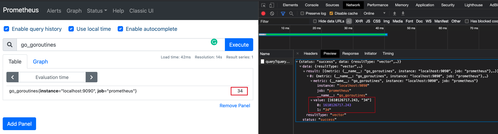
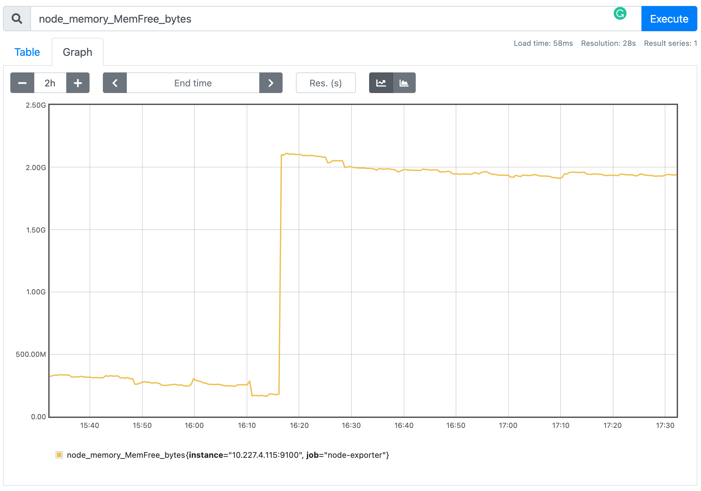
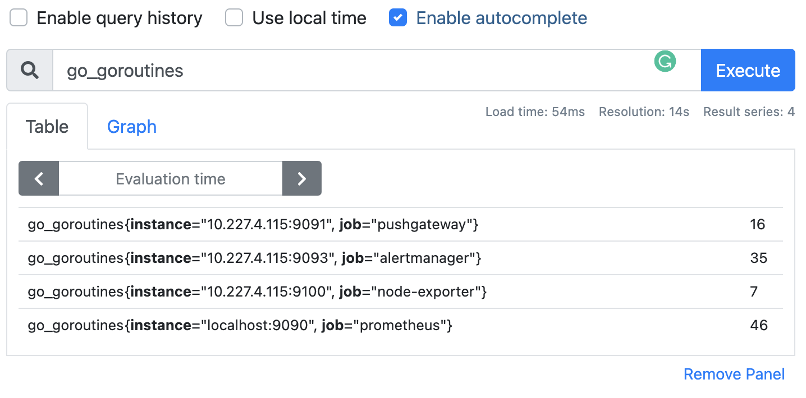

## Prom Intro

[Prometheus](https://github.com/prometheus) 是[SoundCloud](https://soundcloud.com/)开源的系统监控和报警工具集。通过Prometheus可以进行时序数据的采集、监控和报警。

#### 时序数据模型 Time Series Data Model

Metric 是一个对时序指标的统称，例如.：`http_requests_total` - the total number of HTTP requests received，就可以称为一条Metric

在Prometheus 中每一个时序序列(time-series)都是由于Metric Name 和Key-Value组成的

例如： 

```sh
http_request_total{host=192.168.2.1,status=200}
```

**Metric Name**： `http_request_total` 在Prometheus中Metric Name只能由大小写字母、数字、下划线、冒号组成，且不能以数字开头，对应正则为`[a-zA-Z_:][a-zA-Z0-9_:]*`。冒号保留，会在定义规则的时候使用。

**Label Name**: `host` 和`status`都属于Label. 在Prometheus中Label Name只能由大小写字母、数字、下划线组成，且不能以数字开头，对应的正则为`[a-zA-Z_][a-zA-Z0-9_]*`。一般`_`开头的Labels保留位系统内部使用。

**Notation**

```sh
<Metric Name>{<Label Name>=<Label Value>,...}
api_http_request_total{method="POST", handler="/messages"} # 同OpenTSDB

node_cpu_seconds_total{cpu="2",mode="system"} 195721.31
```


```sh
<--- metric name------><-----lable set------><-timestamp -><-value->
node_cpu_seconds_total{cpu="2",mode="system"}@1434417560938 195721.31
# timestamp 是毫秒级时间戳
# value 有且只有一个 float64
```


> 
>
> `__` 作为前缀标签，只能在系统内部使用。 Prome底层实现指标名称是以`__name__=<metric name>`形式存储的，以下两种表达方式是相同的。
>
> ```sh
> api_http_request_total{method="POST", handler="/messages"}
> {__name_=api_http_request_total, method="POST", handler="/messages"}
> ```


## Component

> 所有基础组件的安装都基于Docker。

### Prometheus

```sh
docker pull prom/prometheus
docker run -d -p 9090:9090 --name prometheus prom/prometheus
```

安装完成后可以访问`9090`端口，可以看到Prometheus管理页面。如下图为查询`go_routines`的情况。

查询当前数据：

```http
GET http://devbox:9090/api/v1/query?query=go_goroutines&time=1610127237.659
```




查询历史数据：

```http
GET http://devbox:9090/api/v1/query_range?query=go_goroutines&start=1610126024.257&end=1610126924.257&step=3
```


配置`/etc/prometheus/prometheus.yaml`

```yaml
# my global config
global:
	# 拉取target的默认时间间隔
  scrape_interval:     15s # Set the scrape interval to every 15 seconds. Default is every 1 minute.
  evaluation_interval: 15s # Evaluate rules every 15 seconds. The default is every 1 minute. 执行Rule的时间间隔
  # scrape_timeout is set to the global default (10s). 拉取超时时间

# Alertmanager configuration
alerting:
  alertmanagers:
  - static_configs:
    - targets:
    	# AlertManager ip:port  可以配置多个
      # - alertmanager:9093  

# Load rules once and periodically evaluate them according to the global 'evaluation_interval'.
rule_files:
  # - "first_rules.yml"   # 规则配置文件
  # - "second_rules.yml"

# A scrape configuration containing exactly one endpoint to scrape:
# Here it's Prometheus itself.
scrape_configs:
  # The job name is added as a label `job=<job_name>` to any timeseries scraped from this config.
  - job_name: 'prometheus'
    # metrics_path defaults to '/metrics'
    # scheme defaults to 'http'.
    static_configs:
    - targets: ['localhost:9090']
  - job_name: 'pushgateway'
    # metrics_path defaults to '/metrics'
    # scheme defaults to 'http'.
    static_configs:
    - targets: ['10.x.x.115:9091']
  - job_name: 'alertmanager'
    # metrics_path defaults to '/metrics'
    # scheme defaults to 'http'.
    static_configs:
    - targets: ['10.x.x.115:9093']
```


### PushGateway

```sh
docker pull prom/pushgateway
docker run -d --restart=always --name pushgateway -p 9091:9091 prom/pushgateway
```


### AlertManager

```sh
docker run -d --restart=always --name alertmanager -p 9093:9093 prom/alertmanager
```

配置


**WebHook  Test**

```python
import SimpleHTTPServer
import SocketServer

PORT = 5001

class ServerHandler(SimpleHTTPServer.SimpleHTTPRequestHandler):

    def do_POST(self):
      content_len = int(self.headers.getheader('content-length', 0))
      post_body = self.rfile.read(content_len)
      print post_body
      self.send_response(200)
      self.end_headers()

Handler = ServerHandler

httpd = SocketServer.TCPServer(("", PORT), Handler)

print "serving at port", PORT
httpd.serve_forever()
```

## Prom Metric类型

### Counter

**只增不减，计数器**

Counter类型的指标相当于一个计数器，只增不减。除非Prome重启，将重新计数。例如：`http_request_total`。

例如：`node_cpu_seconds_total{cpu="0",mode="system"}`

**原始指标**


**`rate()`获取增长率**

rate始终大于0


**`topk()` 获取top k数据**


> A *counter* is a cumulative metric that represents a single [monotonically increasing counter](https://en.wikipedia.org/wiki/Monotonic_function) whose value can only increase or be reset to zero on restart. For example, you can use a counter to represent the number of requests served, tasks completed, or errors.


### Gauge

Gauge 相当于一个仪表盘，可增可减，是一个瞬时值。 例如：node_memory_MemFree（主机当前空闲的内容大小）、node_memory_MemAvailable（可用内存大小）都是Gauge类型的监控指标。

> A *gauge* is a metric that represents a single numerical value that can arbitrarily go up and down.
>
> Gauges are typically used for measured values like temperatures or current memory usage, but also "counts" that can go up and down, like the number of concurrent requests.

原始指标



**`delta()` 在一定时间内的差异**


`deriv()`计算样本线性回归模型

`predict_linear(node_memory_MemFree_bytes[10h], 4*3600)` 预测未来4h的指标情况

### Histogram & Summary


 柱状图，用于观察结果采样，分组及统计。例如： 请求持续时间。是对一段时间内的数据进行采样，并能够对其指定区间以及总数进行统计。需要**根据区间计算**。

Histogram指标直接反应了在不同区间内样本的个数，区间通过标签len进行定义。


> **长尾问题**
>
> 如果大多数API请求都维持在100ms的响应时间范围内，而个别请求的响应时间需要5s，那么就会导致某些WEB页面的响应时间落到中位数的情况，而这种现象被称为长尾问题。
>
> 为了区分是平均的慢还是长尾的慢，最简单的方式就是按照请求延迟的范围进行分组。例如，统计延迟在0~10ms之间的请求数有多少而10~20ms之间的请求数又有多少。通过这种方式可以快速分析系统慢的原因。Histogram和Summary都是为了能够解决这样问题的存在，通过Histogram和Summary类型的监控指标，我们可以快速了解监控样本的分布情况。

### 

类似Histogram, 用于表示一段时间内的数据采样结果，不是临时算出来的，结果早已存储。


数据存入Prome




> 存入Prom的点会自动添加Instance&job 两个tag 
>
> 实际打点
> 
> 数据存入Prom后会自动加上 `instance` & `job` 两个tag


[Golib](https://pkg.go.dev/github.com/prometheus/client_golang/prometheus#Counter)

## PromQL

PromQL是Prom的数据查询`DSL(Domain Specified Language)`语言。

**结果类型：**

| Type                       | Desc                                   | Demo                        |
| -------------------------- | -------------------------------------- | --------------------------- |
| 瞬时数据（Instant Vector） | 包含一组TimeSeries，每个时序只有一个点 | `http_request_total`        |
| 区间数据（Range Vector）   | 包含一组TimeSeries, 每个时序有多个点   | `http_request_total[5m]`    |
| 纯量数据（Scalar）         | 只有一个数据，没有Time Series          | `count(http_request_total)` |

**查询方式**

```sh
logback_events_total{level="info"}
```


查询支持正则匹配

```sh
http_request_total{code!="200"}  # code != 200
http_request_total{code=~"2.."}  # code = 2xx
http_request_total{code!~"2.."}  # code != 2xx
```


其他查询

```sh
# 取整
floor(avg(http_request_total{code="200"}))
ceil(avg(http_request_total{code="200"}))
# 查看每秒数据
rate(http_request_total[5m])

#模糊查询： level="inxx
logback_events_total{level=~"in.."}
logback_events_total{level=~"in.*"}

```


聚合查询：

```sh
# count
count(logback_event_total)
# sum
sum(logback_event_total)
# avg
avg(logback_event_total)
# topk
topk(2, logback_events_total)

# irate  如查询过去5分钟的平均值 
irate( logback_events_total[5m])
```

## 


## 参考文档

https://www.jianshu.com/p/93c840025f01

https://yunlzheng.gitbook.io/prometheus-book/parti-prometheus-ji-chu/promql/prometheus-promql-operators-v2

