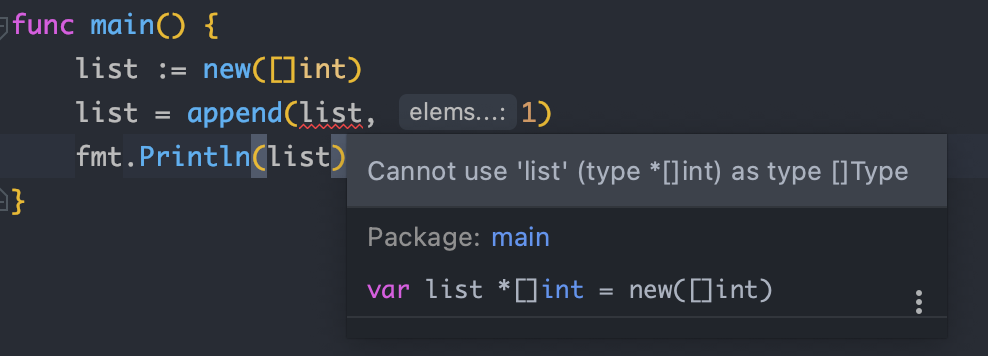

**Golang**

###### 

>  1. 下面两段代码输出什么

```go
// 1.
 func main() {
     s := make([]int, 5)
     s = append(s, 1, 2, 3)
     fmt.Println(s)
 }

// 2.
 func main() {
    s := make([]int,0)
    s = append(s,1,2,3,4)
    fmt.Println(s)
}
```

输出结果如下

```sh
[0 0 0 0 0 1 2 3]
[1 2 3 4]
```

使用make 新建 slice 会根据初始化的容量补0

###### 

>  2. 这段代码的问题

```go
 func funcMui(x,y int)(sum int,error){
        return x+y,nil
 }
```

有多个返回值的时候，返回值的名字要么全部省略，要么全部写上

###### 

>  3. new() 与make() 的区别

new(T)和make(T, args)是go语言的内建函数，用来分配内存，但是适用的类型不同。

new(T) 会为T类型分配`已经置零的内存空间`，并返回地址(指针)，即类型为`*T`的值。换句话说就是，返回一个指针，该指针指向那个新分配的，类型为T的零值。适用于值类型，如`数组、结构体`等。

make(T,args) 返回初始化之后的 T 类型的值，这个值并不是 T 类型的零值，也不是指针 `*T`，是经过初始化之后的 T 的引用。make() 只适用于 `slice、map 和 channel.`


```go
func main() {
	fmt.Println(">>> make: ")
	fmt.Println(make([]int, 4))
	fmt.Println(make(map[string]int))
	fmt.Println(make(chan int, 5))

	fmt.Println("\n >>> new:")
	fmt.Println(new(int))
}
```


```sh
>>> make: 
[0 0 0 0]
map[]
0xc0000ba000

 >>> new:
0xc0000b4038
```


> 4. 下面这段代码能否通过编译，不能的话原因是什么；如果能，输出什么。

```go
func main() {
    list := new([]int)
    list = append(list, 1)
    fmt.Println(list)
}
```

不能通过编译，new([]int) 之后的 list 是一个 `*[]int` 类型的指针，不能对指针执行 append 操作。可以使用 make() 初始化之后再用。同样的，map 和 channel 建议使用 make() 或字面量的方式初始化，不要用 new() 。





> 5. 下面这段代码能否通过编译，如果可以，输出什么？

```go
func main() {
    s1 := []int{1, 2, 3}
    s2 := []int{4, 5}
    s1 = append(s1, s2)
    fmt.Println(s1)
}
```

不能通过编译。append() 的第二个参数不能直接使用 slice，需使用 `…` 操作符，将一个切片追加到另一个切片上：`append(s1,s2…)`。或者直接跟上元素，形如：`append(s1,1,2,3)`。


> 6. 下面这段代码能否通过编译，如果可以，输出什么？

```go
var(
    size := 1024
    max_size = size*2
)

func main() {
    fmt.Println(size,max_size)
}
```


不能通过编译。这道题的主要知识点是变量声明的简短模式，形如：x := 100。但这种声明方式有限制：

```
1.必须使用显示初始化；
2.不能提供数据类型，编译器会自动推导；
3.只能在函数内部使用简短模式；
```


