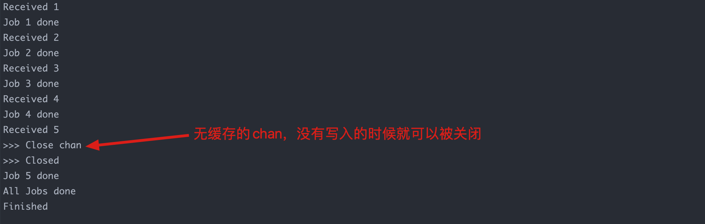

**Golang**

使用channel实现简单并发，注意执行顺序

```go
package main

import (
	"fmt"
	"sync"
	"time"
)

var wg sync.WaitGroup

func printer(ch chan int) {
	for i := range ch {
		fmt.Printf("Received %d \n", i)
		<-time.After(time.Second / 5)
		fmt.Printf("Job %v done \n", i)
	}
	println("All Jobs done")
	wg.Done()
	println("Finished")
}

// main is the entry point for the program.
func main() {
	c := make(chan int)
	go printer(c)
	wg.Add(1)

	// Send 5 integers on the channel.
	for i := 1; i <= 5; i++ {
		c <- i
	}
	println(">>> Close chan")
	close(c)
	println(">>> Closed")
	wg.Wait()
}
```


执行结果如图：



   