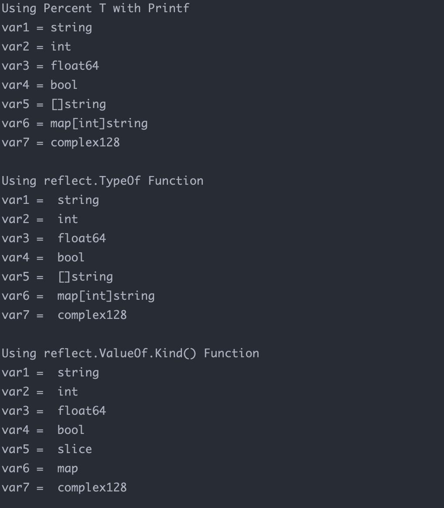

**Golang**


获取变量的数据类型

```go
package main

import (
	"fmt"
	"reflect"
)

func main() {

	// string type : string
	var1 := "hello world"

	// integer : int
	var2 := 10

	// float : float64
	var3 := 1.55

	// boolean : bool
	var4 := true

	// shorthand string array declaration : []string
	var5 := []string{"foo", "bar", "baz"}

	// map is reference datatype : map[string]string
	var6 := map[int]string{100: "Ana", 101: "Lisa", 102: "Rob"}

	// complex64 and complex128
	// is basic datatype : complex128
	var7 := complex(9, 15)

	// using %T format specifier to
	// determine the datatype of the variables

	fmt.Println("Using Percent T with Printf")

	fmt.Printf("var1 = %T\n", var1)
	fmt.Printf("var2 = %T\n", var2)
	fmt.Printf("var3 = %T\n", var3)
	fmt.Printf("var4 = %T\n", var4)
	fmt.Printf("var5 = %T\n", var5)
	fmt.Printf("var6 = %T\n", var6)
	fmt.Printf("var7 = %T\n", var7)

	// using TypeOf() method of reflect package
	// to determine the datatype of the variables
	fmt.Println()
	fmt.Println("Using reflect.TypeOf Function")

	fmt.Println("var1 = ", reflect.TypeOf(var1))
	fmt.Println("var2 = ", reflect.TypeOf(var2))
	fmt.Println("var3 = ", reflect.TypeOf(var3))
	fmt.Println("var4 = ", reflect.TypeOf(var4))
	fmt.Println("var5 = ", reflect.TypeOf(var5))
	fmt.Println("var6 = ", reflect.TypeOf(var6))
	fmt.Println("var7 = ", reflect.TypeOf(var7))

	// using ValueOf() method of reflect package
	// to determine the value of the variable
	// Kind() method returns the datatype of the
	// value fetched by the ValueOf() method
	fmt.Println()
	fmt.Println("Using reflect.ValueOf.Kind() Function")

	fmt.Println("var1 = ", reflect.ValueOf(var1).Kind())
	fmt.Println("var2 = ", reflect.ValueOf(var2).Kind())
	fmt.Println("var3 = ", reflect.ValueOf(var3).Kind())
	fmt.Println("var4 = ", reflect.ValueOf(var4).Kind())
	fmt.Println("var5 = ", reflect.ValueOf(var5).Kind())
	fmt.Println("var6 = ", reflect.ValueOf(var6).Kind())
	fmt.Println("var7 = ", reflect.ValueOf(var7).Kind())

}
```




