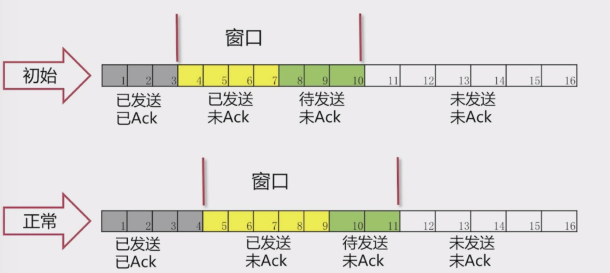
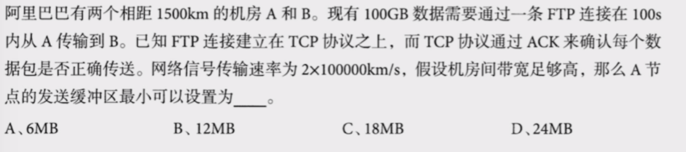

# 网络
## 网络基础

### 不可靠
- 丢包，重复包
- 出错
- 乱序
### 不安全
- 中间人攻击
- 窃取
- 篡改

## 滑动窗口
- TCP协议中使用
- 维持发送方/接收方缓冲区

  - 流量控制+拥塞控制
  - 在传输过程中会调整窗口的大小
  - 窗口的大小为0是合法的，（如果消息来不及处理可以设置为0）

不使用滑动窗口的话吞吐量会非常低

- 滑动窗口的Ack是有序的

- 如果丢ACk 会启动超时重传机制
  

## WireShark 抓包

wireShark 抓包

## 网络例题

一个来回的时间：1500km/(2*10^5km/s) *2 = 0.015s
来回的次数至多：100s/0.015 = 6666.67次

每次传输至少： 100GB/6666.67 = 15M

数据链路层
网络层
传输层 TCP/UDP
应用层