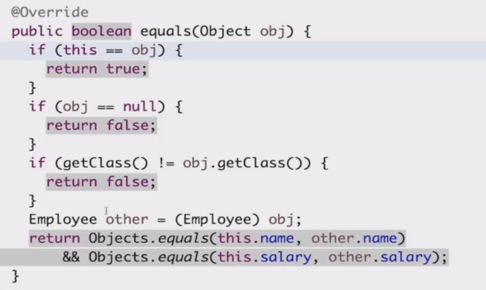
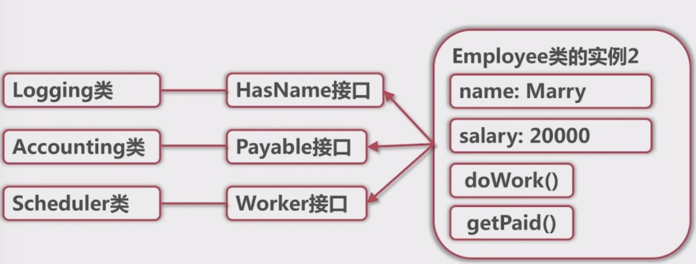

# 面向对象
## 面向对象思想
- 类与对象
- 接口与实现
- 继承与封装
- 不可变对象
- 泛型
- 从用户(终端用户，使用你代码的用户)的角度思考问题
- 摒弃完全基于逻辑的思维

## 类与对象
- 类的成员变量 ->  对象状态
- 类的成员函数 ->  对象行为
- 类的静态变量
- 类的静态函数
  
- 逻辑结构


```
class Employee{
    void getPaid(BankEndPont bank){
        bank.payment(name, salary); // this
    }
}
```
**类的静态变量和静态函数**
- 没有this引用， 金泰变量全局唯一一份
- 普通函数引用静态变量和静态函数？ OK
- 对象引用静态变量, 函数？ 编译器警告
- 静态函数引用普通成员变量、 函数 ？  编译错误


## 对象的特殊函数
- 构造函数
- equals
  <br> Object 的equals方法默认判断是否为同一个对象
  
- hashCode
  <br>a.hashCode() == b.hashCode()
    <<-- a.equals(b)
    
- toString
  
## 接口与抽象类
**为什么要有接口的概念**
- 从用户(使用实现的代码)的角度看看问题
- 由编译器强制的一个模块间协作的合约(Contarct)， 强制协作双方无法犯错
- 无成员变量
- 成员函数只有声明不能有实现

#### 接口的声明
- Java : interface
- C++: 一个全部是纯虚函数的类
- Python/ 大部分动态语言： 依靠注释申明
  

#### 抽象类
至少有一个抽象方法， 抽象方法没有实现；

- 从实现角度看
  <br> 抽象类可以有成员变量
  <br> 抽象类可以有部分实现
  <br> 抽象类不可以多重继承， 接口可以

## 实现Iterable接口