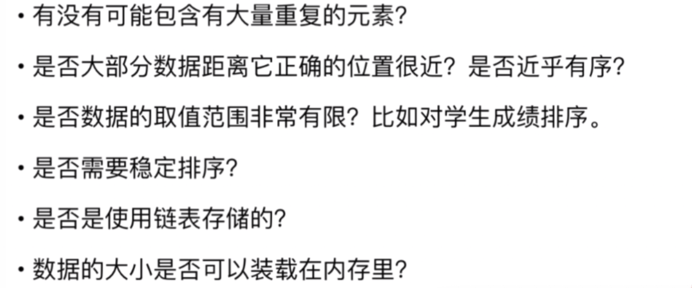

# 算法面试到底是什么鬼？
##  1-1 算法面试不仅仅是正确的回答问题
算法面试的目的 展现思考问题的方式
算法面试过程 看做是和面试官一起探讨一个问题的解决方案。对于问题的细节和应用环境，可以和面试官沟通。
这种沟通本身很重要，它暗示着你思考问题的方式。

我们需要对一组数据进行排序。
快速排序算法 O(nlogn)

正确+更优
这组数据有什么样的特征？
有没有可能包含有大量的重复元素？
如果有这种可能的话，三路快排是更好的选择。
Java 默认是三路快排。

这组数据有什么样的特征？
是否大部分数据距离它的正确位置很近？是否近乎有序？
如果是这样的话插入排序更优

是否数据的取值范围非常有限？比如学生成绩排序。
计数排序更优

对排序有什么额外的要求
是否需要稳定排序
归并排序更优

数据的存储状况是怎样的
如果使用链表存储，归并排序更优

数据的大小是否可以装在内存里， 外部排序

什么是正确的回答一个算法问题

正确还包含对问题的独到见解，容错性，

## 1-2 算法面试只是面试的一部分

算法面试优秀不意味着技术面试优秀

算法面试只是技术面试的一部分

项目经历和项目中遇到的实际问题

你遇到印象最深的bug是什么？

面向对象

设计模式

网络相关：安全相关，内存相关，并发相关

系统设计： scalability

面试不仅仅是考察技术水平，以及对过去项目的思考

项目经历

**通过过去了解你的思考行为方式**

遇到的最大的挑战

犯过的错误

遇到的失败

最享受的工作内容

遇到冲突的处理方式

做的最与众不同的事儿

**准备好合适的问题问面试官**

## 1-3 如何准备算法面试

避免完美学习

使用时间片学习

远远不需要达到竞赛的水平

不要轻视基础算法和数据结构，而只关注有意思的题目

- 各种排序算法
- 技术数据结构和算法的实现： 如堆，二叉树，图
- 基础数据结构的使用： 如链表、栈、队列、哈希表、图、Tire、并查集
- 基础算法： 深度优先、广度优先、二分查找、递归
- 基本算法思想：递归、分治、回溯搜索、贪心、动态规划

选择合适的OJ online judge

leetcode： online portal for interview

hackRank: Revolutionizing Tech recruiting

acmcode

竞赛类oj

codeforces

topcoder

codechef

##  1-4 如何回答算法面试问题

解决算法面试问题的整体思路

注意题目中的条件，

给定一个有序数组

有一些题目中的条件本质是暗示

- 设计一个O(nlogn)的算法   分治
- 无需考虑额外的空间
- 数据规模大概是10000

nlogn 百万级或者千万级别

没有思路的时候给自己几个简单的用例

暴力解法是思考的起点

#### 3：Longest Substring without Repeating characters

在一个字符串中寻找没有重复字母的最长子串

优化算法

遍历常见的算法思路

遍历常见的数据结构

空间和时间的交换 哈希表

预处理信息 排序

在瓶颈处寻找答案： 

实际编写问题

极端条件的判断

数组为空，字符串为空，

变量名

模块化和复用性

