# 图

## 图的表示

#### 邻接矩阵（Adjacent Matrix）

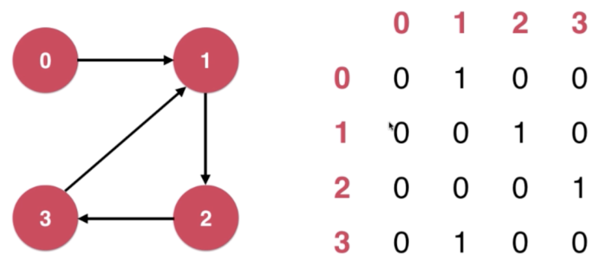

#### 邻接表（Adjacent Matrix）

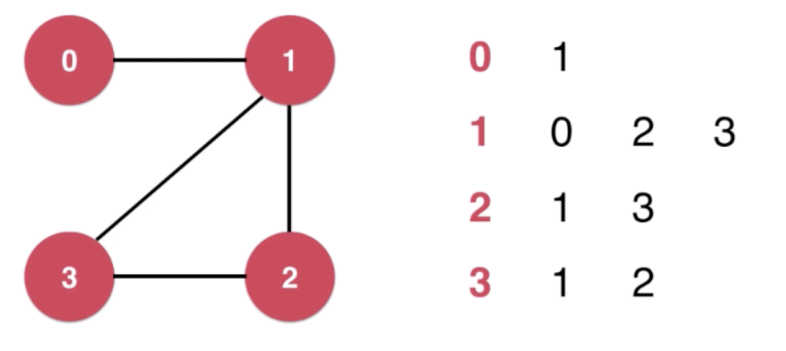

邻接表适合表示稀疏图（Sparse Graph）

邻接矩阵适合表示稠密图（Dense Graph）

#### 稀疏图

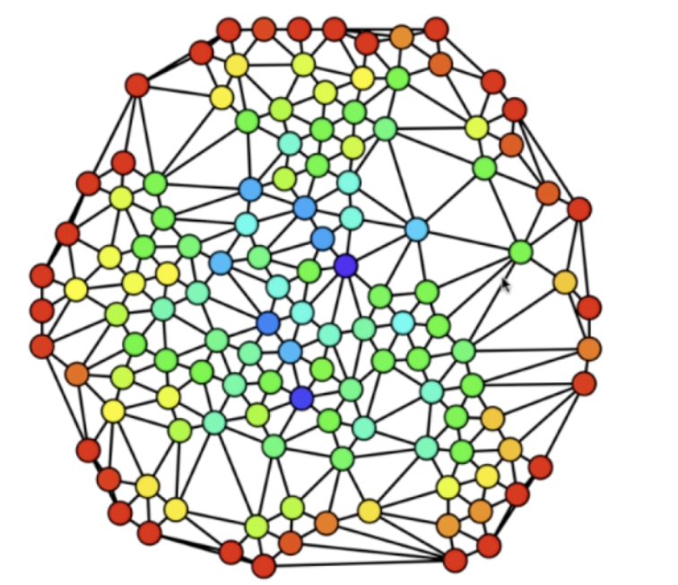

#### 稠密图和完全图

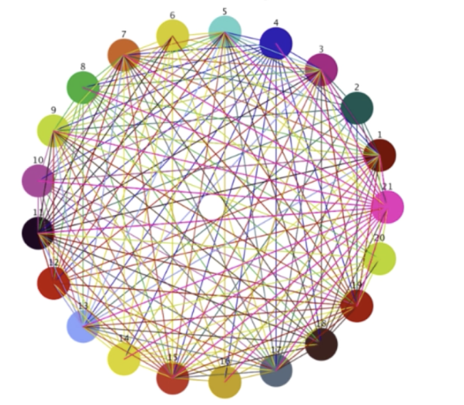

## 寻路

获得两点之间的一条路径

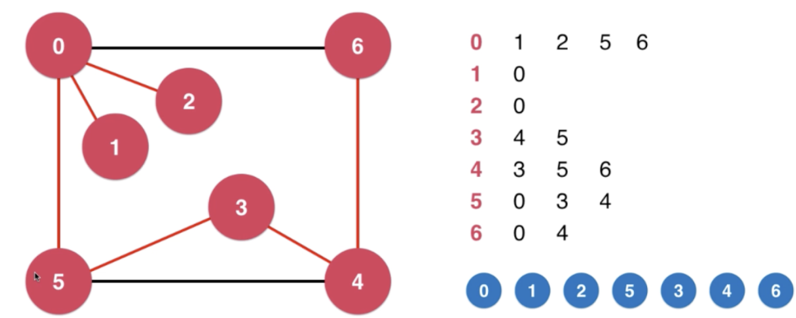

图的深度优先遍历-时间复杂度

稀疏图（邻接表）：O(V+E)

稠密图（邻接矩阵）：O(v^2^)

深度优先遍历算法-有向图

- dfs 查看是否有环- 有向图

## 广度优先遍历和最短路径

借助队列实现

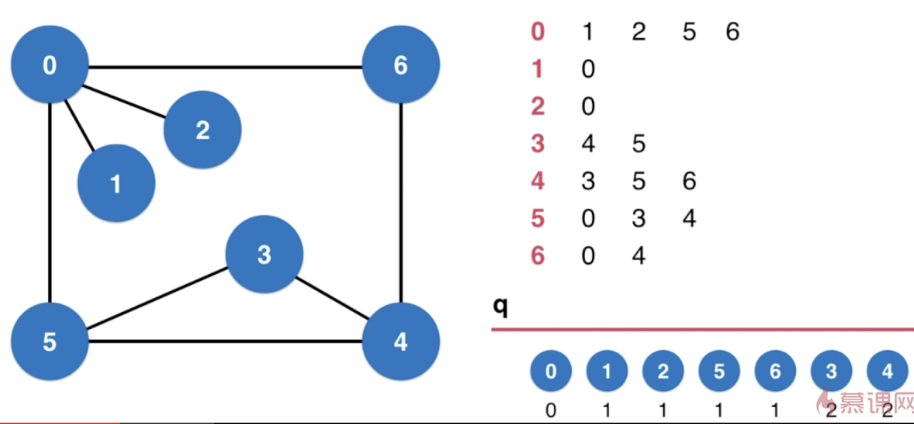

广度优先遍历求出了无权图的最短路径

图的广度优先遍历-时间复杂度

稀疏图（邻接表）：O(V+E)

稠密图（邻接矩阵）：O(v^2^)

## 无权图的应用- 迷宫生成，PS抠图

#### flood fill

魔棒抠图 连通分量 

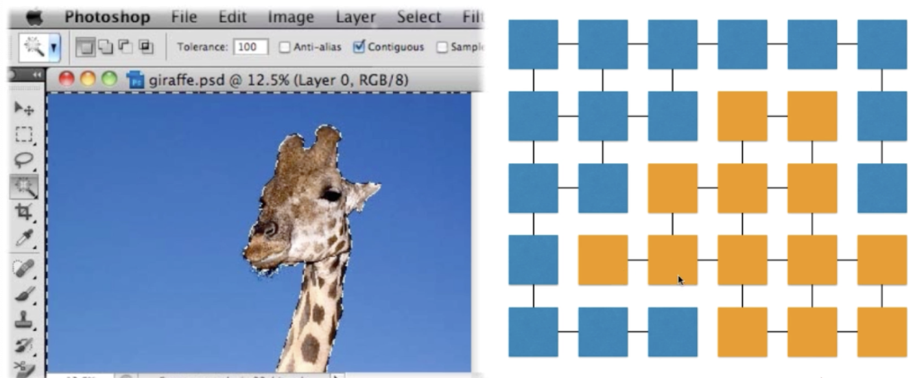

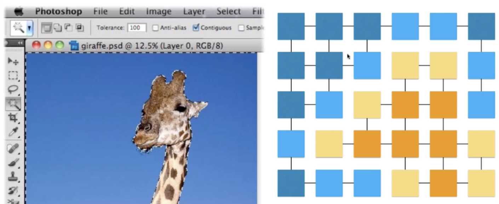

#### 扫雷

#### 走迷宫、 迷宫生成

迷宫的本质是一棵树 本质是一个生成树的过程

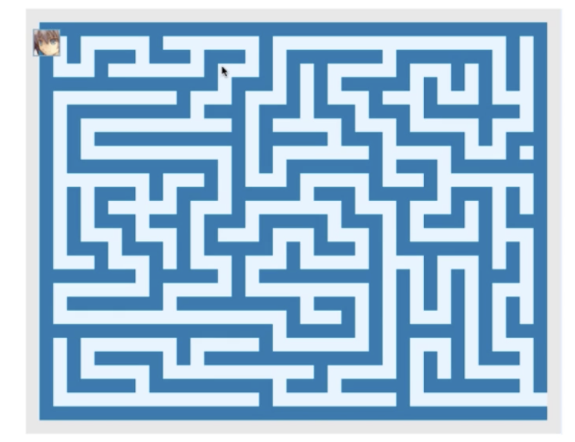

不能只用一种方式遍历， 随机队列遍历

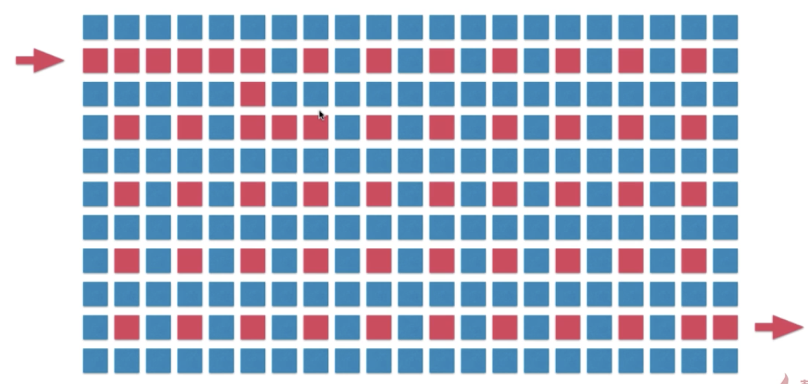

#### 欧拉路径 哈密尔顿路径

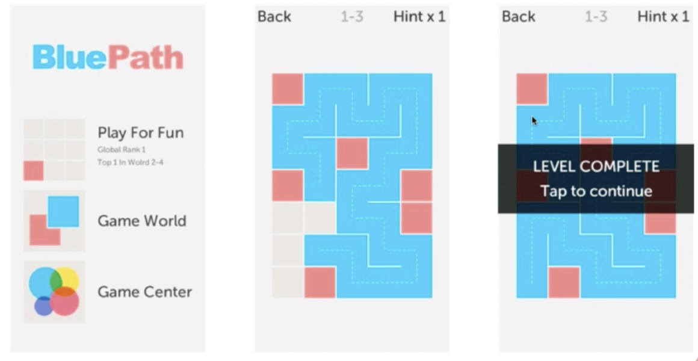

#### 二分图

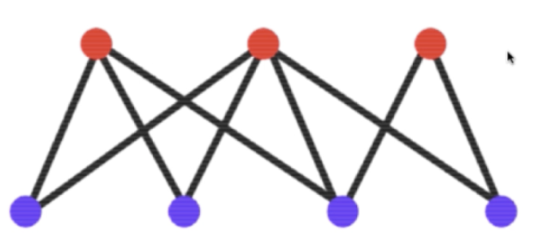

同学选课

#### 地图着色

