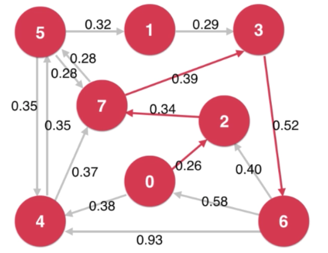
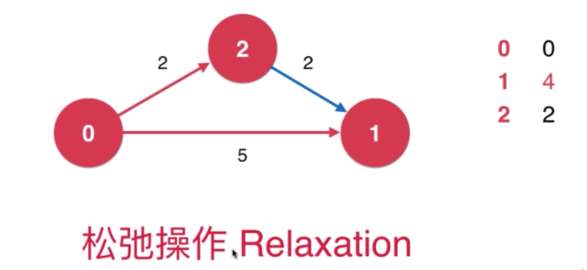
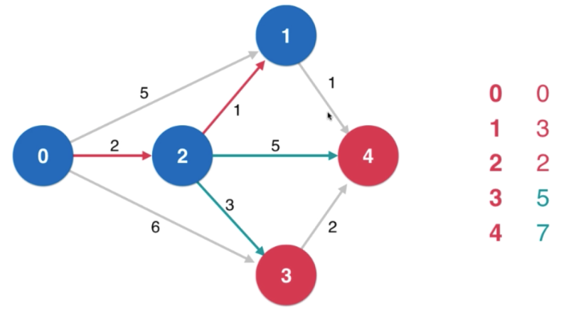
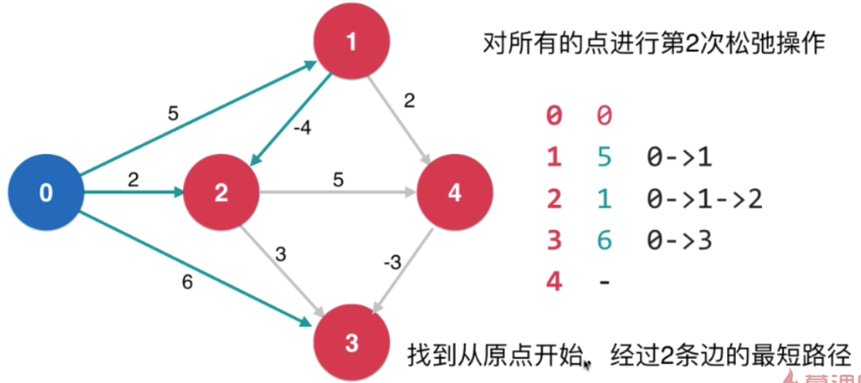

# 最短路径

## 路径最短问题和松弛操作（Relaxation）

#### 最短路径问题 Shortest Path

- 路径规划 城市，路由

- 工作任务规划

广度优先遍历 -> 最短路径树 Shortest Path Tree

单源最短路径 Single Source Shortest Path

无权图的最短路径

松弛操作是求最短路径的核心

## Dijkstra 算法的思想

#### dijkstra 单源最短路径算法

前提： 图中不能有负权边 

复杂度 O(ElogV)

## 负权边和Bellman-Ford算法

拥有负权环的图，没有最短路径

#### Bellman-Ford 单源最短路径算法

前提：图中不能有负权环

Bellman-Ford 判断图中是否有负权环

复杂度O(EV)

- 如果一个图没有负权环，从一个点到另一个点的最短路径，最多经过所有的V个顶线，有V-1条边。否则存在定点经过了两次，即存在负权环。

- 对一个点的一次松弛操作，就是找到经过这个点的另外一条路径，多一条边，权值更小。

- 如果一个图没有负权环，从一个点到另外一个点的最短路径，最多经过所有的V个顶线，有V-1条边。

- 对所有的点进行V-1次松弛操作。

- 对所有的点进程V-1次松弛操作，理论上就找到了从源点到其他所有点的最短路径。

- 如果还可以继续松弛，就说明原图中有负权环

##更多和最短路径相关的思考

