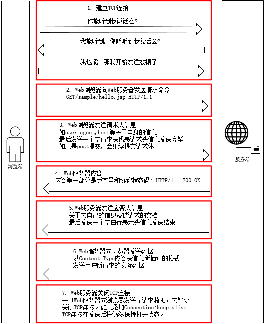

# 11 每日一面

> Ucloud


1. rpc

2. sql优化，如何解决高并发

   explain 慢查询，建索引

3. 什么方式实现缓存，什么情况下需要用到token,token失效怎么办等

4. 主从复制 

5. 数据库四种隔离级别，分别举例子，每种在上一种的基础上加了什么锁(很简单不说了)

6. Tcp，坚持计时器。keepalive计时器。

7. 写了一个shell命令，列出重复数据。awk+unique+sort很简单也不说了。


1. 网络协议
  

  计算机网络五层协议：物理层、数据链路层、网络层、传输层、应用层

  计算机网络的七层OSI协议： 物理层、数据链路层、网络层、传输层、会话层、表示层、应用层

  路由器属于网络层

  网卡与交换机数据数据链路层

2. TCP和UDP

  TCP 是面向连接的字节流服务，对系统资源要求比较多。程序结构复杂，保证数据的正确性和顺序性。

  UDP是无连接的，面向数据报，对系统的资源要求比较少，程序结构简单，不能保证数据的正确性和顺序性

3. 网站安全与防护

   - **sql 注入**

     使用例如PDO的预处理，使用或者编写类似mysql_real_escape_string的方法对sql的特殊字符进行转义

   - **XSS（cross site script）**跨站脚本攻击

     将外部脚本植入到页面中

   - **CSRF(cross-site request forgey)**跨站请求伪造

     伪造受信任的用户信息来请求网站

4. 算法相关

   **冒泡排序**

   ```java
   
   ```

   选择排序


​				快速排序

  **快速排序思想**：通过一趟排序将序列分成两部分，一部分所有数据比另一部分所有数据小，然后在这两个序列的内部再分别进行快速排序操作，直到最后形成一个有序序列

**二分插入排序思想**(之前的序列为有序)：插入第i个元素时，对前面的0~i-1进行折半，当前元素与中间元素比较，如果小，前半部分再次折半，如果大，后半部分进行折半，直到最后left>right,然后把目标位置到i-1的所有元素整体后移，把当前元素放进去

**基本查找算法**：

**顺序查找**

**二分法查找**(折半查找)：将序列分为两部分，找到序列的中间值，如果查找值大于中间值，继续对右半部分进行折半，如果查找值小于中间值，对左半部分进行折半，直到找到或front>end结束，时间复杂度O(log2n)以2为底n的对数	


5. 设计模式

   MVC是一种设计框架，而不是设计模式，框架是比模式更高的概念

   model负责数据逻辑

   controller负责用户交互

   view负责数据显示流程：

   用户对控制器的某个方法发出请求，控制器调用相应的模型返回数据，然后将数据渲染到视图中返回给用户 

   1) **单例模式**i. 私有化构造方法和__clone方法ii. 提供公有的静态的方法返回实例iii. 提供私有的静态属性保存实例 

   2) **简单工厂模式**(重点在创建不同对象，作用就是用来创建对象的) - 例如一个计算器的加减乘除求余取整i. 定义抽象基类让子类分别继承并实现相应方法ii. 定义Factory工厂类里面提供静态方法用于根据不同的参数实例化相应的子类对象 

   3) **策略模式**(重点在于实例化不同类的解决策略不同，作用是根据不同的情况调用相应的策略或算法) - 例如qq普通用户 vip svip购买皮肤的优惠策略i. 定义抽象基类让子类分别继承并实现相应的方法ii. 根据不同的场景实例化相应的类，然后调用其中的方法获取结果 

   4) **观察者模式**

   i. 需要有一个抽象的主题接口和一个抽象的观察者接口

   ii. 实现一个主题，实现多个观察者

   iii. 实例化主题，然后调用主题的方法并将不同的观察者对象实例化传入，在主题的方法中保存传入的观察者对象到一个属性，在主题中定义另外的方法通过保存观察者对象调用观察者的方法 


6. 大流量和高并发网站解决思路

   apache或者nginx进行相关配置 

   CDN加速 

   减少http请求，添加异步请求 

   启用浏览器缓存 代码压缩(去除空白符) 页面静态化：

   信息变更不是很频繁的页面进行静态化处理，生成html文件 

   数据缓存(数据库缓存redis,文件缓存) 

   使用Nginx，负载均衡

    mysql数据库优化 字段数据类型优化 索引优化 SQL语句优化 存储引擎优化 表结构设计优化 分表分库分区 主从复制，读写分离 

   COOKIE 和 SESSION


5. Cookie和Session

   session与cookie都是会话技术，默认情况下session在客户端依赖于cookie

   cookie保存在客户端，保存的是字符串，session保存在服务端，保存的是对象

   cookie安全性低，可被拦截或从本地分析得到，session安全性高

   session保存在服务器上，会占用服务器的资源，理论上大小没有限制，和服务器内存有关

   单个cookie保存的数据不能超过4K,很多浏览器都限制一个站点最多20个cookie

   登录信息等重要信息存放为session，其他信息如需保留，可以存在cookie中

6. MyISAM 和 InnoDB

   MyISAM 是表级锁，不支持事务和外键操作

   InnoDB是行级锁，支持事务处理和外键

   执行大量的select MyISAM更好，执行大量的insert 和update 用InnoDB更好

7. GET 和POST

   | GET                       | POST                            |
   | ------------------------- | ------------------------------- |
   | 参数在url后面，长度有限制 | 参数在RequestBody中，长度无限制 |
   | 可以保存为浏览器缓存      | 不可以保存为书签，不可以缓存    |
   | 保持幂等性                | 数据会被修改                    |
   | HTTP动词，规约            |                                 |

   

8. 一次完成的HTTP请求过程
  1. 域名解析DNS： 浏览器解析域名（主机名）为相应的IP地址
  2. 建立TCP连接 三次握手
  3. 浏览器想服务器发起http请求
  4. 服务器响应http请求，返回html数据
  5. 浏览器解析html代码并请求html中的资源
  6. 浏览器对页面进行渲染然后展示给用户
  7. 关闭TCP连接

  

  

  

  

  
