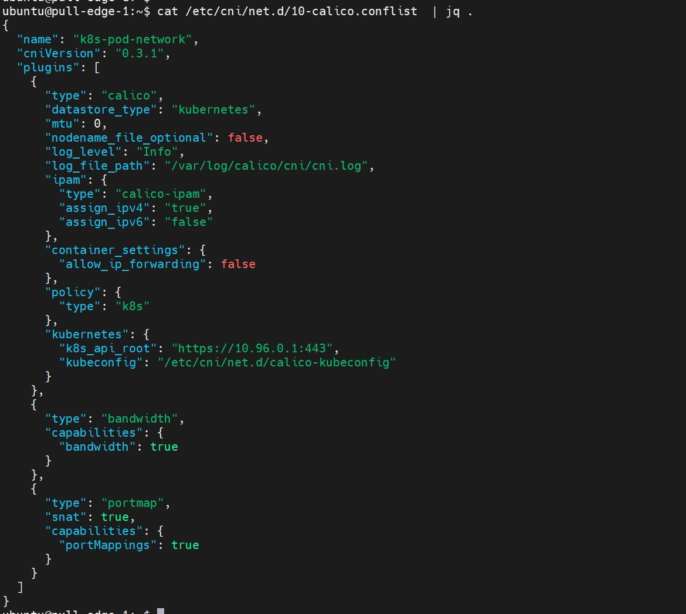
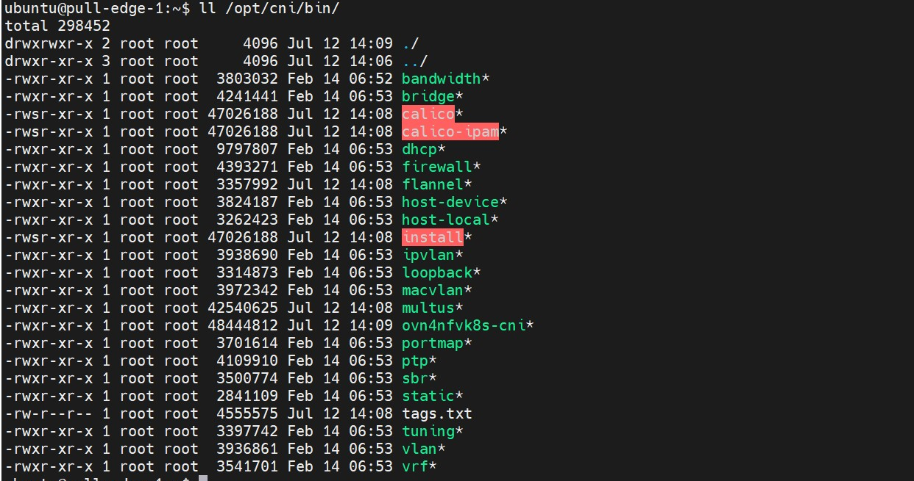

## Docker CNM

> What is CNI?
> 
> How CNI plugin works?
> 
> What a CNI plugin is made of?
> 
> How a CNI plugin is being used in K8s?
> 
> How a CNI plugin is executed?
> 
> Anatomy of Pod networking

#### What is CNI

CNI stands for Container Networking Interface

An interface between container runtime and the network implementation

Configure the network interfaces and routes

Concern itself only with the netwrok connectivity.

#### How CNI plugin works?

- A CNI binary
  - Handle connectivity -  configures the network interface of the Pod
  - `/opt/cni/bin`
- A daemon
  - Handle reachability - manager routings across the  cluster

#### What a CNI plugin is made of ?

##### Part 1

`/etc/cni/net.d` contains the CNI configuration. The name decide the order.



##### Part2



```sh
# cat /opt/cni/bin/my-cni.demo
case $CNI_COMMAND in
ADD)
    # configure networking for a new container
;;
DEL)
    # cleanup when container is stopped
;;
GET)
;;
VERSION)
    # get the version of CNI
;;
esac
```

##### How CNI plugin is executed?

```sh
CNI_COMMAND=ADD
CNI_CONTAINERID=123456780
CIN_NETNS=/proc/123456/netns
CNI_IFNAME=eth0
```

```sh
Container Info ---- env vars ---

                                  --->   CNI
CNI config ------ stdin --------
```

##### Anatomy of Pod Netwroking

veth pair

```sh
case $CNI_COMMAND in 
ADD) 
    podcidr=$(cat /dev/stdin | jq -r ".podcidr") # 10.240.0.0/24
    podcidr_gw=$(echo $podcidr| sed "s:0/24:1/g") # 10.240.0.1
    btctl addbr cni0 # create a new bridge(if doesnt exist),cni0
    ip link set cni0 up
    ip addr add "$(podcidr_gw)/24" dev cni0 # assign 10.230.0.1/24 to cni0


    host_ifname="veth$n" # n = 1,2,3..
    ip link add $CNI_IFNAMW type veth peer name $host_ifname
    ip link set $host_ifname up

    ip link set $host_ifname master cni0 # connect veth1 to bridge
    ln -sfT $CNI_NETNS /var/run/netns/$CNI_CONTAINERID
    ip link set $CNI_IFNAME netns $CNI_CONTAINERID # move eth0 to Pod ns

    # calculate $ip
    ip netns exec $CNI_CONTAINERID ip link set $CNI_IFNAME up
    ip netns exec $CNI_CONTAINERID ip link addr add $ip/24 dev $CNI_IFNAME
    ip netns exec $CNI_CONTAINERID ip route add default via $podcidr_gw dev $CNI_IFNAME

;;
```

```sh
if [ -f /tmp/last_allocated_ip ]; then
    n=`cat /tmp/last_allocated_ip`
else
    n =1
fi
ip=$(echo $podcidr| sed "s:0/24:$(($n+1)):g")
echo $(($n+1)) > /tmp/last_allocated_ip
```

If the pod-to-pod communactaion is doesn't work

```sh
iptables -A FORWARD -s 10.240.0.0/16 -j ACCEPT
iptables -A FORWARD -d 10.240.0.0/16 -j ACCEPT
```

connect to another node

```sh
# node-1
ip route add 10.240.1.0/24 via 10.10.10.11 dev enp0s9
# node-2
ip route add 10.240.0.0/24 via 10.10.10.11 dev enp0s9
# and enable ipv4-forward
```

Pod to publice network need a SNAT

```sh
iptables -t nat -A POSTROUTING  -s 10.240.0.0/24 -o cni0 -j MASQUERADE
```

expose  pod

```sh
kubectl expose pod nginx2 --port=8080 --target-port=80
# this will create service with cluster IP
```

## CNI

Kubernetes Networking Requirements

- Each Pod get their own IP addresss
  
  - Containers within a Pod share network namespace

- All pod can communicate with all other pods without NAT(Network Address Translation)

- All nodes can communicate with all pods without NAT

- The IP of the Pod is same throughout the cluster

- `runtime` is the program responwsible for executing CNI plugins.

- `plugin` is a program that applies a specified network configuration.

### CNI generic parameters

```json
{
  "cniVersion": "0.2.0",
  "name": "mybridge",
  "type": "bridge",
  "bridge": "cni_bridge0",
  "isGateway": true,
  "ipMasq": true,
  "ipam": {
    "type": "host-local",
    "subnet": "10.15.20.0/24",
    "routes": [
      {
        "dst": "0.0.0.0/0"
      },
      {
        "dst": "1.1.1.1/32",
        "gw": "10.15.20.1"
      }
    ]
  }
}
```

- cniVersion: The version of the CNI spec in thich the definition works with
- name: The network name
- type: The name of the plugin you wish to use. In this case, the actual name of the  plugin executable
- args: Optinal additional parameters
- ipMasq:  Configure outbound masquerade (source NAT) for this network
- ipam
  - type:  The name of the IPAM plugin executable
  - subnet: The subnet to allocate out of (this is  actually part of the IPAM plugin)
  - routes:
    - dst: The subnet you wish to reach
    - gw: The IP address of the next hop to reach the dst. If not specified the default fateway for the subnet is assumed
- dns:
  - nameservers: A list of nameservers you wish to use with this network
  - domain: The search domain to use for DNS requests
  - search: A list of search domains
  - options: A list of options to be passed to the receiver

### Plugin (bridge) specific paramters

- isgateway: If true, assigns an IP address to the bridge so containers connected to it may use is as a gateway.
- isdefaultgateway: If true, sets the assigned IP address as the default route.
- forceAddress: Tell the plugin to  allocate a new IP address if the previous value has changed.
- mtu: define the MTU of the bridge
- hairpinMode:  Set hairpin mode for the interfaces on the bridge.

These variables are passed to the plugin via environmental variables.

```sh
sudo CNI_COMMAND=ADD  CNI_CONTAINERID=1234567890 CNI_NETNS=/var/run/netns/1234567890 CNI_IFNAME=eth12 CNI_PATH=`pwd` ./bridge < mybridge.conf
```

- CNI_COMMAND=ADD we are telling CNI that we want to add a connection
- CNI_CONTAINERID=1234567890  We're telling CNI that the network namespace we want to work 
- CNI_NETNS=/var/run/netns/1234567890 The path to the namspace
- CNI_IFNAME=eth12 The name of the interface we wish to  use on the container side of the connection
- CNI_PATH=`pwd` We always need to tell CNI where the plugin executables live. In this 

[7/15/2022 10:33 AM] Ramakrishnan, Kuralamudhan https://www.dasblinkenlichten.com/understanding-cni-container-networking-interface/ 
 [7/15/2022 10:36 AM] Ramakrishnan, Kuralamudhan https://github.com/containernetworking/cni/blob/main/SPEC.md 
 [7/15/2022 10:36 AM] Ramakrishnan, Kuralamudhan https://github.com/containernetworking/plugins/tree/main/plugins/main/bridge 
 [7/15/2022 10:37 AM] Ramakrishnan, Kuralamudhan https://github.com/containernetworking/plugins/blob/main/plugins/main/bridge/bridge.go

https://www.youtube.com/watch?v=zmYxdtFzK6s&ab_channel=CNCF%5BCloudNativeComputingFoundation%5D

https://github.com/eranyanay/cni-from-scratch

## Question:

1. the CNI configuration default path is `/etc/cni/net.d/`. If there are multiple configuration file in this path, for example, In SDEWAN project,  there are as following:
   
   ```sh
   root@pull-edge-1:/etc/cni/net.d# ll
   total 32
   drwxr-xr-x 4 root root 4096 Jul 12 14:09 ./
   drwxr-xr-x 3 root root 4096 Jul 12 14:08 ../
   -rw------- 1 root root  857 Jul 12 14:08 00-multus.conf
   -rw-r--r-- 1 root root  804 Jul 12 14:08 10-calico.conflist
   -rw-r--r-- 1 root root   88 Jul 12 14:09 20-network.conf
   -rw------- 1 root root 2854 Jul 19 09:11 calico-kubeconfig
   drwxr-xr-x 2 root root 4096 Jul 12 14:08 multus.d/
   drwxr-xr-x 2 root root 4096 Jul 12 14:09 ovn4nfv-k8s.d/
   ```

​            How kublet know which one is the default CNI? Does it depend on the file name numberic perfix ?

2. I found  all  the CNI binary in this Path  `/opt/cni/bin`. Is this  a default PATH for CNI spec ? If  any CNI  will put the binary in this path.
3. In the Service Function Chain Demo Archtecture. Is the brown box represent a virtual switch? And except the brown box, does it still need another CNI interface as the default CNI interface for kubelet to manager the pod.
- Does kubernetes support any versoin of CNI SPEC.For example, does kubernetest support all of the CNI SPEC version.
- 

## Reference

https://wiki.ith.intel.com/display/containers/Nodus
