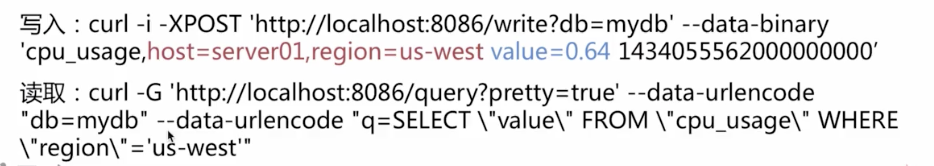

# Go并发编程案例解析


nginx 


influxdb 时序数据库 Prometheus

Grafana 


实例代码

https://github.com/itsmikej/imooc_logprocess


## 常见的并发模型

- 进程&线程 Apache `C10K` 服务器要同时支持10K的并发连接
- 异步非阻塞 （Nginx，Libevent， NodeJs）epoll  复杂度高
- 协程 GoLang， Erlang， Lua

### Golang并发实现

- 程序并发执行 `goroutine`
- 多个goroutine间的数据同步通信`channels`
- 多个channel选择数据读取或者写入`select`

#### Goroutines

Goroutines 程序并发执行

```go
foo() // 执行函数foo, 程序等待函数foo返回
go foo() // 执行函数foo
bar（） // 不用等待foo返回
```

  

#### Channels 

Channels多个goroutine间的数据通信与同步

```go
c := make(chan string) // 创建一个channel
go func(){
  time.Sleep(1*time.Second)
  c <- "message from closure"  // 发送数据到channel 中
}()

msg:=<- c // 阻塞直到接收到数据
```

#### Select

Select 从多个Channel 中读取或写入数据

```go
select{
  case v:= <-c1:
  	fmt.Println("channel 1 sends",v)
  case v:=<- c2:
  	fmt.Println("channel 2 sends")
  default: // 可选
  	fmt.Println("neither channel was ready") 
}
```


### 并发与并行

> Rob Pike Concurrency is not Parallelism

- 并发：  指同一时刻，系统通过调度，来回切换交替运行的多个任务，“看起来”是同时运行
- 并行： 执行统一时刻，两个任务“真正的”同时运行

Concurrency： 单核CPU，逻辑上同时执行

Parallelism： 多核CPU，物理上同时执行


多个goroutine 并发执行

> 将复杂的任务拆分，通过goroutine 去并发执行
>
> 通过channel做数据通信

### Golang 中的面向对象

- struct 类型
- inteface
- 继承、封装、多态


#### 封装

```go
type Foo struct{
  baz string
}

func (f *Foo) echo(){  // 接受者  成员函数
  fmt.Println(f.baz)
}

func main(){
  f := Foo{baz: "hello, struct"}
  f.echo()
}
```


#### 继承

```go
type Foo struct{
  baz string
}

type Bar struct{
  Foo
}

func (f *Foo) echo(){  // 接受者  成员函数
  fmt.Println(f.baz)
}

func main(){
  b := Bar{Foo{baz: "hello, struct"}}
  b.echo()
}
```


#### 多态

非侵入式的接口 duck 接口

```go
type Foo interface{
  qux()
}

type Bar struct{}
type Baz struct{}
	
func (b *Bar) qux(){}
func (b *Baz) qux(){}

func main(){
	var f Foo
  f = Bar{}
  f = Baz{}
  fmt.Println(f)
}
```


## 2. 日志监控程序的实现

### LogProcess


### 读取模块实现

- 打开文件
- 从文件`末尾`开始`逐行`读取
- 写入read channel

### 解析模块的实现

提取数据中有价值的信息

- 从Read Channel 中读取每行日志数据
- 正则提取所需的监控数据(path, status, method 等)
- 写入Write channel

### 写入模块的实现

- 初始化influxDB client
- 从write channel中读取监控数据
- 构造数据并写入influxDB

InfluxDB 简介：

 influxdb是一个开源的`时序型的数据库`，使用Go语言编写，被广泛应用于存储系统的`监控数据`，IoT行业的试试数据等场景。有以下特性。

- 部署简单，无外部依赖
- 内置http支持，使用http读写
- 类sql的灵活查询(max, min, sum 等)

Influx db关键概念

- database ： 数据库
- measurement：数据库中的表
- points： 表里面的一行数据
  - tags 各种有索引的属性
  - fields 各种记录的值
  - time 数据记录的时间戳， 也是自动生成的主索引



### 分析监控需求

某个协议下的某个请求在某个请求方法的 QPS& 响应时间& 流量

**Tags：**Path 、Method、Scheme、Status 
**Fields：** UpstreamTime， RequestTime，ByteSent
**TIme：**   TimeLocal

​                       

### 5. 绘制监控图

### 6. 监控模块的实现

1. 总处理日志的行数
2. 系统吞吐量
3. read channel 长度
4. write channel 长度
5. 运行总时间
6. 错误数量


并发的基础知识

并行和并发的区别

Golang 面向对象

并发编程的思路

模块化编程

