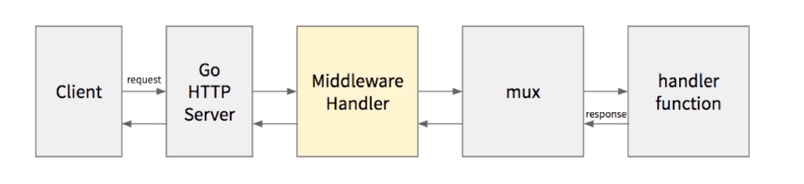
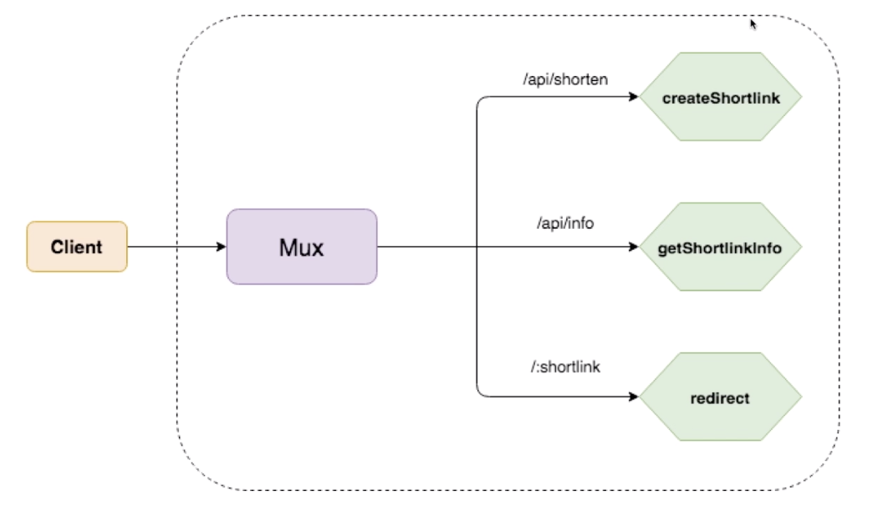
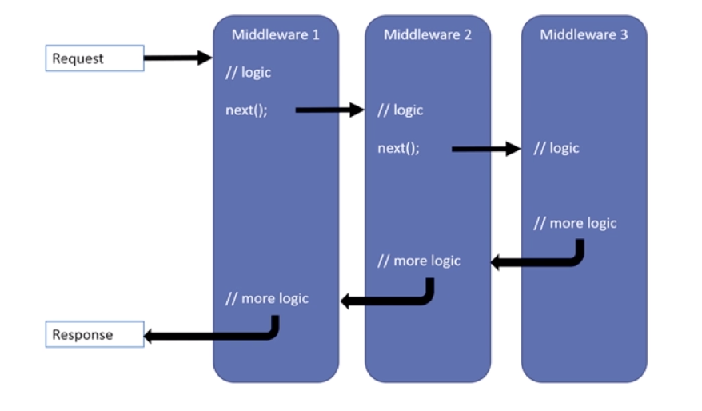
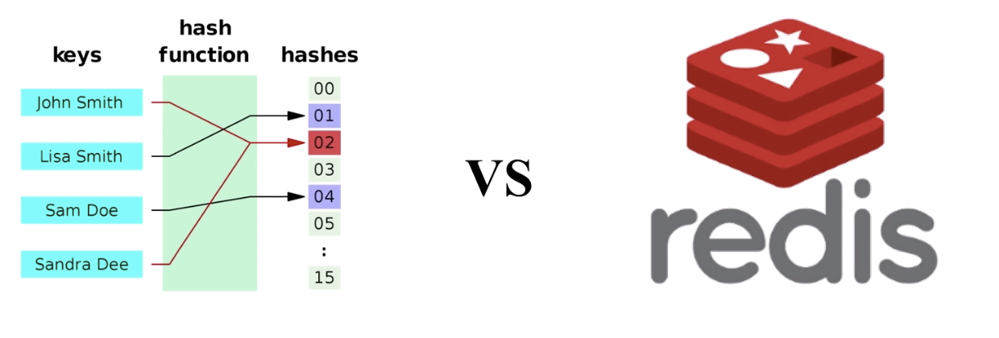
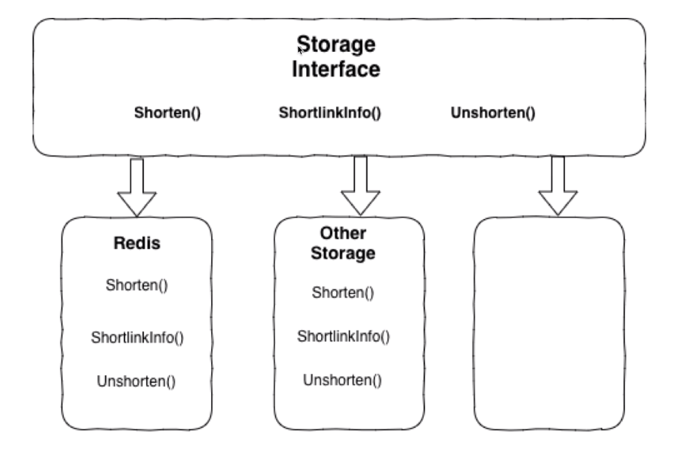
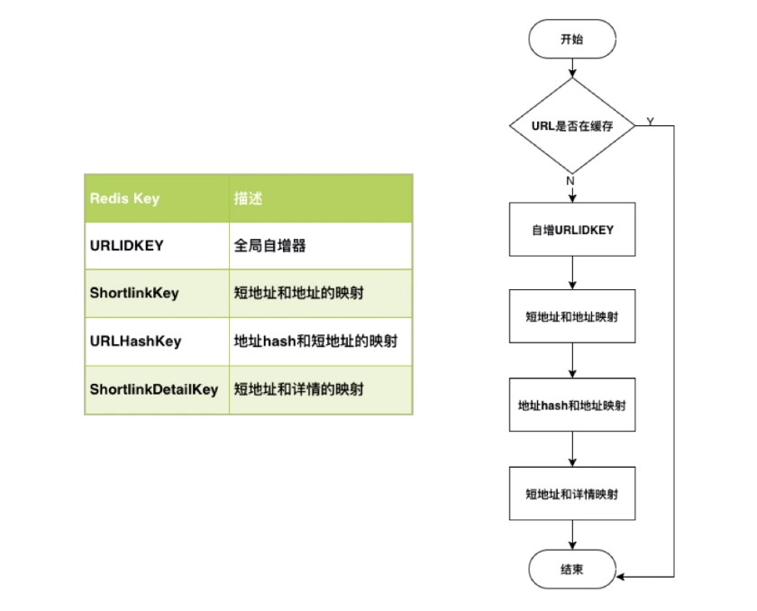

## 1 短地址服务

将长地址缩短到一个很短的地址，用户访问这个短地址可以重定向到原本的长地址。

- 如何设计HTTP Router 和handler
- 如何在HTTP 处理流程中加入Middleware
- 如何利用Go的Interface来实现可扩展的设计
- 如何使用redis的自增长序列生成短地址

## 2 主服务模块

###  API接口

- POST /api/shorten
- GET /api/info?shortlink=shortlink
- GET /:shortlink - return 302 code 重定向

#### POST /api/shorten

- Params

  | Name                  | Type   | Description                                                  |
  | --------------------- | ------ | ------------------------------------------------------------ |
  | url                   | string | Required. URL to shorten. e.g. https://www.example.com       |
  | expiration_in_minutes | int    | Required. Expiration of short link in minutes. e.g. value 0 represents permanent. |

- Response

  ```json
  {
    "shortlink":"P"
  }
  ```

  

#### GET /api/info?shortlink=shortlink

- Params

  | Name      | Type   | Description                       |
  | --------- | ------ | --------------------------------- |
  | shortlink | string | Required. Id of shortened. e.g. P |

- Response

  ```json
  {
    "url":"https://www.example.com",
    "created_at": "2022-03-09 23:07:03",
    "expiration_in_minutes": 60
  }
  ```

  

#### GET /:shortlink - return 302 code 重定向 Redirect

302 临时重定向；301会永久保存在用户的缓存中。

一个完整的HTTP 处理流程



Middleware 是一个pipeline：认证，鉴权，log

### Mux中router和Handler设计

gorilla/mux 处理router 和handler



```go
func main(){
  r := mux.NewRouter()
  r.HandleFunc("/", HomeHandler)
  r.HandleFunc("/product", ProductsHandler)
  r.HandleFunc("/articles",ArticlesHandler)
  http.Handle("/",r)
}
```

### 实现router和handler

工程代码

```fh
➜  goshorten tree
.
├── app.go
└── main.go
```

main.go

```go
package main

func main() {
    a := App{}
    a.Initialize()
    a.Run(":8000")
}

```

app.go

```go
package main

import (
	"encoding/json"
	"fmt"
	"io"
	"log"
	"net/http"

	"github.com/gorilla/mux"
	"gopkg.in/validator.v2"
)

// App encapsulate Env, Router and middleware
type App struct {
	Router *mux.Router
}

type shortenReq struct {
	URL                 string `json:"url" validate:"nonzero"`
	ExpirationInMinutes int64  `json:"expiration_in_minutes" validate:"min=0"`
}

type shortlinkResp struct {
	ShortLink string `json:"shortlink"`
}

// Initialize is initialization of app
func (a *App) Initialize() {
	// set log formatter
	log.SetFlags(log.LstdFlags | log.Lshortfile)
	a.Router = mux.NewRouter()
	a.initializeRouters()
}

func (a *App) initializeRouters() {

	a.Router.HandleFunc("/api/shorten", a.createShortLink).Methods("POST")
	a.Router.HandleFunc("/api/info", a.getShortLinkInfo).Methods("GET")
	a.Router.HandleFunc("/{shortlink:[a-zA-Z0-9]{1,11}}", a.redirect).Methods("GET")
}

func (a *App) createShortLink(w http.ResponseWriter, r *http.Request) {
	var req shortenReq
	if err := json.NewDecoder(r.Body).Decode(&req); err != nil {
		return
	}
	if err := validator.Validate(req); err != nil {
		return
	}
	defer func(Body io.ReadCloser) {
		_ = Body.Close()
	}(r.Body)

	fmt.Printf("%v\n", req)
}

func (a *App) getShortLinkInfo(w http.ResponseWriter, r *http.Request) {

	vars := r.URL.Query()
	s := vars.Get("shortlink")

	fmt.Printf("%s\n", s)
}

func (a *App) redirect(w http.ResponseWriter, r *http.Request) {

	vars := mux.Vars(r)
	fmt.Printf("%s\n", vars["shortlink"])
}

// Run starts listen and serve
func (a *App) Run(addr string) {
	log.Fatal(http.ListenAndServe(addr, a.Router))
}
```

#### 测试API

```sh
curl -X POST \
  http://localhost:8000/api/shorten \
  -d '{"url":"www.baidu.com","expiration_in_minutes":1}'
  
curl -X GET \
  'http://localhost:8000/api/info?shortlink=hi' 
  
curl -X GET \
  http://localhost:8000/A 
```


### 错误处理设计

- An interface type is defined as a set of method signatures.

  一个接口是一系列方法签名的集合

- A values of interface type can hold any value that implements those methods.

  一个接口的类型 可以接受任何实现了接口方法的对象

```go
// Go 的内置接口
type error interface{
  Error() string
}
```

```go
err := errors.New("Error message!")
if err != nil{
  fmt.Print(err)
}
```

工程代码

```go
.
├── app.go
├── error.go
└── main.go
```

error.go

```go
package main

type Error interface {
    error
    Status() int
}

type StatusError struct {
    Code int
    Err  error
}

func (se StatusError) Error() string {  // (se *StatusError)   区别
    return se.Err.Error()
}

func (se StatusError) Status() int {
    return se.Code
}

```

app.go

```go
func (a *App) createShortLink(w http.ResponseWriter, r *http.Request) {
	var req shortenReq
	if err := json.NewDecoder(r.Body).Decode(&req); err != nil {
		responseWithError(w, StatusError{http.StatusBadRequest,
			fmt.Errorf("prase parameters failed %v", r.Body)})
		return
	}
	if err := validator.Validate(req); err != nil {
		responseWithError(w, StatusError{http.StatusBadRequest,
			fmt.Errorf("validate parameters failed %v", req)})
		return
	}
	defer func(Body io.ReadCloser) {
		_ = Body.Close()
	}(r.Body)

	fmt.Printf("%v\n", req)
}

func responseWithError(w http.ResponseWriter, err error) {
	switch e := err.(type) {
	case Error:
		log.Printf("HTTP %d - %s", e.Status(), e)
		responseWithJSON(w, e.Status(), e.Error())
	default:
		responseWithJSON(w, http.StatusInternalServerError,
			http.StatusText(http.StatusInternalServerError))
	}

}

func responseWithJSON(w http.ResponseWriter, code int, payload interface{}) {
	resp, _ := json.Marshal(payload)
	w.Header().Set("Content-Type", "application/json")
	w.WriteHeader(code)
	_, _ = w.Write(resp)
}

```

## 3 中间件模块 Middleware

 

- Log Middleware 

- Recover Middleware

middleware.go

```go
package main

import (
	"log"
	"net/http"
	"time"
)

type Middleware struct {
}

//LoggingHandler log the time-consuming of http request
func (m Middleware) LoggingHandler(next http.Handler) http.Handler {
	fn := func(w http.ResponseWriter, r *http.Request) {
		t1 := time.Now()
		next.ServeHTTP(w, r)
		t2 := time.Now()
		log.Printf("[%s] %q %v", r.Method, r.URL.String(), t2.Sub(t1))
	}

	// adaptor
	return http.HandlerFunc(fn)
}

// RecoverHandler recover panic
func (m Middleware) RecoverHandler(next http.Handler) http.Handler {
	fn := func(w http.ResponseWriter, r *http.Request) {
		defer func() {
			if err := recover(); err != nil {
				log.Printf("Recover from panic: %+v", err)
				http.Error(w, http.StatusText(500), 500)
			}
		}()
		next.ServeHTTP(w, r)
	}
	return http.HandlerFunc(fn)
}

```


### Alice包的使用

- Alice provide a convenient way to chain your HTTP middleware function and the app handler.

```go
Middleware1(Middlerware2(Middlerware3(app)))

alice.New(Middlerware1, Middleware2, Middleware3).Then(app)
```


## 4 存储模块 Storage 

### 如何生成短地址



-  INCR key

  ```sh
  redis> SET mykey "10"
  "OK"
  redis>INCR mykey 
  (integer) 11
  redis>get mykey
  "11"
  redis>
  ```

  > Redis 客户端
  >
  > Medis
  > TablePlus
  >
  > Redis-cli

### Storage接口设计



### 实现Shorten, Unshort 和 ShortlinkInfo 接口


 


```sh
curl -X POST \
  http://localhost:8000/api/shorten \
  -d '{"url":"www.baidu.com","expiration_in_minutes":15}'
  
curl -X GET \
  'http://localhost:8000/api/info?short_link=8' 
  
curl -X GET \
  http://localhost:8000/2
```


## 5 单元测试


主服务测试用例
