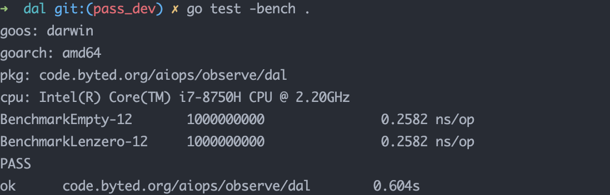

````go
package dal

import "testing"

func Empty() {
	str := "12312"
	if str == "" {

	}
}
func Lenzero() {
	str := ""
	if len(str) == 0 {

	}
}
func BenchmarkEmpty(b *testing.B) {
	for n := 0; n < b.N; n++ {
		Empty()
	}
}

func BenchmarkLenzero(b *testing.B) {
	for n := 0; n < b.N; n++ {
		Lenzero()
	}
}

````

