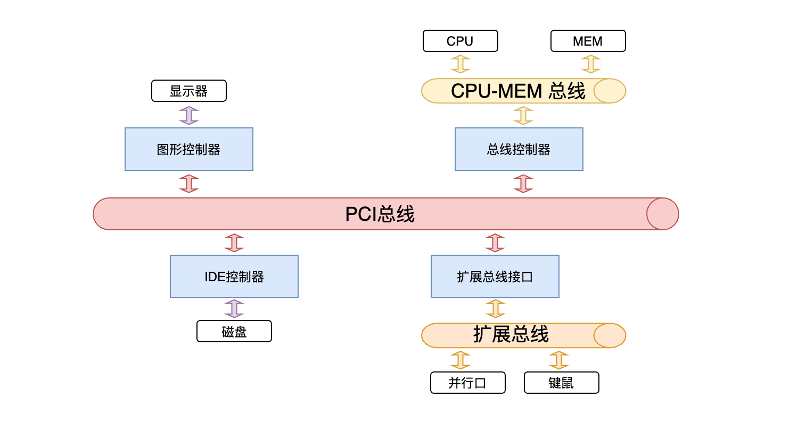
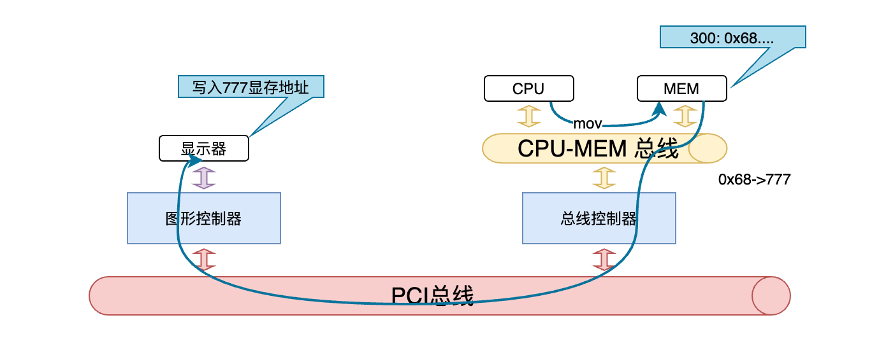

---

title: 「OS」操作系统之基础

---

# 1.操作系统概述

什么是操作系统？

 操作系统就是组织所有的硬件，为用户程序提供调用接口的代码。是计算机硬件与应用之间的一层软件。封装了对硬件调用的实现，以及进程的管理。

硬件管理分类：

CPU管理、内存管理、终端管理、磁盘管理、文件管理

网络管理、电源管理、多核管理

计算机硬件组成如图

我们学习一门编程语言，最先学习的就是打印“Hello World”。

计算机把代码加载到内存，通过PCI总线将数据写入显存地址，图形控制器将数据显示到面板。

> 对操作系统的学习需要掌握以下几点
>
> 系统调用: 使用显示器 print； 使用CPU：fork； 使用文件： open、read
>
> 一段文字是如何写到磁盘上的
>
> **成为掌握计算机关键技术的工程师，而不是仅仅调用API的工程师。**
>
> | Lab1: 扩展线程     | 实现线程调度         |
> | ------------------ | -------------------- |
> | Lab2: 实现系统调用 | 将整个接口剥掉，添加 |
> | Lab3: 实现虚存管理 | 扩展实现内存管理     |
> | Lab4: 扩展文件系统 | 扩展实现一个文件管理 |

> 知名计算机高校
>
> CMU Carnegie Mellon University: 卡内基·梅隆大学
>
> MIT Massachusetts Institute of Technology： 麻省理工学院
>
> Leland Stanford Junior University 斯坦福大学
>
> **"Learn OS concepts by coding them!!!"**

# 2. 操作系统引导

从打开电源开始，操作系统做了什么？

计算机怎么工作的

> 不要总等着别人告诉你答案，尽量自己去寻找
>
> 从知识和常识出发进行推理，思索

 图灵机-> 通用图灵机 

前缀表达式

后缀表达式

自动机

PC program counter

取指执行

、

BIOS： Basic  Input Output System

CS 段寄存器

cs << 4 +IP

一个扇区512Byte

0 磁道0扇区 引导扇区

c 编译后int i  无法确定内存地址

段寄存器，段内偏移

宏定义

> 
>
> [Bochs](https://bochs.sourceforge.io/)is a highly portable open source IA-32 (x86) PC emulator written in C++, that runs on most popular platforms. It includes emulation of the Intel x86 CPU, common I/O devices, and a custom BIOS. Bochs can be compiled to emulate many different x86 CPUs, from early 386 to the most recent x86-64 Intel and AMD processors which may even not reached the market yet.
>
> 
>
> 
>
> The [GNU Compiler Collection](https://gcc.gnu.org/) includes front ends for [C](https://gcc.gnu.org/c99status.html), [C++](https://gcc.gnu.org/projects/cxx-status.html), Objective-C, [Fortran](https://gcc.gnu.org/fortran/), Ada, Go, and D, as well as libraries for these languages (libstdc++,...). GCC was originally written as the compiler for the [GNU operating system](http://www.gnu.org/gnu/thegnuproject.html). The GNU system was developed to be 100% free software, free in the sense that it [respects the user's freedom](http://www.gnu.org/philosophy/free-sw.html).
>
> 
>
> [GDB](https://www.gnu.org/software/gdb/), the GNU Project debugger, allows you to see what is going on `inside' another program while it executes -- or what another program was doing at the moment it crashed.

CMU

斯坦福
