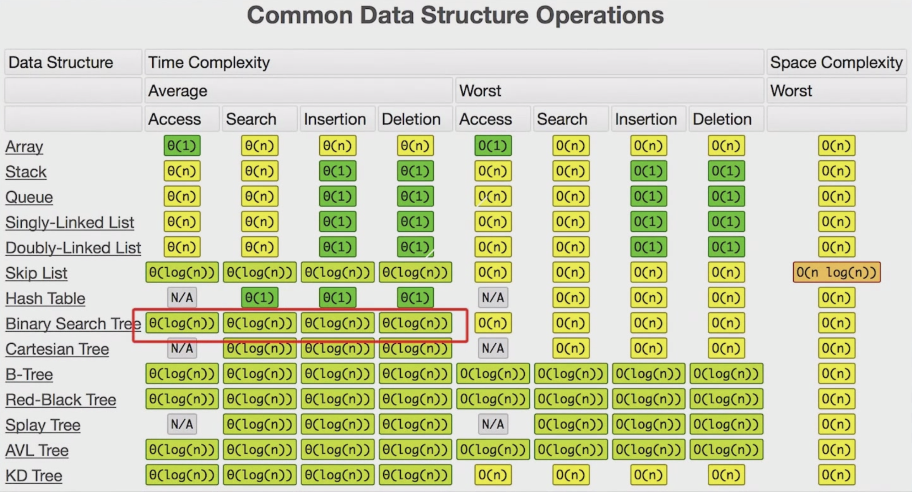
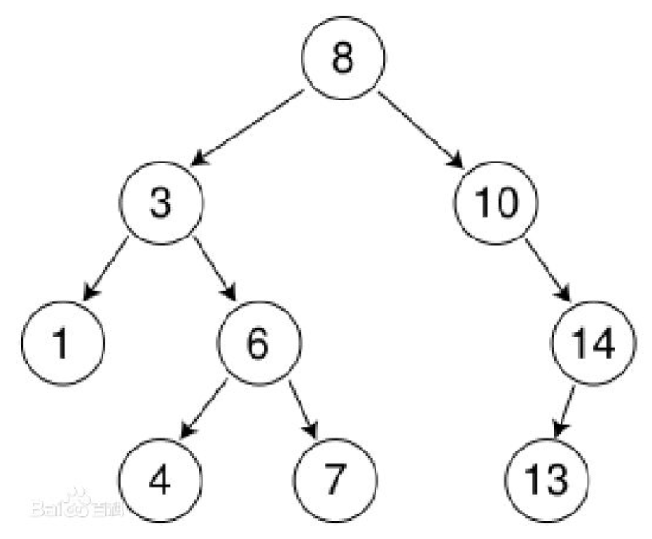

> 单链表的查询时间复杂度是O(n)
>
> 跳表
>
> 树
>
> 图
>
> Linked List 是特殊化的Tree
>
> Tree 是特殊化的图


斐波那契， 状态树，递归树

状态树空间

决策树空间




## 二叉树

**满二叉树**：一个二叉树的所有非叶子节点都存在左右孩子，并且所有叶子节点都在同一层级上。

**完全二叉树**:


存储结构:

1. 链式存储

   ```go
   // golang
   type Node struct {
   	Data      int64
   	LeftNode  *Node
   	RightNode *Node
   }
   ```

1. ```c++
// C++
   struct TreeNode{
     int val;
     TreeNode *left;
     TreeNode *right;
     TreeNode(int x): val(x), left(NULL), right(NULL){}
   }
   ```

3. ```java
   public class TreeNode{
     public int val;
     public TreeNode left,right;
     public TreeNode(int val){
   		this.val=val;
       this.left=NULL;
       this.right=NULL;
     }
   }
   ```

1. 

1. 

2. 

2. 数组: 适用于表示完全二叉树，对于稀疏二叉树是非常浪费空间的。              

   ```go
   	Tree := make([]int64,1000)
   	// 一般情况下，0 为root节点。 对于n位置的节点 左孩子 Tree[2*n-1]， 右孩子为Tree[2*n]
   ```


中序遍历，前序遍历

```java
import java.util.*;

public class Solutions {

    public class TreeNode {
            int val;
            TreeNode left;
            TreeNode right;
            TreeNode(int x) { val = x; }
         }
    public TreeNode Solutions(int [] pre,int [] in) {
        if(pre == null || in == null || pre.length == 0){
            return null;
        }
        int rootValue = pre[0];
        TreeNode node = new TreeNode(rootValue);
        for(int i = 0; i < in.length; i++){
            if(in[i] == rootValue ){
                if(pre.length > 1){
                    node.left = Solutions(Arrays.copyOfRange(pre, 1, i+1),
                                                 Arrays.copyOfRange(in, 0,i));
                    node.right = Solutions(Arrays.copyOfRange(pre,i+1,pre.length),
                                                  Arrays.copyOfRange(in,i+1,in.length));
                }else{
                    node.left = null;
                    node.right = null;
                }
                
            }
        }
      
        return node;
    }


    public static void main(String[] args) {
        int[] a = new int[]{1,2,3,4,5,6,7};
        int[] b = new int[]{3,2,4,1,6,5,7};

        Solutions solution = new Solutions();
        TreeNode node = solution.Solutions(a,b);
        System.out.println("result");

        int i = 0;

        //int s = i++ + i;
        int tmp = i;
        i = i +1;
        i = tmp +i;
        
        System.out.println(  (byte)129);
    }
}
```


## 二叉搜索树

二叉排序树（Binary Sort Tree），又称二叉查找树（Binary Search Tree），亦称二叉搜索树。

**定义**

二叉排序树或者是一个棵空树，或者具有下列性质的二叉树
- 若左子树不空，则左子树上所有节点的值均小于它的根节点的值；
- 若右子树不空，则右子树上所有节点的值均大于它的根节点的值；
- 左、右子树也分别为二叉排序树；
- 没有键值相等的节点。




> 中序遍历 ：升序排列
>
> 左子树始终要小于右子树

#### 查找

时间复杂度：O(logn)
步骤：

1. 若根结点的关键字值等于查找的关键字，成功。
2. 否则，若小于根结点的关键字值，递归查左子树。
3. 若大于根结点的关键字值，递归查右子树。
4. 若子树为空，查找不成功。

#### 插入
首先执行查找算法，找出被插结点的父亲结点。
判断被插结点是其父亲结点的左、右儿子。将被插结点作为叶子结点插入。
若二叉树为空。则首先单独生成根结点。
注意：新插入的结点总是叶子结点。

#### 删除
在二叉排序树删去一个结点，分三种情况讨论：
1. 若*p结点为叶子结点，即PL(左子树)和PR(右子树)均为空树。由于删去叶子结点不破坏整棵树的结构，则可以直接删除此子结点。
2. 若`*p`结点只有左子树PL或右子树PR，此时只要令PL或PR直接成为其双亲结点`*f`的左子树（当`*p`是左子树）或右子树（当*p是右子树）即可，作此修改也不破坏二叉排序树的特性。
3. 若`*p`结点的左子树和右子树均不空。在删去*p之后，为保持其它元素之间的相对位置不变，可按中序遍历保持有序进行调整，可以有两种做法：
其一是令`*p`的左子树为`*f`的左/右(依`*p`是`*f`的左子树还是右子树而定)子树，`*s`为`*p`左子树的最右下的结点，而`*p`的右子树为`*s`的右子树；
其二是令`*p`的直接前驱（或直接后继）替代`*p`，然后再从二叉排序树中删去它的直接前驱（或直接后继）－即让`*f`的左子树(如果有的话)成为`*p`左子树的最左下结点(如果有的话)，再让`*f`成为`*p`的左右结点的父结点。
在二叉排序树上删除一个结点的算法如下：


## 二叉树顺序存储结构


https://www.jianshu.com/p/74490c570cc1

https://blog.csdn.net/u012469528/article/details/81475824

## 二叉树的遍历

### 深度优先遍历（前/中/后序遍历）

```sh
# pre-order In-order Post-order

func() preOrder(root TreeNode){
	if root != nil{
		print(root.val)
		preOrder(root.left)
		preOrder(root.right)
	}
}
```


#### 递归遍历

```go
/**
 * Definition for a binary tree node.
 * type TreeNode struct {
 *     Val int
 *     Left *TreeNode
 *     Right *TreeNode
 * }
 */
func inorderTraversal(root *TreeNode) []int {
    
    tmp := make([]int,0,0)
    if root == nil{
        return tmp
    }
    if root.Left != nil{
        tmp = append(tmp,inorderTraversal(root.Left)... )
    }
    tmp = append(tmp, root.Val)
     if root.Right != nil{
        tmp = append(tmp,inorderTraversal(root.Right)... )
    }
    return tmp
}
```


#### 非递归遍历


### 广度优先遍历（层序遍历）


### 优先队列（最大堆，最小堆）


## 平衡二叉树

平衡树，即平衡二叉树（Balanced Binary Tree），具有以下性质：它是一棵空树或它的左右两个子树的高度差的绝对值不超过1，并且左右两个子树都是一棵平衡二叉树。
平衡二叉树的常用算法有红黑树、AVL、Treap、伸展树、SBT等。

对一棵查找树（search tree）进行查询/新增/删除 等动作, 所花的时间与树的高度h 成比例, 并不与树的容量 n 成比例。如果可以让树维持矮矮胖胖的好身材, 也就是让h维持在O(lg n)左右, 完成上述工作就很省时间。能够一直维持好身材, 不因新增删除而长歪的搜寻树, 叫做balanced search tree（平衡树）。
平衡树有很多种, 其中有几类树维持平衡的方法。


#### 二叉左旋

#### 二叉右旋

#### 红黑树

#### AVL


树的面试题一般都是递归，为什么

