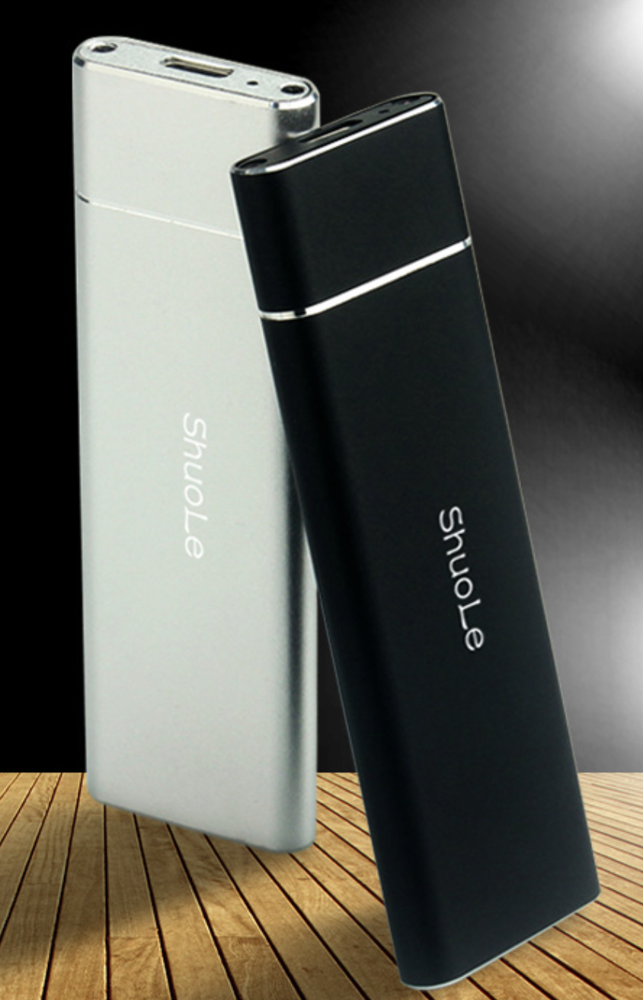
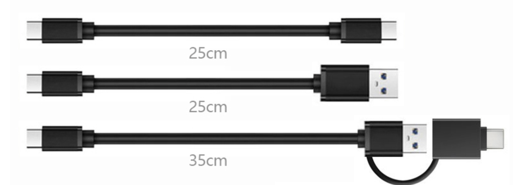
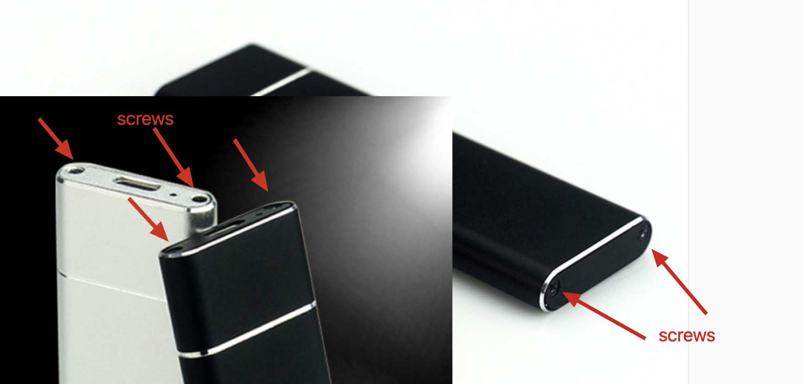
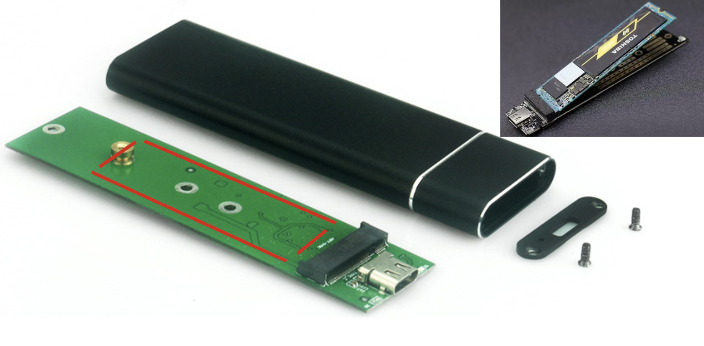
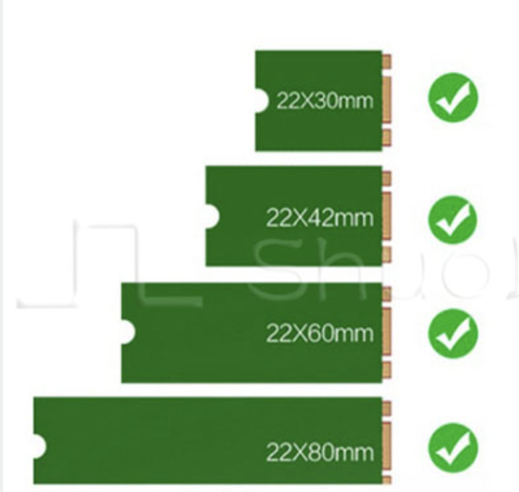

### 18th May 2022

Yesterday, I am sorry heard you External Solid State Drive is corrupted. Is name correct, or Mobile Solid State Storage, or external hard driver, which one is usual. SSD, the short name is often used in China, so do Philippine? I remember that you bought it from Shopee.  It's may be a China brand.

The electronic device in Chinese brand I only suggest HUAWEI, XIAOMI, VIVO, HONOR, and Lenovo. The electronic  device with a famous brand will may more stable and have much better service after it sold. some extend device，a  brand  name UGREEN is better choice.

For a storage device, stability is much important the than the size. Larger size can storage much data, but if you device corrupted, you will lose all of you data.

Through the picture you shared with me yesterday, I found a similar device like that.

This is External SSD. It have a type-c interface with fast speed more than 100MB/s. It's light and handy, but you should take a type-c cable with it, or else you can't connect it with you computer or mobile phone. Cell phone or smart phone, which word you use usually or what is different between it, we can talk in next class.

There three kind of Type-c cable(at least on endpoint is type-C interface). First one is Type-C to Type-C，second is Type-C to Type-A, Type-A is a very common usb interface in various kind of electronic device. The last one, is Type-C to a multifunction interface, it can be Type-A or Type-C, it depend on you use case.

Ok, turn back. If you device is similar to it, you can check on the end of you device, are there two screws on the top or on the bottom as is shown in the following picture.

Make sure you device is out of warranty period，and or the seller do not mind you tear down(disassemble) it. If you don't care the warranty. You can follow me.

If you cannot see the screws, There maybe a plastic paper cover on the end, you can try to remove it. After you use screw tools to screw the screws out, and remove the bottom case, or the top case. You can get a electronic board like that.

In the red square there is the solid state disk with M.2 interface, the black on is M.2 Jack.  In the right-top picture pane you can see the SSD.

M.2 SSD have 4 kind of size. The common size is 2242 and 2280. You can check which one is you disk's size.

You can remove you SSD from the type adaptor.

Now you know you External SDD consist of two parts, one is the type-c adaptor(maybe named that), and another is the M.2 SSD.

I don't know what happened to you external SSD. It you have a computer with M.2 interface, this interface usually on the mother board, you can connect to M.2 SSD to you computer directly to check if it is normal.

or else, you can only by a M.2 to type-C adaptor, and move you SSD to the new adaptor, If you are lucky, it will be work. It it works normally, it proves that you old  type-C adaptor is broken.

If it doesn't work, maybe you SSD is broken.

M.2-To-Type-C adaptor is cheaper than a SSD.  In China, a M.2 to Type-C adaptor is about 40 RMB,  same to 308 PHP.

I suggest to a computer repair shop to check if your SSD is still work normal，it the SSD is OK, you can only by a M.2-To-Type-C adaptor with a case. Yours is with aluminium alloy, it looks beautiful.

