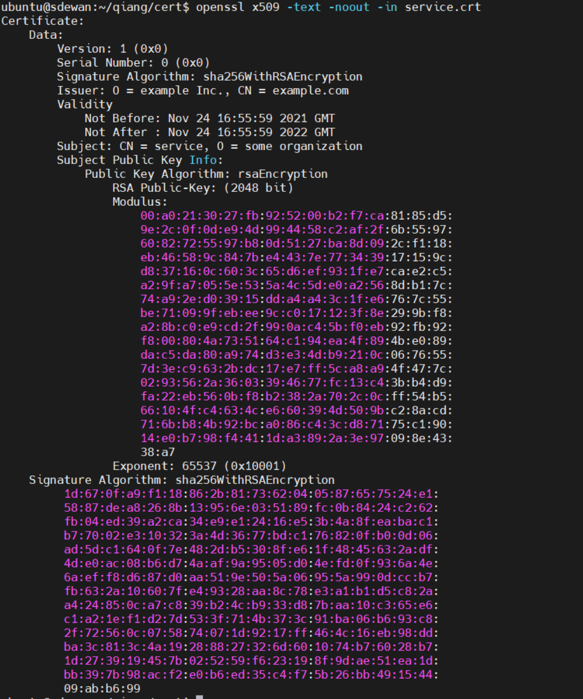
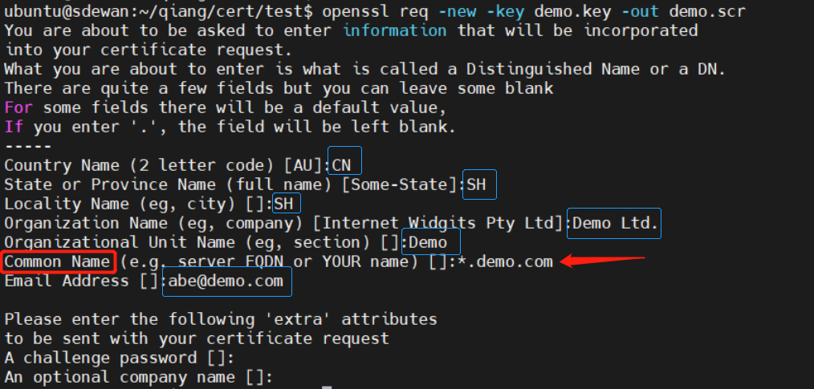
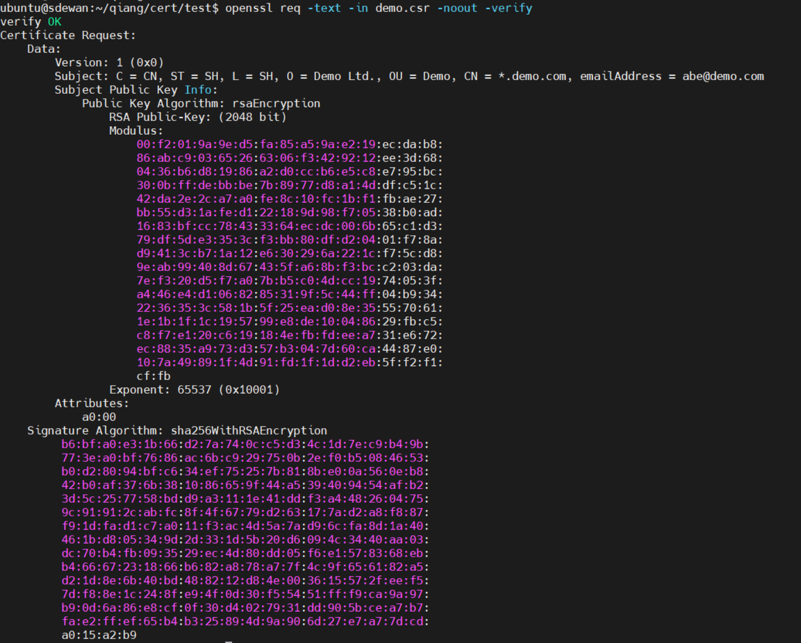

## 对称加密

## 非对称加密

### RSA

由于计算非常复杂，只适用于小数据加密。

### HTTPS

非对称加密+对称加密

### mTLS

## 数字证书

数字证书的颁发过程一般为： 用户首先产生自己的密钥对，并将公共密钥以及部分个人身份信息传送给认证中心。认证中心在核实身份后，执行一些必要的步骤，以确认请求确实是由用户发送来的。然后，认证中心将发给用户一个数字证书。该证书内包含用户的个信息和他的公钥信息。同时还附有认证中心的签名信息。

### 加密通信

Alice [Decode message by Alice's private key]     <---- send message ---  [message encrypted with Alice's public key] Bob 

公钥加密，私钥解密

### 数字签名

Bob 给Alice发送的文件需要携带数字签名。

Bob使用自己的私钥 以及文件的哈希值， 通过签名算法 计算出 数字签名

Alice 收到文件后， 通过文件哈希值，Bob的数字签名，以及Bob的公钥 进行签名验证

数字签名主要有以下三个作用：认证，确认收到的数据的身份信息；防止抵赖，文件一旦签名后不能反悔；防止篡改，保证文件在传输过程中的完整性。

> 比特币其实就是数字签名

## X.509 数字证书

证书版本信息

证书的序列号，每个证书都有一个唯一的证书序列号

证书所使用的签名算法；

证书的发行机构名称，命名规则一般采用X.500格式；

证书的有效期，现在通用的证书一般采用UTC时间格式，它的计时范围1950-2049；

证书所有人的名称，命名规则一般采用X.500格式；

证书所有人的公开密钥；

证书发行者对证书的签名；

## Openssl

创建一个 root certificates 和 private key 用来为服务签署 certificates

```sh
openssl req -x509 -sha256 -nodes -days 365 -newkey rsa:2048 -subj '/O=example Inc./CN=example.com' -keyout root.key -out root.crt
```

创建一个 certificate 和 private for service

```sh
openssl req -out service.csr -newkey rsa:2048 -nodes -keyout service.key -subj "/CN=service/O=some organization"
openssl x509 -req -days 365 -CA root.crt -CAkey root.key -set_serial 0 -in service.csr -out service.crt
```

创建一个client的certificate 和 private key

```sh
openssl req -out client.csr -newkey rsa:2048 -nodes -keyout client.key -subj "/CN=client/O=client organization"
openssl x509 -req -days 365 -CA root.crt -CAkey root.key -set_serial 1 -in client.csr -out client.crt
```

```sh
cert$ tree
.
├── root.crt   # CERTIFICATE
├── root.key   # PRIVATE KEY
├── client.crt
├── client.csr # CERTIFICATE REQUEST
├── client.key
├── service.crt
├── service.csr
└── service.key
```

查看证书详情

```sh
openssl x509 -text -noout -in  xxx.crt
```



### Step by Step Generate Keys,  CSR & Self Signed Certificates

Generate Key-Pair -> Extract Public Key -> Generate CSR File -> Generate Self-signed Certificate

```sh
# get key pair, contains private key and public key 
openssl genrsa -out demo.key 2048  # RSA PRIVATE KEY
# extrace public frm above
openssl rsa -in demo.key -pubout -out demo_pub.key  # PUBLIC KEY
# create CSR
openssl req -new -key demo.key -out demo.csr
# verify CSR
openssl req -text -in demo.csr -noout -verify
# self signed certificate
openssl x509 -in demo.csr -out demo.crt -req -signkey demo.key -days 365
```

When create CSR need to fill some details.



Verify the CRS created above.



RSA - public key & private key

use private key to create CSR, and use CSR and sign-key to sign a certificate.

## PSCK#11

接口解析： https://blog.csdn.net/zhubeifen_521/article/details/89360027

https://blog.csdn.net/wan706364166/article/details/8617293?spm=1001.2101.3001.6650.12&utm_medium=distribute.pc_relevant.none-task-blog-2%7Edefault%7EBlogCommendFromBaidu%7Edefault-12.no_search_link&depth_1-utm_source=distribute.pc_relevant.none-task-blog-2%7Edefault%7EBlogCommendFromBaidu%7Edefault-12.no_search_link

在密码系统中，PKCS#11 时公钥加密标准(PKCS, Public-Key Cryptography Standards)的一份子,由RSA实验室发布，它为加密平台定义了一组平台无关的API，如硬件安全模块HSM和智能卡。

由于没有一个真正的标准加密令牌，这个API已经发展成为一个通用的加密令牌的抽象层。PKCS#11 API定义最常用的加密对象类型(RSA密钥，X.509证书，DES/三重DES密钥等)和所有需要使用的功能，创建/生成，修改和删除这些对象。PKCS#11只提供了接口的定义，不包括接口的实现，一般接口的实现是由设备提供商提供的，如usbkey的生产商会提供符合PKCS#11接口标准的API实现。这样你只要通过接口调用API函数就可以实现其功能。

本标准为那些保存密码信息，执行密码函数的设备确定一种程序设计接口(API)，该接口称作Cryptoki. 音“Crypto-Key”，cryptographic token interface(密码令牌接口), 它遵循一种基于对象的简单方法，提出技术独立性(各种各样的设备)和资源共享(多个应用程序访问多个设备)的目标，把设备的一种通用逻辑试图，即密码令牌，提供给应用程序。

PKCS#11主要是应用于智能卡和HSM。大多数商业证书颁发机构软件使用PKCS#11访问CA的签名密钥或注册用户证书。

**mount /dev/sda1 /mnt/boot/efi**
