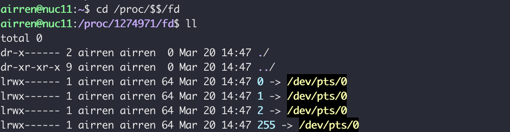
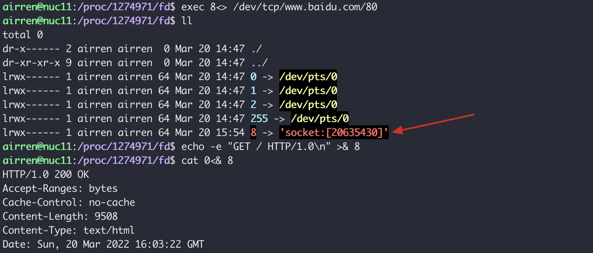

高并发，负载均衡，高可用

不要因为技术而技术, 软件工程学需要分层解耦


### 应用层

```sh
# $$ current process pid
cd /proc/$$/fd
```



>0 stdin
>
>1 stdout
>
>2 stderr

```sh
# 8 is the name of the file descriptor, <> in and out direction
exec 8<> /dev/tcp/www.baidu.com/80
# exec 8<& -
# & represent the argument is a fd
echo -e "GET / HTTP/1.0\n" >& 8 
```





### 传输层


