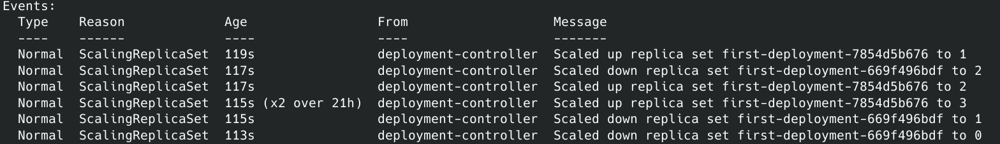
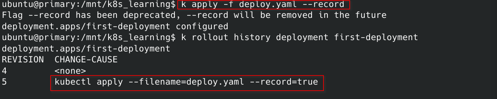

## 蓝绿部署

蓝绿部署是一种比较常见的部署方式，经常会用于新旧版本不兼容的情况。

1. 先将新版本(绿版)的服务运行起来。
2. 将所有的流量切到新版本的服务上
3. 删除旧版本(蓝版)的服务

创建新版本的ReplicaSet，将Service指向新的Pods，删除旧版本的ReplicaSet

## 滚动升级

蓝绿部署可以有效保证业务的正确性，但是也带来了一定的风险，例如稳定性。

假设新部署的应用是有问题的，一旦切换之后就会导致业务的崩溃，造成损失。于是就有了稍微友好的升级方式，滚动升级。

1. 先关闭一个旧版本的实例
2. 开启一个新版本的实例用于替换旧版本
3. 替换成功时候循环1和2，直到所有的实例升级完成。

在整个过程中，如果中途发现异常可以及时停手，及时止损。而且Kubernetes也在客户端中支持了这个特性。kubectl rolling-update。

- 升级前后RC的Selector都被改变了
- 操作都是在客户端执行的？


## 金丝雀发布

金丝雀发布是滚动发布的一种特例，在滚动发布中，是不会等待的，除非中间出错了。但是有些时候，我们并不想要全都升级，可能只是处于POC的一些原因，我们只希望部分实例是新的，大部分是旧的，而这种情形，我们就称之为金丝雀发布。

1. 升级少部分实例
2. 查看效果，如果好，全部升级
3. 如果不好，则不升级


## 声明式升级

前面介绍的这些升级发布方式在K8s上很多时候是半手工方式执行的，而Kubernetes作为一款DevOPS友好的系统，已经内置了对于部署方式的一种资源抽象，这个资源就是：Deployment。

Deployment --> ReplicaSet --> Pods

Deployment 存在的意义为：在升级应用程序时，需要引入额外的ReplicaSet，并协调新旧两个RS，使他们再根据彼此不断修改，而不会造成干扰。Deployment将这些运维过程都代码化，内置为自己的逻辑，从而让升级变得简单。


首先我们使用Deployment创建3个实例

```yaml
# deploy.yaml
---
apiVersion: apps/v1
kind: Deployment
metadata:
  name: first-deployment
  labels:
    app: simple-pod-deployment 
spec:
  replicas: 3
  selector:
    matchLabels:
      app: simple-pod-deployment
  template:
    metadata:
      name: simple-pod-deployment
      labels:
        app: simple-pod-deployment
    spec:
      containers:
        - name: simple-pod-de
          image: lukelau/rest-docker:0.0.1 
          ports:
            - containerPort: 8080
          args:
            - -server.addr=0.0.0.0:8080
```


此时创建了3个Pod，接下来我们将修改下images的版本，重新`apply -f` 

```yaml
#  image: lukelau/rest-docker:0.0.1 
 image: lukelau/rest-docker:0.0.2
```

通过kubectl describe deployment first-deployment 可以看到整个升级的过程。




可以使用record记录执行历史

```sh
kubectl rollout history deployment first-deployment
```





控制滚动升级速率

```sh
---
apiVersion: apps/v1
kind: Deployment
metadata:
  name: first-deployment
  labels:
    app: simple-pod-deployment 
spec:
  replicas: 3
  minReadySeconds: 10
  strategy:
    type: RollingUpdate
    rollingUpdate:
      maxSurge: 1
      maxUnavailable: 0
  selector:
    matchLabels:
      app: simple-pod-deployment
  template:
    metadata:
      name: simple-pod-deployment
      labels:
        app: simple-pod-deployment
    spec:
      containers:
        - name: simple-pod-de
          image: lukelau/rest-docker:0.0.2 
          ports:
            - containerPort: 8080
          args:
            - -server.addr=0.0.0.0:8080
```


```sh
# 停止升级
kubectl rollout pause deployment first-deployment
# 恢复升级
kubectl rollout resume deployment first-deployment
# 取消升级
kubectl rollout undo deployment first-deployment
```

