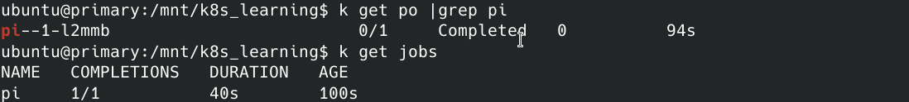
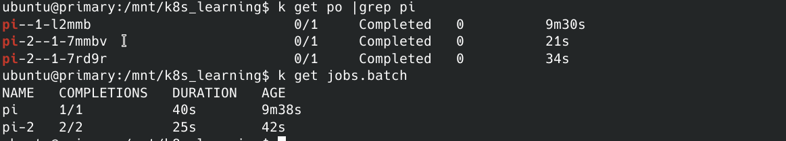

Replicas 和deployment这两类资源都是用于控制workload的。这两种类型的资源一般都是持续运行的，同时还有一些辅助方式帮助workload出现异常时恢复，以及根据情况进行动态伸缩的特性。


## Job

根据Job的定义创建出对应的Pod，然后关注Pod的状态， 直到满足定义。例如Pod执行成功了或者执行失败了，并且达到了重试次数。

```yaml
---
apiVersion: batch/v1
kind: Job
metadata:
  name: pi
spec:
  template:
    spec:
      containers:
        - name: pi
          image: perl
          command: ["perl", "-Mbignum=bpi","-wle", "print bpi(2000)"]
      restartPolicy: Never
  backoffLimit: 4
```




Job正常执行结束后结果如上图。这是一个只执行一次的Job。它的操作方式就是创建一个Pod，然后运行一遍，然后就退出。如果想执行多次，则只需要增加一个参数

```yaml
completions: 2
```

执行2次时创建了两个Pod，然后保证这两个Pod都执行成功。




我们在使用Deployment等Workload的时候，一般会指定restartPolicy，默认都是RestartOnFail。在Job中不能这么指定，因为这个逻辑应该由Job来控制， 而不是让Pod来控制。


## CronJob

定时任务， CronJob就是在Job的基础上加上了周期定义的API

```sh
---
apiVersion: batch/v1
kind: CronJob
metadata:
  name: batch-job-pi
spec:
  schedule: "0,15,30,45 * * * *"
  jobTemplate:
    spec:
      template:
        metadata:
          labels:
            app: pi-job
        spec:
          containers:
            - name: pi
              image: perl
              command: ["perl", "-Mbignum=bpi","-wle", "print bpi(2000)"]
          restartPolicy: Never
```

