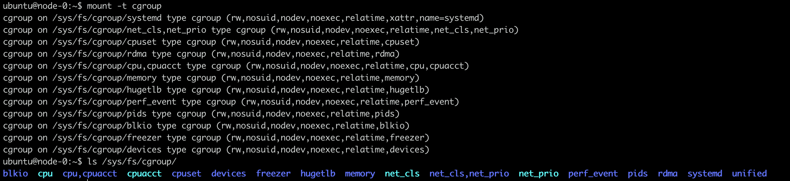
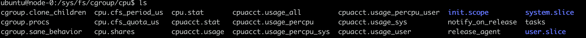
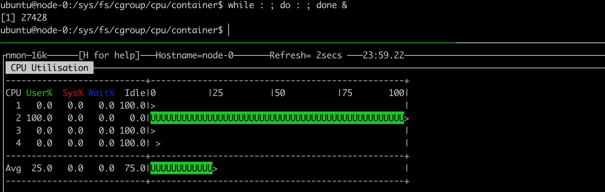
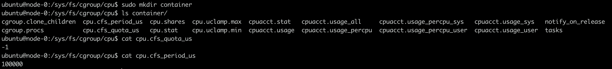
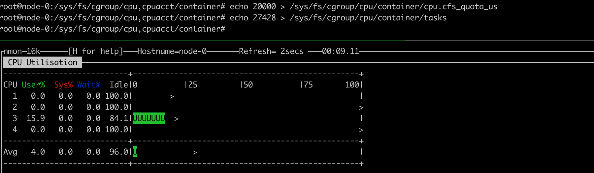

---

title: 容器技术基础
---


> 1. 为什么容器里只能跑“一个进程”？
> 2. 为什么我原先一直在用某个JVM参数，在容器里就不好使了？
> 3. 为什么kubernetes就不能固定IP地址？容器网络联不通又该如何去debug？
> 4. Kubernetes中的StatefulSet和Operator到底什么区别？PC和PVC这些概念又该怎么用？
> 5. Linux进程模型对容器本身的重要意义，控制器模式对整个K8s项目提纲挈领的作用？


## 从PaaS到K8s

### PaaS

PaaS(Platform as a Service) 应用托管。

Docker镜像，其实就是一个压缩包，直接由一个完整的操作系统的所有文件和目录构成。

>  其实只打包了文件系统，不包括操作系统的内核。各种内核相关的模块或者特性支持完全依赖于宿主机。

通过docker build 打包镜像，docker run 运行镜像，docker run创建的沙盒，就是使用Linux Cgroups和Namespace机制创建出来的隔离环境。解决了应用打包这个根本性问题。


### Swarm 

swarm 提供集群管理功能

单机docker项目

```sh
docker run <container-name>
```

多机docker项目

```sh
docker run -H 'swarm cluster API' <container-name>		
```


### Fig 项目

Fig项目第一次在开发者面前提出了容器编排(Container Orchestration)的概念。

加入用户现在需要部署的是应用容器A、数据库容器B、负载均衡容器C，那么Fig就允许用户把ABC三个容器定义在一个配置文件中， 并且可以指定他们之间的关联关系，比如容器A需要访问数据库B。定义好之后，只需要执行一条非常简单的指令。

```sh
fig up
```

Fig就会把这些容器的定义和配置交给DockerAPI按照访问逻辑一次创建。而容器A和B之间的关联关系，也会交给docker的Link功能通过写入hosts文件的方式进行配置。更重要的是，你还可以在Fig的配置文件里定义各种容器的副本个数等编排参数。

Fig 项目被Docker收购后更名为Compose。


### Libcontainer

LibContainer -> RunC

以RunC为依据，制定容器和镜像的标准和规范。

OCI(Open Container Initiative), 意在将容器运行时和镜像的实现从Docker项目中完全剥离出来。


### Containerd

容器运行时


## 进程隔离与限制

程序被执行起来，它就从磁盘上的二进制文件，变成了计算机 内存中的数据，寄存器里的值，堆栈中的指令、被打开的文件，以及各种设备的状态信息的一个集合。像这样一个程序运行起来后的计算机执行环境的总和，就是：进程。

对于进程来说，它的静态表现就是程序，一个二进制文件；而一旦运行起来，就变成了计算机数据和状态的总和，这就是进程的动态表现。

容器技术的核心功能，就是通过约束和修改进程的动态表现，从而为其创造出一个“边界”。对于大多数Linux容器来说， Cgroups是用来制造约束的主要手段， 而Namespace技术则是用来修改进程视图的主要方法。


### 隔离

```sh
docker run -it busybox /bin/sh
```


> What is BusyBox? The Swiss Army Knife of Embedded Linux
>
> Coming in somewhere between 1 and 5 Mb in on-disk size(depending on the variant), BusyBox is a very good ingredient to craft space-efficient distributions.
>
> BusyBox combines tiny versions of many common Unix utilities into a single small executable. It provides replacements for most of the utilities you usually find in GNU fileutils, shellutils, etc. The utilities in BusyBox generally have fewer options than their full-featured GNU cousins; however, the options that are included provide the expected functionality and behave very much like the GNU counterparts. BusyBox provides a fairly complete environment for any small or embedded system.


```sh
➜  ~ docker run -it busybox
/ # ps
PID   USER     TIME  COMMAND
    1 root      0:00 sh
    7 root      0:00 ps
/ #
```


可以看到容器中只有两个进程，第一个是bin/sh为1号进程，第二个是ps，可以看到docker容器已经隔离在了一个与宿主机完全不同的空间中。

在Docker容器中看到的进程Pid 实际上是重新计算过的进程ID，在容器中，只能看到当前容器的相关进程。

这种技术就是Linux中的Namespace机制。Namespace只是Linux创建进程的一个可选参数。

在Linux系统中创建线程的系统调用是clone().

```c
int pid = clone(main_function, stack_size,SIGCHLD, NULL);
```

这个系统调用会为我们创建一个新的进程，并且返回它的进程号pid。

当我们用clone()系统调用创建一个新的进程时，可以在参数中指定CLONE_NEWPID参数

```c
int pid = clone(main_function, stack_size, CLONE_NEWPID | SIGCHLD, NULL)
```

> Linux 的线程是用进程实现的。

这时，新创建的这个进程将会看到一个全新的进程空间，在这个进程空间里，它的pid是1。但是在宿主机真实的进程空间里，这个进程的PID还是真实数值。

除了PID Namespace，Linux操作系统还提供了Mount、UTS、IPC、Network和User这些Namespace，用来对不同的进程上下文进行隔离。Mount Namespace，用于让被隔离的进程只看到当前Namespace里的挂载点信息。Network Namespace用于被隔离的进程看到当前Namespace里的网络设备和配置。

所以，容器其实是一种特殊的进程。

> 单进程的意思不是只能运行一个进程，而是是有一个进程是可控的。


Lxc

Namespace技术实际上修改了应用程序看待真个计算机的“视图”，即它的视线被操作系统做了限制，只能看到某些指定的内容。但是对于宿主机而言，这些被隔离了的进程和其他进程没有太大区别。容器化后的用户应用依然是宿主机上的普通进程。


> 一个CentOS的KVM虚拟机在不做优化的情况下，虚拟机自己要占100~200MB内存。用户应用运行在虚拟机里面对宿主机操作系统的调用不可避免的要经过虚拟化软件的拦截和处理，这本身又是一层性能损耗。尤其对计算资源，网络和磁盘I/O的损耗非常大。

基于Linux Namespace的隔离机制相比于虚拟化技术也有很多不足，其中最主要的问题就是隔离的不彻底。

容器只是运行在宿主机上的一种特殊的进程，那么，多个容器之间使用的就还是同一个宿主机的操作系统内核。举个例子，如果在容器中，使用系统调用settimeofday修改了时间，整个宿主机的时间也会被修改。由于容器共享宿主机的内核，容器给应用暴露出来的攻击面是相当大的，应用越狱的难度自然也比虚拟机低的多。

我们可以使用Seccomp等技术对容器内部所有发起的系统调用进行过滤和甄别来进行安全加固，但是这种方法因为多了一层对系统调用的过滤，一定会拖累容器的性能。

> 尽管可以在容器里通过Mount Namespace单独挂载其他不同版本的操作系统文件，但是这并不能改变共享宿主机内核的事实。如果在windows宿主机运行Linux容器，或者再低版本的Linux宿主机上运行高版本的Linux容器都是行不通的。
>
> Docker 在windows 和Mac OS上的工作方式与Linux 上的工作方式是不同的，是通过虚拟机的方式运行容器的。


> 为什么生产环境中，没有人敢把运行在物理机上的Linux容器直接暴露到公网上？某公司mongodb podId泄露导致数据被删除。

### 限制

我们使用Namespace对进程进行隔离之后， 但是它所能都使用到的资源(比如CPU， 内存)却是随时可以被Host上的其他进程所占用的，当然，这个进程也有可能吧所有的资源都吃光。

Linux Cgroups(Linux Control Group) 就是Linux内核中用来为进程设置资源限制的一个重要功能。主要作用就是限制一个进程组能都使用的资源上限，包括CPU、Mem、磁盘、网络带宽等等。

> 在Google内部，Container这个术语长期以来用于形容被Cgroups限制过的进程组。Cgroups还能都对进程优先级设置、审计。以及将进程挂起和恢复等操作。


Cgroup 给用户暴露出来的操作接口是文件系统，即它以文件和目录的方式组织在操作系统/sys/fs/cgroup路径下。在/sys/fs/cgroup 下面有很多诸如cpuset、cpu、memory这样的子目录，也叫子系统。这些都是当前这台机器可以被Cgroups进行限制的资源种类。



在子系统对应的资源种类下，就可以看到该类资源具体可以被限制的方法。例如，对cpu子系统来说，有如下几个配置文件：



我们举个例子，看下如何使用配置文件进行cpu资源的限制。

我们在后台执行一个脚本。

```sh
while : ; do : ; done &
```



此时可以看到一个cpu被打满。

在/sys/fs/cgroup/cpu 创建一个container目录，目录下会自动生成该子系统对应的资源限制文件。cfs_period 和cfs_quota 这两个参数，用来限制 进程在长度为cfs_period的一段时间里，只能分配到总量为cfs_quota的CPU时间。



我们修改cfs_quota 为20000, 并且把PID写入container组里的tasks文件。

```sh
# use root
echo 20000 > /sys/fs/cgroup/cpu/container/cpu.cfs_quota_us
echo 27428 > 
```



cpu 的使用率降低到80%左右。

除了CPU子系统外，Cgroups的每一项子系统都有其独有的资源限制能力。

- blkio， 为块设备设定I/O限制，一般用于磁盘等设备
- cpuset 为进程分配单独的cpu核和对应的内存节点
- memory 为进程设定内存的使用限制。

