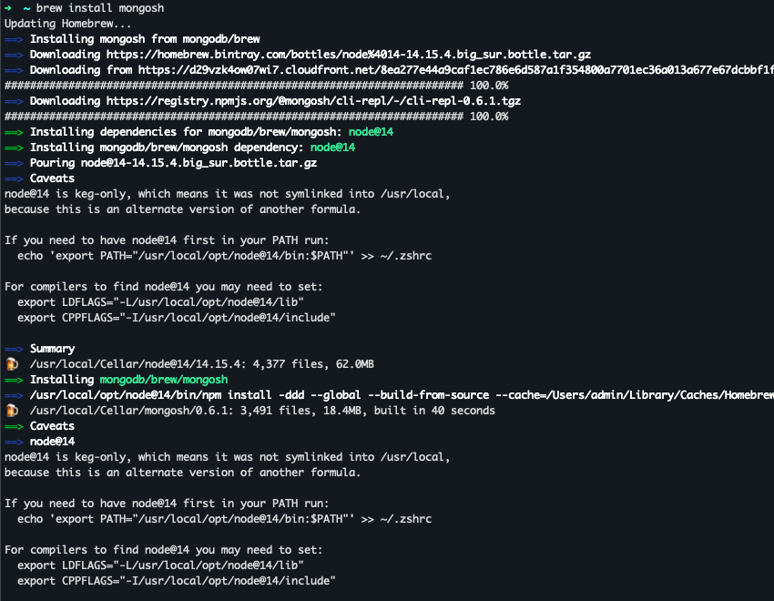
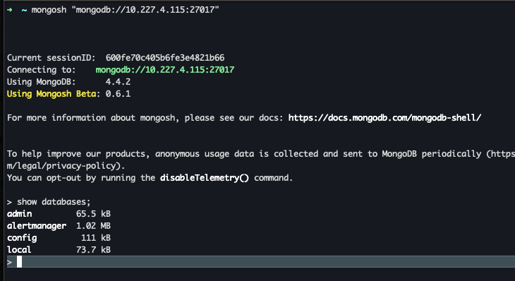

```sh
 docker run -d -p 27017:27017 --name mongo_4_4_2 mongo:4.4.2
```


##### mongosh  命令行client

https://docs.mongodb.com/mongodb-shell/install



````sh
If you need to have node@14 first in your PATH run:
  echo 'export PATH="/usr/local/opt/node@14/bin:$PATH"' >> ~/.zshrc

For compilers to find node@14 you may need to set:
  export LDFLAGS="-L/usr/local/opt/node@14/lib"
  export CPPFLAGS="-I/usr/local/opt/node@14/include"
````





mongo doc

https://mongoing.com/docs/tutorial/query-documents.html