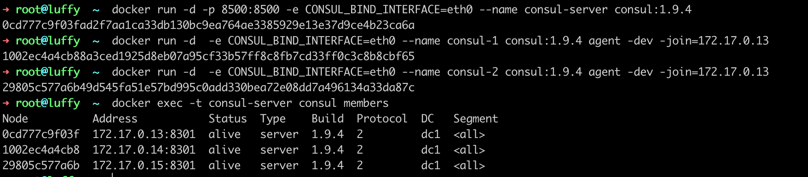
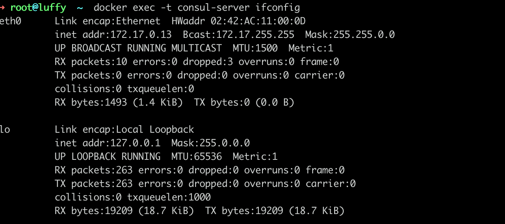
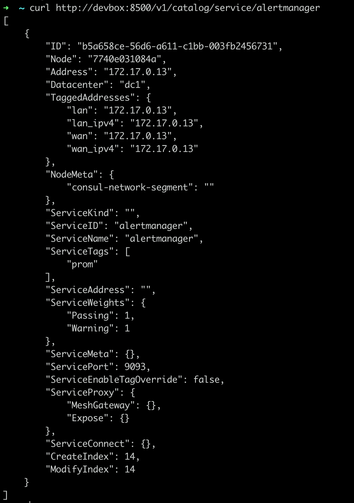

> 1. 什么是consul
> 2. Consul是用来做什么的
> 3. 服务如何注册到Consul，以及如何进行服务发现


## Consul部署

基于docker部署

| node          |        |
| ------------- | ------ |
| consul-server | server |
| consul-1      | client |
| consul-2      | client |

```sh
docker run -d -p 8500:8500 -e CONSUL_BIND_INTERFACE=eth0 --name consul-server consul:1.9.4
docker run -d  -e CONSUL_BIND_INTERFACE=eth0 --name consul-1 consul:1.9.4 agent -dev -join=172.17.0.13
docker run -d  -e CONSUL_BIND_INTERFACE=eth0 --name consul-2 consul:1.9.4 agent -dev -join=172.17.0.13

# docker stop consul-server consul-1 consul-2
# docker rm consul-server consul-1 consul-2
```





> Tips： 查看consul-server ip
>
> ```sh
>  docker exec -t consul-server ifconfig
> ```
>
> 
>
> 


可以通过`8500`端口访问UI


Server:

Client:

Client 只与Server交互。

Port：

| Post | Desc                                                |
| ---- | --------------------------------------------------- |
| 8300 | consul agent服务 relplaction 、rpc（client-server） |
| 8301 | lan gossip                                          |
| 8302 | wan gossip                                          |
| 8500 | http api端口                                        |
| 8600 | DNS服务端口                                         |


## 服务注册

### 服务自己调用http API注册

```sh
curl -X PUT -d '{"Datacenter": "sz-1", "Node": "mysql-1", "Address": \
"mysql-1.node.consul","Service": {"Service": "mysql", "tags": ["master","v1"], \
"Port": 3306}}' http://127.0.0.1:8500/v1/catalog/register
```


### json配置文件注册

启动时候指定配置文件路径`-config-dir`  `/etc/consul.d/`

```json
{
    "service":{
        "name":"alertmanager",
        "tags":[
            "prom"
        ],
        "port":9093,
        "check":{
            "name":"ping",
            "args":["curl -s 10.227.4.115:9093"],
            "interval":"3s"
        }
    }
}
```


## 服务发现

### HttpAPI

通过服务名字“alertmanager”获取服务的IP和Port



### DNS 8600

使用dns查询，默认域名格式NAME.service.consul，NAME就是web.json里面定义的service的name。可以自己指定域和端口：-domain、-dns-port 53 

## Consul

Consul的主要作用是用于服务治理。

在分布式场景下，服务会部署多个实例。传统的基于API直连的调用方式，在服务挂掉或者连接信息被修改之后就会导致API调用失败。如果调用方不用去关注所调用服务的实际部署情况，只要知道所调用服务的名称。其他实际部署情况，负载均衡、健康检查由一个统一的平台去做。这个就是Consul的作用。


Consul分为Server Agent和Client Agent。

Server：consul的server模式，表明这个consul是个server，这种模式下，功能和CLIENT都一样，唯一不同的是，它会把所有的信息持久化的本地，这样遇到故障，信息是可以被保留的。服务端, 保存配置信息, 高可用集群, 在局域网内与本地客户端通讯, 通过广域网与其他数据中心通讯. 每个数据中心的 server 数量推荐为 3 个或是 5 个。存储服务信息

Server-Leader：

个SERVER下面有LEADER的字眼，表明这个SERVER是它们的老大，它和其它SERVER不一样的一点是，它需要负责同步注册的信息给其它的SERVER，同时也要负责各个节点的健康监测。

Client： 客户端, 无状态, 将 HTTP 和 DNS 接口请求转发给局域网内的服务端集群。注册到当前节点的信息都会转发给Server, 本身不持久化信息。


Consul使用gossip协议管理成员关系、广播消息到整个集群，他有两个gossip pool（LAN pool和WAN pool），LAN pool是同一个数据中心内部通信的，WAN pool是多个数据中心通信的，LAN pool有多个，WAN pool只有一个。

### 服务发现

http & DNS

consul支持两种方式实现服务发现，一种是通过http API来查询有哪些服务，另外一种是通过consul agent 自带的DNS（8600端口），域名是以NAME.service.consul的形式给出，NAME即在定义的服务配置文件中，服务的名称。DNS方式可以通过check的方式检查服务。

### 服务配置

consul支持两种方式实现服务注册，一种是通过consul的服务注册http API，由服务自己调用API实现注册，另一种方式是通过json个是的配置文件实现注册，将需要注册的服务以json格式的配置文件给出。consul官方建议使用第二种方式。

### 健康检查

### 键值存储

### 安全服务通信

### 多数据中心


类似的服务组件有Eureka，zookeeper，etcd


一致性协议采用Raft算法

>
>
>todo
>
>- [ ] Dig


#### 参考文档

https://blog.csdn.net/a312586670/article/details/105337943/