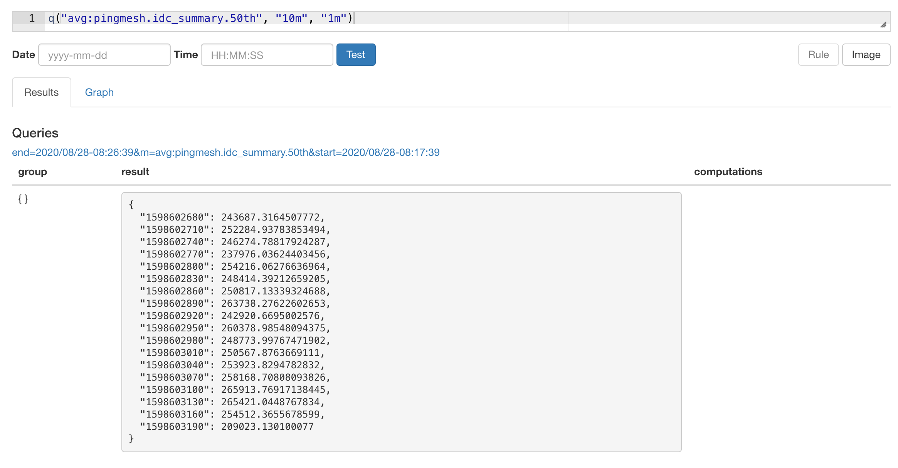

> Telegraf is an agent for collecting metrics and writing the to InfluxDB or other outputs.
使用bosun之前首先要了解什么是时序数据，时序数据的组成部分以及时序数据的常用查询

## 时序数据的类型


counter

guage(store)


## Bosun的数据类型

- Scalar
- NumberSet：   Group+Scalar


## Bosun 查询语法

### 简单查询

查询过去10分钟到过去1分钟之间的时序数据




`avg`是时序数据库的的运算，对不同的tag set的数据求平均


最外面的`avg` 是对这段时间内的时序数据做一个平均，得到一个数值


### 宏替换


运算的时候会对变量进行宏替换


**OpenTSDB**

如果没有数据的时候会导致bosun查询失败，可以采取不上

```json
avg(100*q("avg:1m-avg-zero:store:toutiao.tce.sysprobe.aweme.recommend.predict.cpu.usage.pod{sidecar_psm=ad.qa.java_sidecar,pod_name=dp-cb2f23ec64-6987c9d65d-ds7j5}","1h","")/q("avg:1m-avg:store:toutiao.tce.sysprobe.aweme.recommend.predict.cpu.limit.pod{sidecar_psm=ad.qa.java_sidecar,pod_name=dp-cb2f23ec64-6987c9d65d-ds7j5}","1h",""))
```


Streak 连续非0 数据的最大长度

https://blog.csdn.net/lslxdx/article/details/79454916


转置


### InfluxDB

```sql
influx("iaas_metrics", '''SELECT sum(value)  FROM "host_CpuSystem"   group by "resource_id" ''', "7d", "2m", "1m")
```


# Bosun, Time Series, and OpenTSDB's DataModel

An introduction to the data model of Bosun's Primary time series backend OpenTSDB. Time Series, Metircs and Tags, Aggregation, Rate Calculation, and Downsampling are covered. These features are demoed using Bosun's graphing interface.

## Time Series 

A Series of observations , each recorded as a Time and Date with an associated Value.

```sh
Observation on 08-22-2015 10:20:01 of 10
Observation on 08-22-2015 10:20:15 of 20 
Observation on ... of ...
```


## Open TSDB

**Time Series Database**

Each Time Series in the Database in Uniquely Identified by:

- A Metric Name

- A Set of Tags

  A Tag is made of :  `A Tag Key` & `A Tag Value`


参考文档
https://blog.csdn.net/lslxdx/article/details/79454916