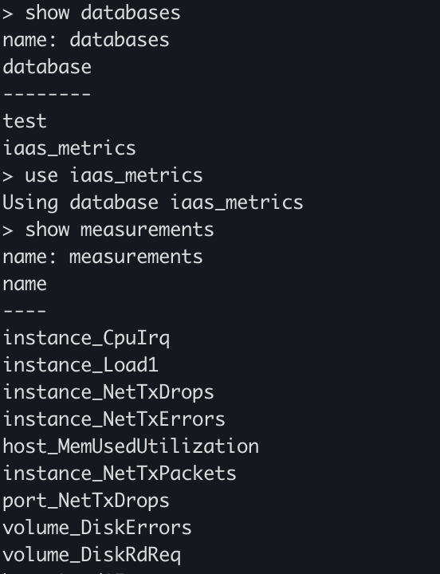
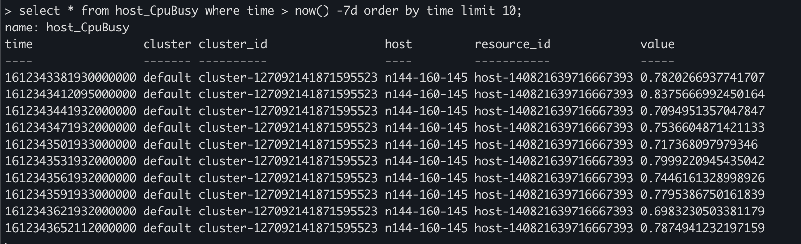

## 安装InfluxDB

```sh
docker run --name=influxdb -d -p 8086:8086 influxdb
docker exec -it influxdb influx
```


| InfluxDB    | Desc 对应数据库 |
| ----------- | --------------- |
| database    | 数据库          |
| measurement | 数据库中的表    |
| point       | 表中的一行数据  |
|             |                 |


databases

```sql
show databases
use iaas_metrics
show measurements
```



数据查询

```sql
select * from host_CpuBusy where time > now() -7d order by time limit 10;
```




influx("telegraf", '''SELECT sum(usage_system)  FROM "cpu"   group by "host" ''', "20m", "2m", "1m")****


https://zhuanlan.zhihu.com/p/97247465

https://zhuanlan.zhihu.com/p/85097140

https://www.cnblogs.com/suhaha/p/11692210.html

https://www.cnblogs.com/suhaha/p/11692210.html

grafa 配置查询influxdb

https://ken.io/note/grafana-quickstart-influxdb-datasource-graph


https://www.jianshu.com/p/f0905f36e9c3