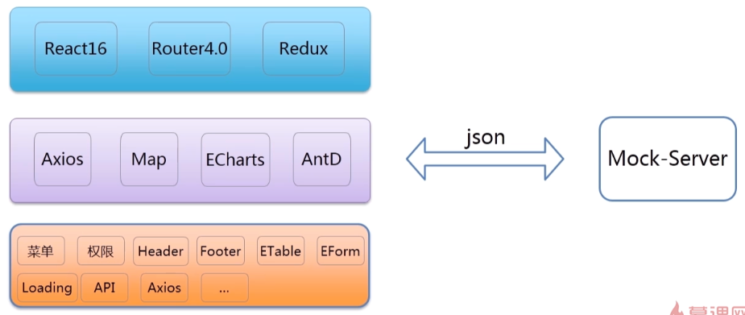

# 项目架构




ES6 和TypeScript


And Design Pro

log 可以放在`src/assets/images/klogo.svg`。 然后在页面中通过以下方式使用

```typescript

// @ 表示在src 目录下面
import logo from '@/assets/images/logo.svg'

<LoginForm
	logo={<image alt="logo" src={logo}>}
```


