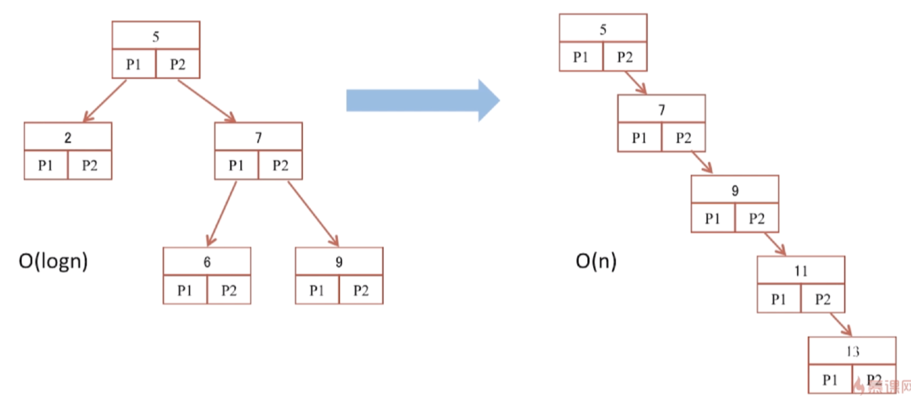
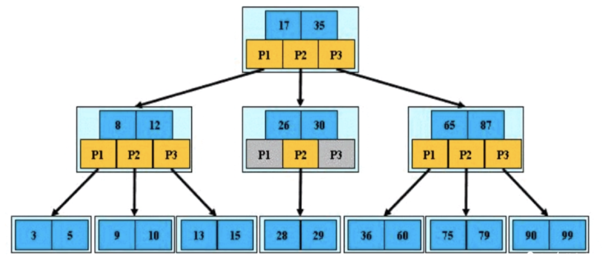
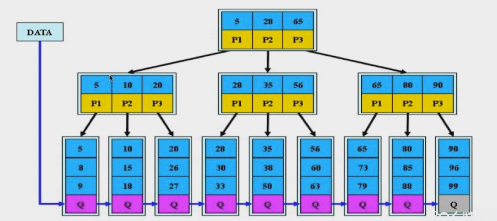
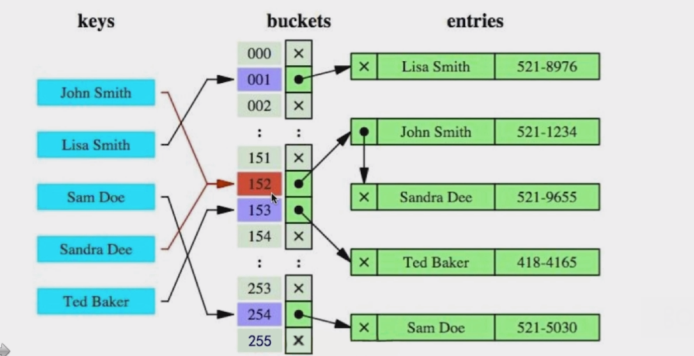
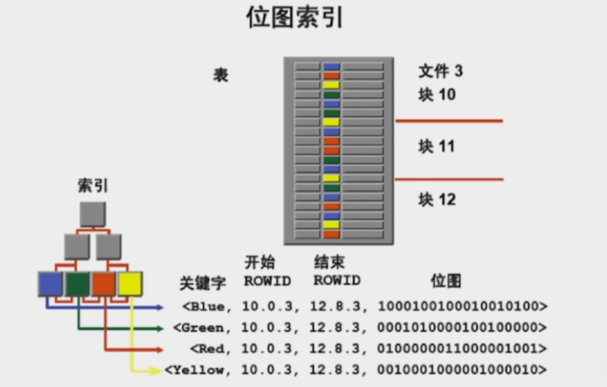

# 数据库
## 1. 数据库架构

关系型数据库的主要考点： 架构、 **索引**、**锁**、语法、理论范式

范式一： 列不可再分
范式二： 标准键
范式三： 去除传递依赖

#### 如何设计一个关系型数据库
RDMBS

存储管理：尽可能的减少IO，使用块或者页实现
缓存机制：不宜过大，要有淘汰机制 LRU
SQL解析：SQL解析
日志管理：记录操作记录 binlog
权限划分：
容灾机制：处理异常
索引管理：
锁管理：

#### 1. 为什么要使用索引？
避免全表扫描，快速查询数据

**全表扫描** 所有的数据分批次加载到内存
索引 - 对应字典的偏旁部首等 

#### 2. 什么样的信息能够成为索引
主键、唯一键、普通键等
#### 3. 索引的数据结构
生成索引，建立二叉查找树今次那个二分查找
生成索引，建立B-Tree进行查找

生成索引，建立B+Tree结构进行查找

生成索引，建立Hash结构进行查找

## 2. 优化索引- 二叉查找树
#### 二叉查找树
二叉查找树：左子节点小于 根节点， 右子节点大于根节点
平衡二叉树： 左右子树深度的差值不超过1

- 二叉查找树容易变为线性二叉树
- 即使使用数的旋转也会出现数的深度递增导致IO的次数增加

## 3. 优化索引- B-Tree 平衡多路查找树
每个节点有至多m个孩子， M阶B树

定义： 
1. 根节点至少包括两个孩子
2. 树中每个节点最多含有有M个孩子(m>2)
3. 除根节点和叶节点外，其他每个节点都至少有ceil(m/2)个孩子
4. 所有的叶子节点都位于同一层
5. 假设每个非终端节点中包含有n个关键字信息，其中
   -  Ki(i=1,...n) 为关键字，且关键字顺序按升序排序Ki-1\< Ki
   - 关键字的个数n必须满足：[ceil(m/2) -1]<= n <= m-1
   - 非叶子节点的指针：P[1],P[2],...P[M];其中P[1]指向关键字小于K[1]的子树，P[M]指向关键字大于K[M-1]的子树，其他P[i]指向关键字属于(K[i-1]K[i])的子树。

让每一个节点尽可能存储更多的信息，尽可能的减少数的深度，从而减少IO的次数

B-Tree 会远比二叉树矮的多

## 4. 优化索引 B+-Tree

B+-Tree 与 B-Tree 的区别
- 关键字的个数和指针的个数一致
  
#### B+-Tree 是B-Tree 的变体，其定义基本与B-Tree 相同
除了
1. 非叶子节点的子树指针与关键字个数相同
2. 非叶子节点的子树指针P[i],指向关键字值[K[i],K[i+1])的子树。（左闭右开）
3. 非叶子节点仅用来做索引，数据保存在叶子节点中
4. 所有叶子节点均有一个链指针，指向下一个叶子节点。（有利于做范围统计）

#### B+-Tree 更适合用来做存储索引
- B+Tree 的磁盘读写代价更低，内部节点只存储索引
- B+Tree 的查询效率更加稳定 O(logn)
- B+Tree 更有利于对数据库的扫描

## 5. 优化索引 - Hash以及BitMap
Hash索引

**缺点**
- 仅能满足"=", "IN",不能使用范围查询
- 无法被用来避免数据的排序操作
- 不能利用部分索引键查询  组合索引建立的hash 值
- 不能避免表扫描
- 遇到大量Hash值相等的情况后，性能并不一定会比B+-Tree索引高

BitMap 索引

锁的粒度非常的大，不适合高并发， OLAP

