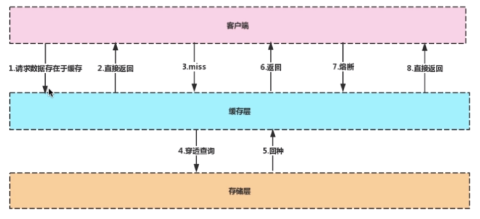
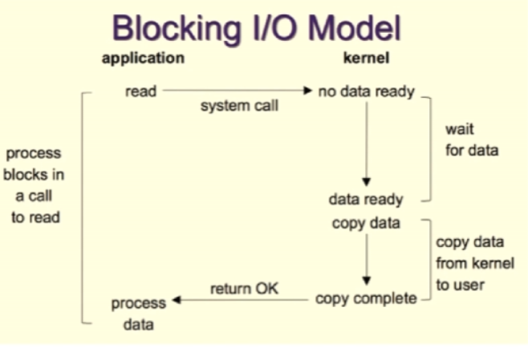
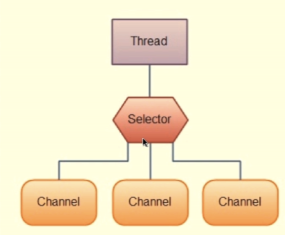

# Redis 

## 缓存知识考点 

熔断机制： 数据库down掉，可以缓存顶上
#### 缓存中间件-Memcache 和 Redis 的区别
Memcache: 代码层次类似Hash
- 支持简单数据类型
- 不支持数据持久化
- 不支持主从
- 不支持分片 shard
Redis
- 数据类型丰富
- 支持数据磁盘持久化存储
- 支持主从
- 支持分片
#### 为什么Redis能这么快
100000+ QPS(QPS-> query per second, 每秒查询次数)
- 完全基于内存， 绝大部分请求是纯粹的内存操作， 执行效率高
- 数据结构简单， 对数据的操作简单
- 采用单线程，单线程也能处理高并发请求，想多核也可以启动多实例
- 使用多路I\/O复用模型，非阻塞I\/O

#### 多路I\/O 复用模型
**FD： File Descriptor , 文件描述符**
一个打开的文件通过唯一的描述符进行引用， 该描述符是打开文件的元数据到文件本身的映射。

- 传统的阻塞IO模型

- 多路IO复用模型
    select 系统调用
   

   Redis采用的IO多路复用函数： epoll【】/kqueue/evport/select ...
   - 因地制宜
   - 优先选用时间复杂度为O(1)的IO多路复用函数作为底层实现

