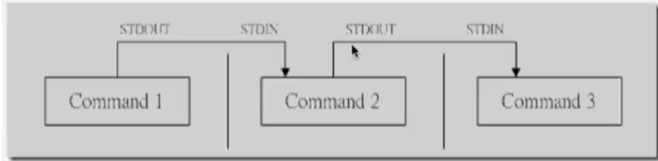
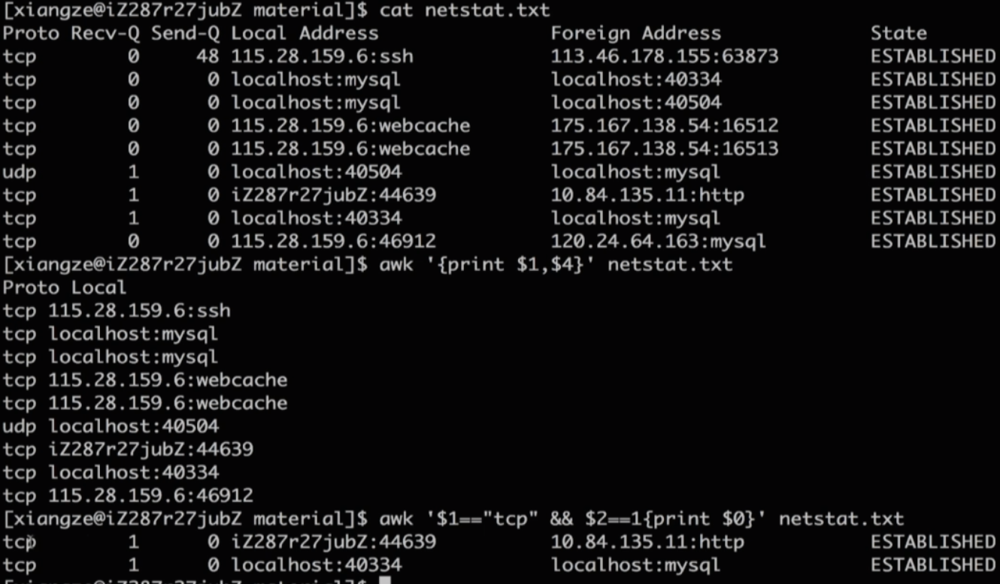
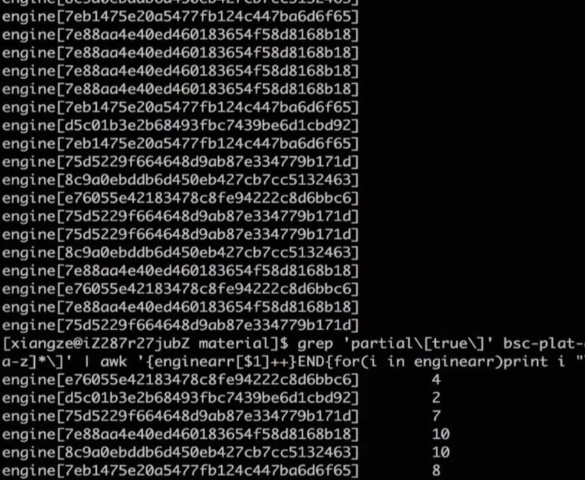

# Linux 

## Linux 的体系结构
- 体系结构主要分为 用户态(用户上层活动)和内核态
- 内核： 本质是一段管理计算机硬件设备的程序
- 系统调用：内核的访问接口，是一种不能再简化的操作。 原子性的操作。
- 公用函数库： 系统调用的组合拳
- Shell:命令解释器， 可编程
  

windows - cigwin

查看系统调用
```Linux - man 2 syscalls ```

less / more / cat /tail

切换默认shell 

## 查找特定的文件
`find`

- 语法：  `find path [options] params`
- 作用： 在指定目录下查找文件

``` s
find ./ -name "fileName" # 精确查找
find ~ -name "target*" # 模糊查找文件
find ~ -iname "target*" # 忽略大小写的查找
man find # 查看find的使用说明
```

## 检索文件内容
`grep`
- 语法： `grep [options] pattern file`
- 全称 Global Regular Expression Print
- 作用： 用于查找文件里符合条件的字符串, 智慧筛选出目标字符串所在的行
```s
grep "moo" target* # 查找 target* 开头的文件中包含 "moo" 的行
```

#### 管道操作符 | 
- 可以将指令连接起来，前一个指令的输出作为后一个指令的输入

- 只处理前一个命令的正确输出， 不处理错误输出
- 右边命令必须接收标准输入流，否则传递过程中数据会被抛弃
- sed, awk, grep, cut, head, top, less, more, wc, join, sort, split 等

```sh
grep 'partial\[true\]' test.log | grep -o 'engine\[[0-9 a-z]*\]'  # 符合正则表达式

ps -ef|grep tomcat| grep -v "grep" # 过滤掉不需要的内容
```

## 对文件内容做统计
`awk`
- 语法： `awk [options] 'cmd' file`
- 一次读取一行文本， 按照输入分隔符进行切片，切成多个组成部分
- 将切片直接保存在内建的变量中，$1, $2....($0 表示行的全部)
- 支持对单个切片的判断，支持循环判断，默认分隔符为空格

```sh
awk '{print $1,$4}' fileName.txt  # 获取文件的第1， 4 列

awk '$1=="tcp" && $2==1{print $0}' fileName.txt #按条件查询获取对应的行

awk '($1=="tcp" && $2==1) || NR==1 {print $0}' fileName.txt # 按条件查询，同时获取第1行

awk -F "," '{print $2}' fileName.txt # 分隔符号为 ","

XXXXXX | awk '{enginearr[$1]++}END{for(i in enginearr)print i "\t" enginearr[i]}' # 统计 第1列 出现的次数

```



## 批量替换掉文本中的内容
`sed`

语法: `sed [option] 'sed command' fileName`
- 全名 stream editor， 流编辑器
- 适合对文本内容进行处理

```sh
sed 's/^Str/String/' fileName.txt # 替换内容后输出 ^ 表示以Str 开头的

sed -i 's/^Str/String/' fileName.txt # 替换源文件的内容， 无输出

sed -i 's/\.$/\;/' fileName.txt # $ 代表以...结束

sed -i 's/Jack/me/g' fileName.txt # g 表示全文替换，如果没有g只会替换第一个 

sed -i '/^ *$/d' fileName.txt # 删除空

sed -i '/Integer/d' fileName.txt # 删除包含Integer 的行

```

## 跳槽过程中容易被忽略的细节
- 面试要偷偷摸摸进行
- 面试时间不要一味的将就对方
- 提离职要谨慎， 拿到offer再离职
- 好聚好散
- 跳槽时间衔接： 一般15号之后离职， 下个月15号前入职社保不会断
  


