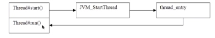
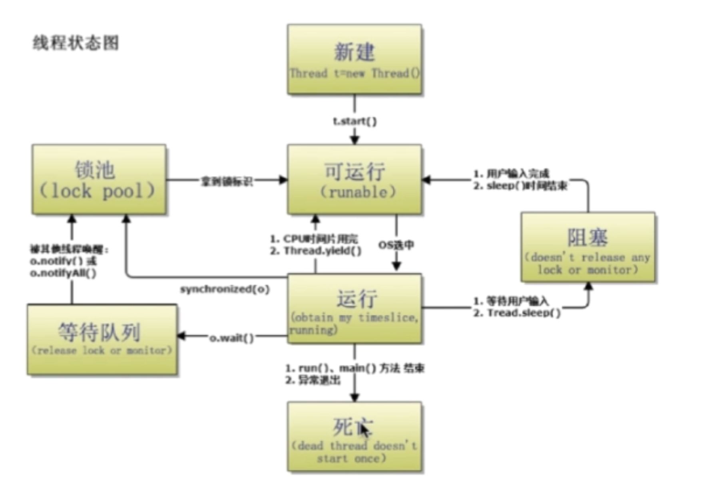

# Java 多线程与并发
## 1. 进程与线程的区别
  #### 关于jdk版本的选择
JDK8,JDK11:Oracle 长期支持

Java线程知识考点 
进程和线程的区别
用户态和内核态的转换

#### 进程和线程的由来
串行 初期的计算机只能执行串行执行任务，并且需要长时间等待用户输入

批处理  预先将用户指令集中成清单，批量串行处理用户指令，仍然无法并发执行

进程  进程独占内存空间，保存各自运行状态，相互间不干扰且可以互相切换，为并发处理任务提供了可能

线程 共享进程的内存资源，相互间切换更快捷，支持更细粒度的任务控制，使进程内的子任务得以并发执行
#### 进程和线程的区别
  进程是资源分配的最小单位，线程是CPU调度的最小单位
- 所有与进程相关的资源，都被记录在PCB中

- 进程是抢占处理机的调度单位；线程属于某个进程，共享其资源

- 线程只由堆栈寄存器、程序计数器和TCB组成
  
  
  
  
  
  
  

总结
- 线程不能看做独立应用，而进程可以看做独立应用
- 线程有独立的地址空间， 相互不影响，线程只是进程的不同执行路径
- 线程没有独立的地址空间，多进程的程序比多线程程序健壮
- 进程的切换比线程的切换开销大
  
#### Java进程和线程的关系
    - Java对操作系统提供的功能进行封装，包括进程和线程
    - 运行一个程序会产生一个进程，进程包含至少一个线程
    - 每个进程对应一个JVM实例，多个线程共享JVM里的堆
    - Java采用单线程编程模型，程序会自动创建主线程
    - 主线程可以创建子线程，原则上要后于子线程完成执行

## 2. Thread 中start和run方法的区别
start native 方法 openjdk.java.net
- 调用start() 方法会创建一个新的子线程并启动
- run()方法只是一个Thread的一个普通方法的调用

 

## 3. Thread 和Runnable 的区别
  - Thread 实现了Runnable接口的类，使得run支持多线程
  - Runnable 只有一个抽象方法run
  - 因为单一继承的原则，推荐多使用Runnable结构
 ## 4. 如何给run()方法传参
 实现方式主要有三种
 - 构造函数传参
 - 成员变量传参
 - 回调函数传参
  #### 如何实现处理线程的返回值
  实现方式主要有三种
  - 主线程等待法（有多个变量的时候比较难处理，循环等待的时间是不精确的）
  - 使用Thread的join()方法阻塞当前线程以等待子线程处理完毕(粒度不够细)
  - 通过Callable接口是实现： 通过FutureTask 或者 线程池获取

  ## 5.线程的状态

  Thread 源码中有enum state
  六个状态：
  - 新建 NEW: 创建后尚未启动的线程状态
  - 运行 RUNNABLE：包含Running 和 Ready(等待时间片轮转)
  - 无限期等待 WAITING：不会分配CPU执行时间，需要被显式的唤醒
    1. 没有设置Timeout参数的Object.wait() 方法
    2. 没有设置Timeout参数的Thread.join() 方法
    3. LockSupport.park()方法
  - 限期等待 Time Waiting 在一定时间后会由系统自动唤醒
     1. Thread.sleep()方法
     2. 设置了Timeout参数的Object.wait()方法。
     3. 设置了Timeout参数的Thread.join()方法。
     4. LockSupport.parkNanos()方法。
     5. LockSupport.patkUtil()方法。
  - 阻塞 Blocked 等待获取排它锁 synchronized 关键字
  - 结束 Terminated : 已终止线程的状态，线程已经结束执行。（已经终止的线程不可以再次执行，否则会抛出IlleagleThreadStateException）
  ## 6 sleep和wait的区别
  基本的差别：
  - sleep() 是Thread类中定义的方法， wait是Object类中定义的方法。
  - sleep()方法可以在任何地方使用
  - wait()方法只能在synchronized方法或synchronized块中使用
    最主要的本质区别
  - Thread.sleep()只会让出CPU， 不会导致锁行为的改变
  - Object.wait() 不仅会让出CPU，还会释放已经占有的同步资源锁

  ## 7.notify 和notifyall的区别
  唤醒 wait
  #### 两个概念
  - 锁池 EntryList
  - 等待池 WaitSet

  **锁池** 假设线程A已经拥有了某个对象(不是类)的锁，而其他线程B/C想要调用这个对象的某个synchronize方法(或者块)，由于B/C线程在进入对象的synchronized方法(或者块)之前必须获得该对象锁的拥有权， 而恰巧该对象的锁目前正在线程A所占用， 此时B/C线程就会被阻塞， 进入一个地方去等待锁的释放， 这个地方便是该对象的锁池。
  **等待池** 假设线程A调用了某个对象的wait()方法， 线程A就会释放该对象的锁， 同时线程A就进入了该对象的等待池中，进入到等待池中的线程不会去竞争该对象的资源锁。

  #### notify和notifyall的区别
  - notifyAll 会让所有处于等待池中的线程全部进入锁池去竞争获取锁的机会
  - notify 只会随机选取一个处于等待池中的线程进入锁池去竞争获取锁的机会

  volatile 修饰的变量，一旦线程A对其进行改动， 线程 B/C/D能够立马看线程A对其的改动
  ## 8 yield函数
  概念
  当调用Thread.yield()函数时， 会给当前线程调度器一个当前线程愿意让出CPU的暗示，但是线程调度器可能会忽略这个暗示。
  yield并不会让当前线程释放已经获得的锁
  ## 9. 如何中断线程
  已经被抛弃的方法：
  - 通过调用stop()方法停止线程 太过于暴力，线程不安全，数据不同步
  - 通过调用suspend() 和 resume() 方法
    目前使用的方法
  - 调用interrupt()，通知线程应该中断了
    1. 如果线程处于被阻塞状态，那么线程将立即退出被阻塞状态，并且抛出一个InterruptedException异常。
    2. 如果线程处于正常活动状态，那么会将该线程的中断标志设置为true。被设置中断标志的线程将会继续正常运行，不受影响。
  - 需要被调用的线程配合中断
    1. 在正常运行任务时，经常检查本线程的中断标志位，如果设置的了中断标志位就自行停止线程。
    2. 如果线程处于正常活跃状态，那么会将该线程的中断标志设置为true。 被设置中断标志的线程将继续正常运行，不受影响。

## 10. 前述方法以及线程状态总结
 状态转换图

 ## 彩蛋 如何有效谈薪资

 增加自己的筹码
 - 尽量打听公司岗位职位的薪酬幅度 阿里p6 百度 p4 p5 
 - 感知目标公司的缺人程度， 工作的紧急程度  入职时间
 - 最有效的方式是已经具备了有竞争力的offer 

