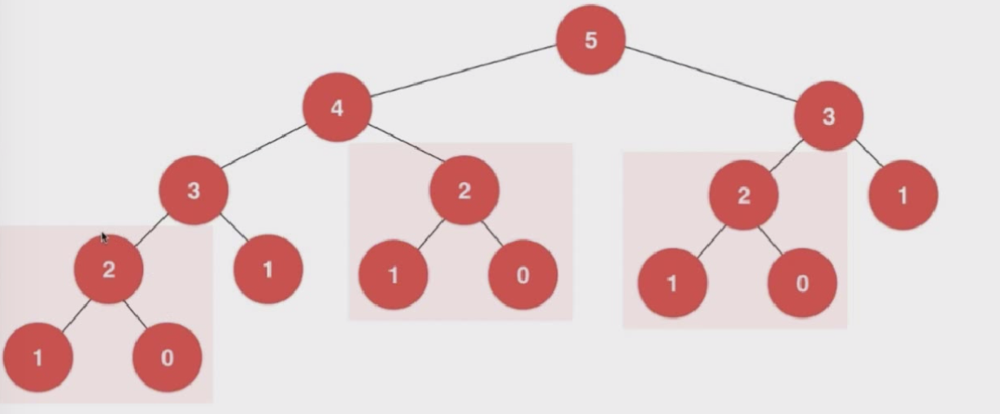
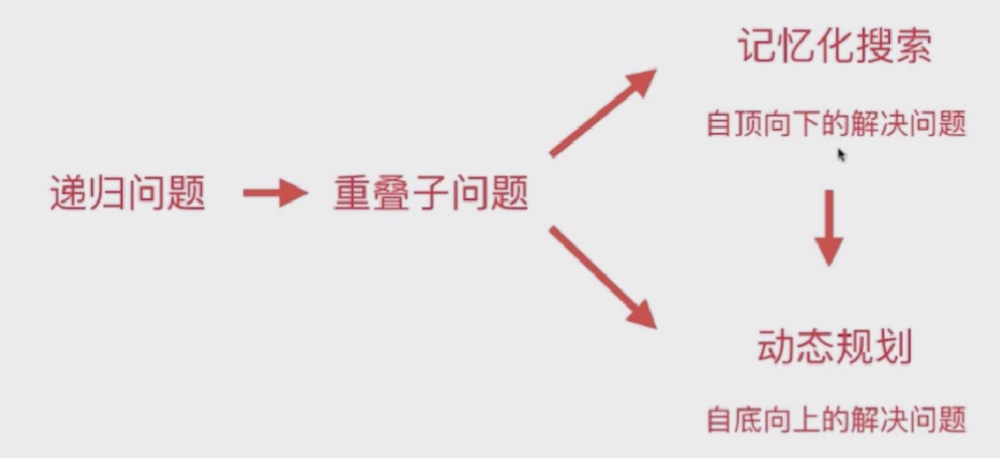
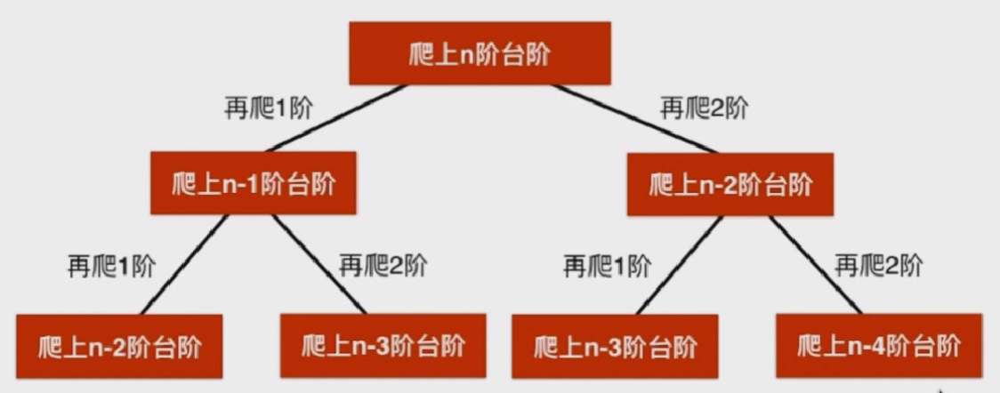

# 动态规划基础

## 什么是动态规划

#### 斐波那契数列 Fibonacci Sequence

```Java
//时间复杂度 应该是指数级
int fib(){
  if(n==0){
    return 0;
  }
  if(n==1){
    return 1;
  }
  return fib(n-1)+fib(n-2);
}
```



递归会有很多的重复计算，重复的计算量会非常大。

所以想办法对重复的计算 只计算一次

#### 记忆化搜索-自上而下的解决问题

改进的Fibonacci 

```Java
// 记忆化搜索  时间复杂度O(n)
int memo[];
int fib(){
  if(n==0){
    return 0;
  }
  if(n==1){
    return 1;
  }
  if(memo[n]==-1){
    memo[n]=fib(n-1)+fib(n-2);
  }
  return memo[n];
}
```

#### 动态规划-自下而上的解决问题

```java
// 动态规划
int fib(int n){
  vector<int> memo(n+1, -1);
  memo[0] = 0;
  memo[1] = 1;
  for(int i=2; i<n;i++){
    memo[i] = memo[i-1]+memo[i-2];
  }
  return memo[n];
}
```

动态规划：

- 将原问题拆解成若干子问题，同时保存子问题的答案，使得每个子问题值求解一次，最终获得原问题的答案。

递归问题-> 重叠子问题



#### 爬楼梯问题



